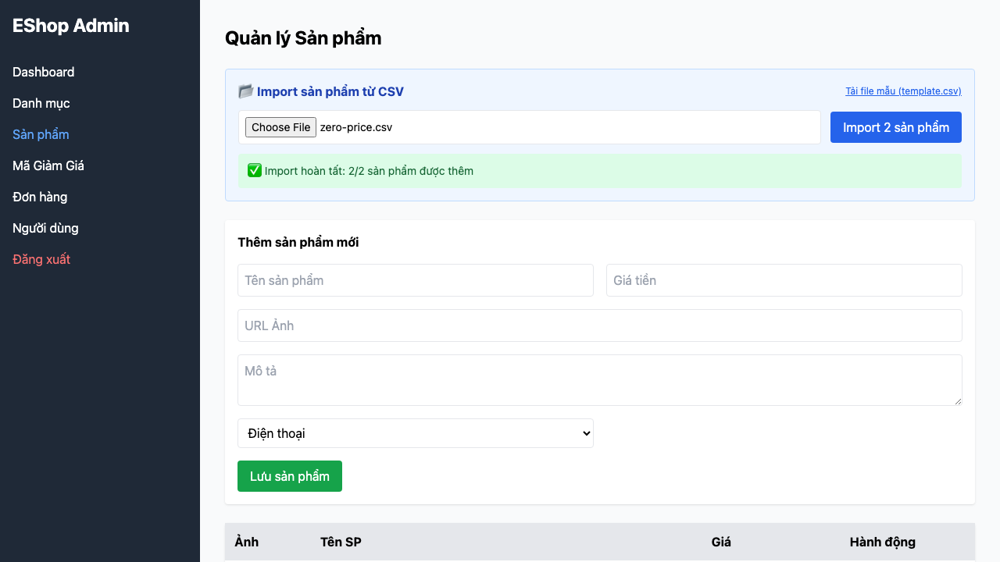

# [BUG][CSV Import] Import không validate price và không rollback khi có dòng lỗi

## Found by Test Case

TC-CSV-006 (cũng tái hiện bởi TC-CSV-007 đến TC-CSV-011)

## Requirement liên quan

FR-16

## Severity / Priority

Major / P1

## Environment

- Browser: Chromium, Firefox, WebKit (Playwright 1.62.1)
- OS: macOS 26.5.2
- URL: http://127.0.0.1:5174/
- Build/commit: `0a9af99e240cad01ade855346c5b89086dd4c588`
- Run timestamp: 2026-08-08T05:42:20Z

## Steps to reproduce

1. Đăng nhập Web Admin và mở tab Sản phẩm.
2. Tải CSV gồm một dòng hợp lệ và một dòng thiếu name; bấm Import.
3. Lặp lại với price bằng 0, âm, không phải số hoặc bị thiếu; kiểm tra báo cáo và API sản phẩm.

## Expected result

Name rỗng hoặc price không dương làm toàn bộ file thất bại; báo cáo 0 dòng thành công, nêu rõ dòng lỗi và không lưu sản phẩm nào.

## Actual result

Với name rỗng, dòng hợp lệ vẫn được lưu (1/2), vi phạm rollback. Với price bằng 0, âm, chuỗi hoặc thiếu, cả hai dòng đều được lưu (2/2) và không có lỗi validation. Lỗi tái hiện trên cả ba browser.

## Evidence

[Trace](../../artifacts/product-csv-import/chromium/product-csv-import-FR-16---fa0a1-8-Rollback-khi-price-bằng-0-chromium/trace.zip)

## GitHub Issue

https://github.com/lmchkhi/CS423-CSC15003-Testing-N08/issues/32
