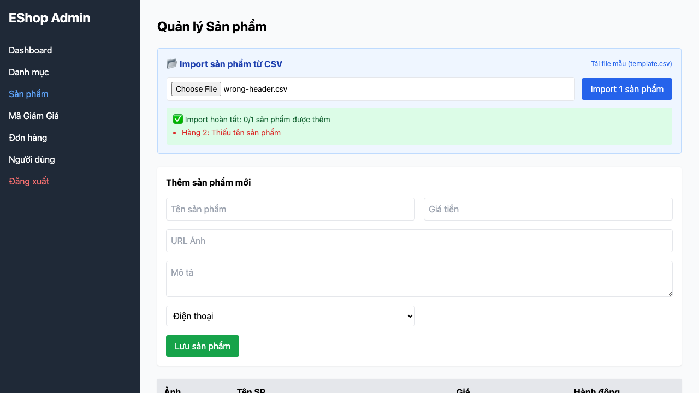

# [BUG][CSV Import] File có header sai không bị từ chối đúng lý do

## Found by Test Case

TC-CSV-012

## Requirement liên quan

FR-16

## Severity / Priority

Major / P1

## Environment

- Browser: Chromium, Firefox, WebKit (Playwright 1.62.1)
- OS: macOS 26.5.2
- URL: http://127.0.0.1:5174/
- Build/commit: `0a9af99e240cad01ade855346c5b89086dd4c588`
- Run timestamp: 2026-08-08T05:42:20Z

## Steps to reproduce

1. Đăng nhập Web Admin và mở tab Sản phẩm.
2. Tải CSV có header `product_name,cost,details,picture,category`.
3. Bấm Import và quan sát báo cáo.

## Expected result

File bị từ chối trước import với lý do header/cột không đúng chuỗi bắt buộc của FR-16.

## Actual result

Hệ thống vẫn gửi import rồi báo `Hàng 2: Thiếu tên sản phẩm`, không phát hiện hoặc giải thích header sai. Lỗi tái hiện trên cả ba browser.

## Evidence

[Trace](../../artifacts/product-csv-import/chromium/product-csv-import-FR-16---b5f74-ối-header-không-đúng-đặc-tả-chromium/trace.zip)

## GitHub Issue

https://github.com/lmchkhi/CS423-CSC15003-Testing-N08/issues/25
