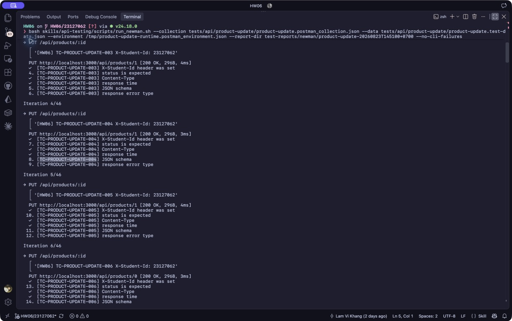

# [BUG][Product Update API] Endpoint không thực thi xác thực và phân quyền admin

## Found by Test Case
TC-PRODUCT-UPDATE-004

## Also detected by
- TC-PRODUCT-UPDATE-002
- TC-PRODUCT-UPDATE-003
- TC-PRODUCT-UPDATE-005

## Requirement liên quan
FR-12, SEC-02, SEC-03

## Severity / Priority
Critical / P0

## Environment
- Base URL: `http://localhost:3000`
- Endpoint: `PUT /api/products/:id`
- Commit/build: `192090fbdf78207f3873cfd5008d655cb16e4dff`
- Executed at: `2026-08-23T14:51:00+07:00` (Asia/Ho_Chi_Minh)
- Student ID header: `23127062`

## Steps to reproduce
1. Gửi `PUT /api/products/1` với body hợp lệ bằng JWT của user thường.
2. Lặp lại request tối giản mà không có header `Authorization`.
3. Đọc response và kiểm tra sản phẩm mục tiêu.

## Expected result
Request user thường bị từ chối `403`; request thiếu token bị từ chối `401`; sản phẩm không thay đổi.

## Actual result
Cả hai request trả HTTP `200` với `{"message":"Product updated"}` và thao tác cập nhật được chấp nhận.

## Evidence
- Screenshot: 
- Raw response/log: [Reproduction evidence](../../test-reports/evidence/product-update/reproduction-20260823T144713+0700.txt)
- Newman report: [HTML report](../../test-reports/newman/product-update-20260823T145100+0700/newman-report.html)

## Reproducibility
2/2 request đại diện/tối giản; Newman còn tái hiện với missing, invalid, user và Bearer rỗng.

## Regression run `20260823T154712+0700`
- TC-PRODUCT-UPDATE-002–005 tiếp tục fail với HTTP `200`.
- TC-PRODUCT-UPDATE-EXT-002 xác nhận user thường không chỉ được chấp nhận mà còn làm thay đổi state sản phẩm.
- [Newman HTML report](../../test-reports/newman/product-update-20260823T154712+0700/newman-report.html)

## Duplicate check
- Query: `"PUT /api/products" in:title,body`, `FR-12 SEC-02 SEC-03 product mutation`
- Result: Existing issue [#234](https://github.com/lmchkhi/CS423-CSC15003-Testing-N08/issues/234) (và issue cũ #48 cùng root cause); không tạo issue mới.
