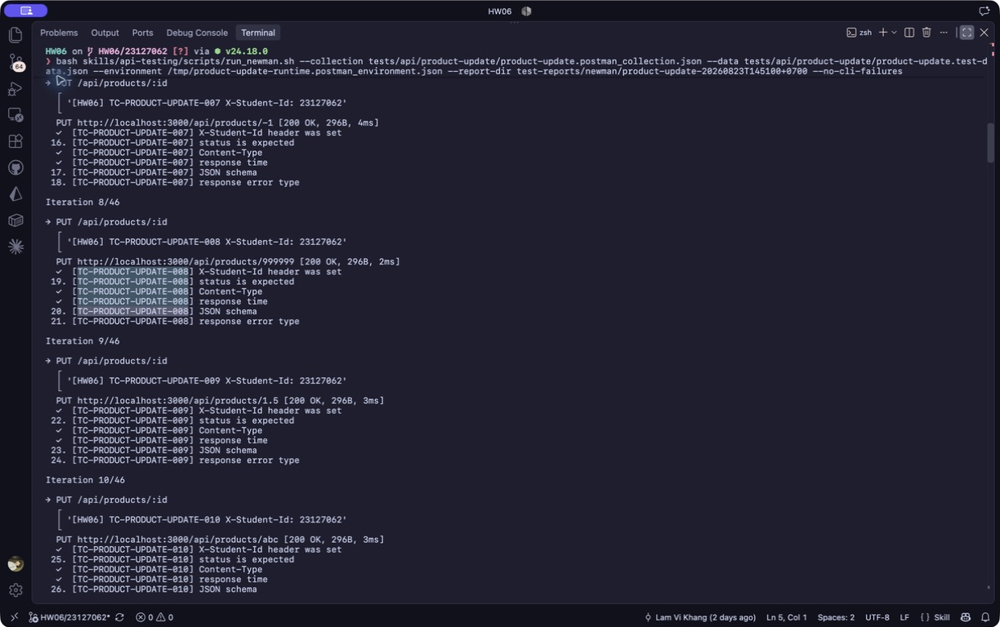

# [BUG][Product Update API] ID không hợp lệ hoặc không tồn tại vẫn báo cập nhật thành công

## Found by Test Case
TC-PRODUCT-UPDATE-008

## Also detected by
- TC-PRODUCT-UPDATE-006
- TC-PRODUCT-UPDATE-007
- TC-PRODUCT-UPDATE-009
- TC-PRODUCT-UPDATE-010
- TC-PRODUCT-UPDATE-011

## Requirement liên quan
FR-15; contract của resource path `PUT /api/products/:id`

## Severity / Priority
Major / P1

## Environment
- Base URL: `http://localhost:3000`
- Endpoint: `PUT /api/products/:id`
- Commit/build: `192090fbdf78207f3873cfd5008d655cb16e4dff`
- Executed at: `2026-08-23T14:51:00+07:00` (Asia/Ho_Chi_Minh)
- Student ID header: `23127062`

## Steps to reproduce
1. Gửi `PUT /api/products/999999` bằng JWT admin và body hợp lệ.
2. Lặp lại với body tối giản gồm `name`, `price`, `category_id` hợp lệ.
3. Quan sát status và body.

## Expected result
API trả `404 Not Found`; không báo cập nhật thành công khi không có resource nào được sửa.

## Actual result
Cả hai lần đều trả HTTP `200` với `{"message":"Product updated"}`. Các ID `0`, `-1`, `1.5`, `abc` và SQLi-like cũng nhận response thành công tương tự.

## Evidence
- Screenshot: 
- Raw response/log: [Reproduction evidence](../../test-reports/evidence/product-update/reproduction-20260823T144713+0700.txt)
- Newman report: [HTML report](../../test-reports/newman/product-update-20260823T145100+0700/newman-report.html)

## Reproducibility
2/2 với ID `999999`; 6/6 path partitions thất bại trong Newman.

## Duplicate check
- Query: `products update validation`, `"Product updated"`, `products "không tồn tại" update`
- Result: No duplicate found. Đã tạo [issue #290](https://github.com/lmchkhi/CS423-CSC15003-Testing-N08/issues/290). Issue #249 chỉ áp dụng cho `GET /api/products/:id`, khác endpoint và symptom.
