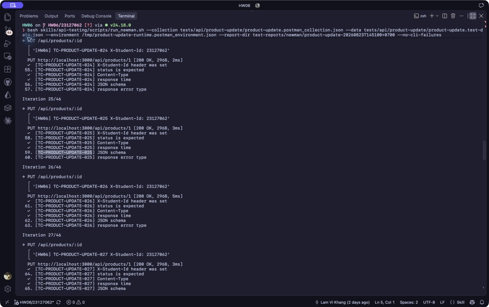

# [BUG][Product Update API] Chấp nhận các trường bắt buộc sai kiểu, sai biên hoặc thiếu

## Found by Test Case
TC-PRODUCT-UPDATE-025

## Also detected by
- TC-PRODUCT-UPDATE-015–021
- TC-PRODUCT-UPDATE-023–036
- TC-PRODUCT-UPDATE-043
- TC-PRODUCT-UPDATE-045

## Requirement liên quan
FR-15

## Severity / Priority
Major / P1

## Environment
- Base URL: `http://localhost:3000`
- Endpoint: `PUT /api/products/:id`
- Commit/build: `192090fbdf78207f3873cfd5008d655cb16e4dff`
- Executed at: `2026-08-23T14:51:00+07:00` (Asia/Ho_Chi_Minh)
- Student ID header: `23127062`

## Steps to reproduce
1. Gửi `PUT /api/products/1` bằng JWT admin với `price: 0` và các trường còn lại hợp lệ.
2. Lặp lại với body tối giản `{"name":"A","price":0,"category_id":1}`.
3. Quan sát response.

## Expected result
API trả controlled `400/422` và không cập nhật vì FR-15 yêu cầu `price > 0`.

## Actual result
Cả hai request trả HTTP `200` với `{"message":"Product updated"}`. Newman xác nhận endpoint cũng chấp nhận name thiếu/null/rỗng/whitespace/quá 255/sai kiểu, price thiếu/null/âm/sai kiểu, category thiếu/null/0/không tồn tại/sai kiểu và body array.

## Evidence
- Screenshot: 
- Raw response/log: [Reproduction evidence](../../test-reports/evidence/product-update/reproduction-20260823T144713+0700.txt)
- Newman report: [HTML report](../../test-reports/newman/product-update-20260823T145100+0700/newman-report.html)

## Reproducibility
2/2 với `price: 0`; 23 invalid body partitions cùng root cause thất bại trong Newman.

## Regression run `20260823T154712+0700`
- Các invalid body case thuộc FR-15 tiếp tục được chấp nhận với HTTP `200`.
- TC-PRODUCT-UPDATE-EXT-001 xác nhận `price = 0` vẫn làm thay đổi state; EXT-003 xác nhận thiếu `category_id` vẫn gây partial update.
- TC-PRODUCT-UPDATE-019 được tách khỏi defect này vì whitespace-only/trimming chưa được FR-15 quy định.
- [Newman HTML report](../../test-reports/newman/product-update-20260823T154712+0700/newman-report.html)

## Duplicate check
- Query: `"FR-15" "price"`, `category_id products`, `products update validation`
- Result: No duplicate found cho `PUT /api/products/:id`; đã tạo [issue #289](https://github.com/lmchkhi/CS423-CSC15003-Testing-N08/issues/289). Issue #265 thuộc CSV import FR-16, khác endpoint/root cause.
