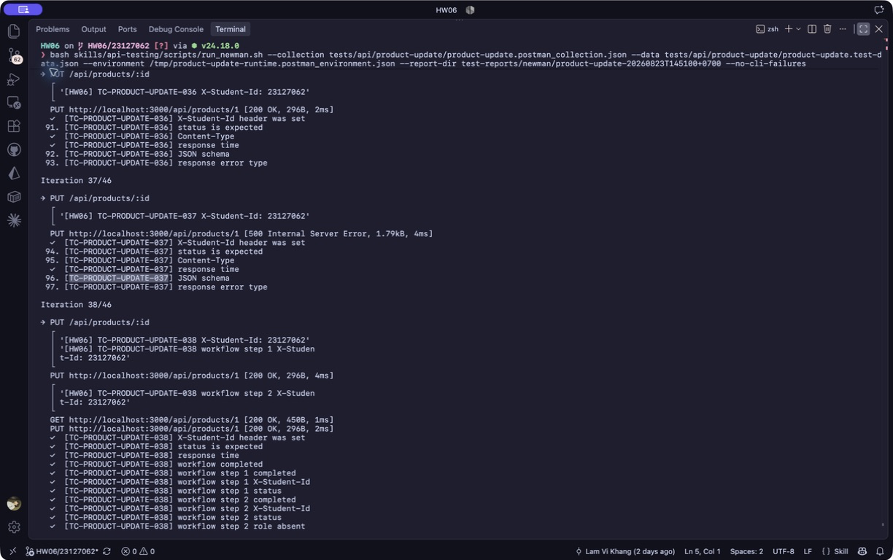

# [BUG][Product Update API] Content-Type text/plain gây HTTP 500 và lộ stack trace HTML

## Found by Test Case
TC-PRODUCT-UPDATE-037

## Also detected by
- Request tái hiện tối giản `text/plain` với body `{}`

## Requirement liên quan
FR-15; schema/content-type validation; safe error handling

## Severity / Priority
Major / P1

## Environment
- Base URL: `http://localhost:3000`
- Endpoint: `PUT /api/products/:id`
- Commit/build: `192090fbdf78207f3873cfd5008d655cb16e4dff`
- Executed at: `2026-08-23T14:51:00+07:00` (Asia/Ho_Chi_Minh)
- Student ID header: `23127062`

## Steps to reproduce
1. Gửi `PUT /api/products/1` bằng JWT admin.
2. Đặt `Content-Type: text/plain` và body JSON-looking hợp lệ.
3. Lặp lại với body tối giản `{}`.

## Expected result
API trả controlled `400/415/422` dạng JSON, không trả 5xx và không lộ stack trace/path nội bộ.

## Actual result
Cả hai request trả HTTP `500`, `Content-Type: text/html; charset=utf-8`, kèm `TypeError` và absolute filesystem paths trong stack trace.

## Evidence
- Screenshot: 
- Raw response/log: [Reproduction evidence](../../test-reports/evidence/product-update/reproduction-20260823T144713+0700.txt)
- Newman report: [HTML report](../../test-reports/newman/product-update-20260823T145100+0700/newman-report.html)

## Reproducibility
2/2; Newman canonical run cũng tái hiện HTTP 500 và bốn assertion failures.

## Duplicate check
- Query: `products "text/plain"`, `products "Internal Server Error"`, `products "stack trace"`
- Result: No duplicate found cho endpoint này; đã tạo [issue #288](https://github.com/lmchkhi/CS423-CSC15003-Testing-N08/issues/288). Issue #284 thuộc Admin Coupon, khác endpoint.
