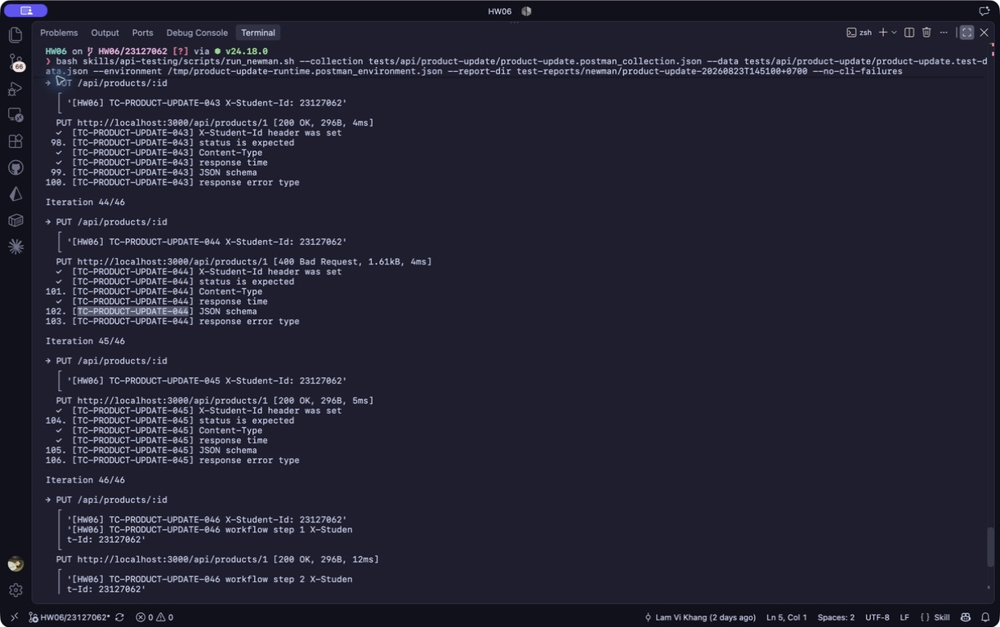

# [BUG][Product Update API] JSON primitive trả HTML stack trace thay vì lỗi JSON an toàn

## Found by Test Case
TC-PRODUCT-UPDATE-044

## Also detected by
- Request tối giản với JSON string `"x"`

## Requirement liên quan
Schema/content-type validation; safe error handling

## Severity / Priority
Major / P1

## Environment
- Base URL: `http://localhost:3000`
- Endpoint: `PUT /api/products/:id`
- Commit/build: `192090fbdf78207f3873cfd5008d655cb16e4dff`
- Executed at: `2026-08-23T14:51:00+07:00` (Asia/Ho_Chi_Minh)
- Student ID header: `23127062`

## Steps to reproduce
1. Gửi `PUT /api/products/1` bằng JWT admin và `Content-Type: application/json`.
2. Dùng top-level JSON string `"invalid-body"`.
3. Lặp lại với JSON string tối giản `"x"`.

## Expected result
API trả controlled `400/422` dạng JSON với error message an toàn, không lộ stack trace/path nội bộ.

## Actual result
API trả HTTP `400` nhưng `Content-Type: text/html; charset=utf-8`; body chứa `SyntaxError` và absolute filesystem paths trong stack trace.

## Evidence
- Screenshot: 
- Raw response/log: [Reproduction evidence](../../test-reports/evidence/product-update/reproduction-20260823T144713+0700.txt)
- Newman report: [HTML report](../../test-reports/newman/product-update-20260823T145100+0700/newman-report.html)

## Reproducibility
2/2 với hai JSON string tối giản.

## Duplicate check
- Query: `products "stack trace"`, `products JSON HTML`, `products update validation`
- Result: No duplicate found cho endpoint này; đã tạo [issue #287](https://github.com/lmchkhi/CS423-CSC15003-Testing-N08/issues/287). Issue #281 ghi nhận cùng kiểu error ở Admin Coupon nhưng endpoint/payload khác.
