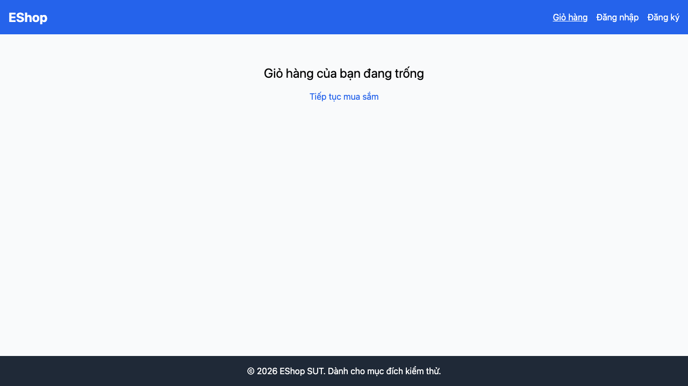

# [BUG][Shopping Cart] Empty state không có hình minh họa

## Found by Test Case

TC-CART-002

GitHub Issue: https://github.com/lmchkhi/CS423-CSC15003-Testing-N08/issues/23

## Requirement liên quan

FR-07

## Severity / Priority

Minor / P2

## Environment

- Browser: Chromium (Playwright 1.62.1)
- OS: macOS 26.5.2 (25F84)
- URL: http://127.0.0.1:5173/cart
- Build/commit: d76d95f
- Run timestamp: 2026-08-09T05:55:09.293Z

## Steps to reproduce

1. Mở Frontend Web trong một phiên trình duyệt mới.
2. Chọn liên kết Giỏ hàng khi chưa thêm sản phẩm.
3. Quan sát empty state trong vùng nội dung chính.

## Expected result

Giỏ hàng trống có hình minh họa và thông báo rõ ràng.

## Actual result

Chỉ có thông báo và liên kết; không có ảnh, SVG hoặc phần tử mang vai trò hình minh họa.

## Evidence

[Trace](../../artifacts/shopping-cart/chromium/shopping-cart-FR-07---Giỏ--25c44-minh-họa-khi-giỏ-hàng-trống-chromium/trace.zip)
