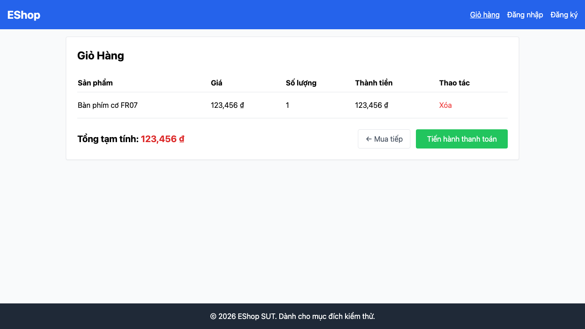

# [BUG][Shopping Cart] Tiêu đề cột đơn giá hiển thị sai đặc tả

## Found by Test Case

TC-CART-004

GitHub Issue: https://github.com/lmchkhi/CS423-CSC15003-Testing-N08/issues/19

## Requirement liên quan

FR-07

## Severity / Priority

Minor / P2

## Environment

- Browser: Chromium (Playwright 1.62.1)
- OS: macOS 26.5.2 (25F84)
- URL: http://127.0.0.1:5173/cart
- Build/commit: d76d95f
- Run timestamp: 2026-08-09T05:55:09.293Z

## Steps to reproduce

1. Thêm một sản phẩm từ trang chủ.
2. Mở trang Giỏ hàng.
3. Đọc tiêu đề cột thứ hai.

## Expected result

Tiêu đề cột thứ hai là “Đơn giá”.

## Actual result

Tiêu đề cột thứ hai là “Giá”.

## Evidence

[Trace](../../artifacts/shopping-cart/chromium/shopping-cart-FR-07---Giỏ--80e0f-ển-thị-đúng-năm-tiêu-đề-cột-chromium/trace.zip)
