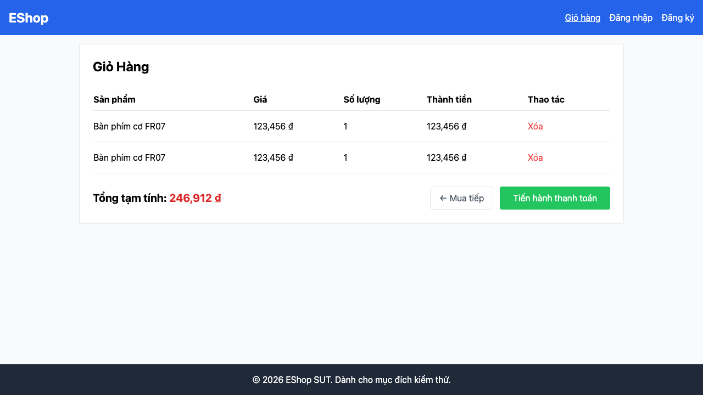

# [BUG][Shopping Cart] Thêm cùng sản phẩm tạo dòng trùng

## Found by Test Case

TC-CART-009

GitHub Issue: https://github.com/lmchkhi/CS423-CSC15003-Testing-N08/issues/20

## Requirement liên quan

FR-07

## Severity / Priority

Major / P1

## Environment

- Browser: Chromium (Playwright 1.62.1)
- OS: macOS 26.5.2 (25F84)
- URL: http://127.0.0.1:5173/cart
- Build/commit: d76d95f
- Run timestamp: 2026-08-09T05:55:09.293Z

## Steps to reproduce

1. Từ trang chủ, chọn “Thêm vào giỏ” hai lần cho cùng một sản phẩm.
2. Mở trang Giỏ hàng.
3. Đếm dòng của sản phẩm và đọc số lượng.

## Expected result

Chỉ có một dòng của sản phẩm với số lượng 2.

## Actual result

Có hai dòng giống nhau, mỗi dòng có số lượng 1.

## Evidence

[Trace](../../artifacts/shopping-cart/chromium/shopping-cart-FR-07---Giỏ--6ebef-phẩm-trùng-và-tăng-số-lượng-chromium/trace.zip)
