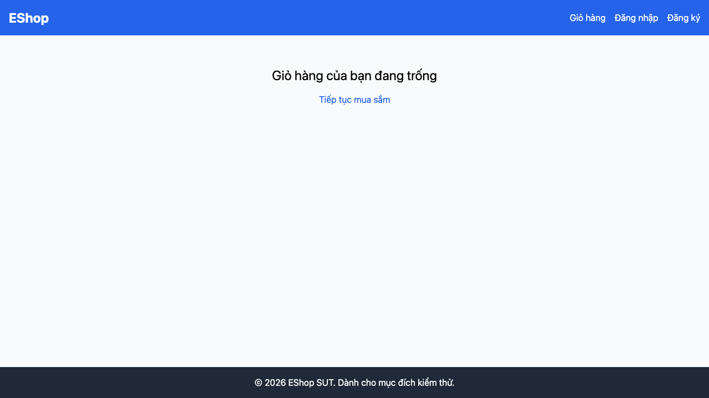

# [BUG][Shopping Cart] Xóa sản phẩm không yêu cầu xác nhận

## Found by Test Case

TC-CART-012 (cũng được tái hiện bởi TC-CART-013)

GitHub Issue: https://github.com/lmchkhi/CS423-CSC15003-Testing-N08/issues/21

## Requirement liên quan

FR-07

## Severity / Priority

Major / P1

## Environment

- Browser: Chromium (Playwright 1.62.1)
- OS: macOS 26.5.2 (25F84)
- URL: http://127.0.0.1:5173/cart
- Build/commit: d76d95f
- Run timestamp: 2026-08-09T05:55:09.293Z

## Steps to reproduce

1. Thêm một sản phẩm vào giỏ và mở trang Giỏ hàng.
2. Chọn nút Xóa trên dòng sản phẩm.
3. Quan sát phản hồi và trạng thái giỏ.

## Expected result

Dialog xác nhận xuất hiện; chỉ xóa sau khi người dùng đồng ý và cho phép hủy thao tác.

## Actual result

Không có dialog; sản phẩm bị xóa ngay lập tức.

## Evidence

[Trace](../../artifacts/shopping-cart/chromium/shopping-cart-FR-07---Giỏ--009dd-log-xóa-giữ-nguyên-sản-phẩm-chromium/trace.zip)
