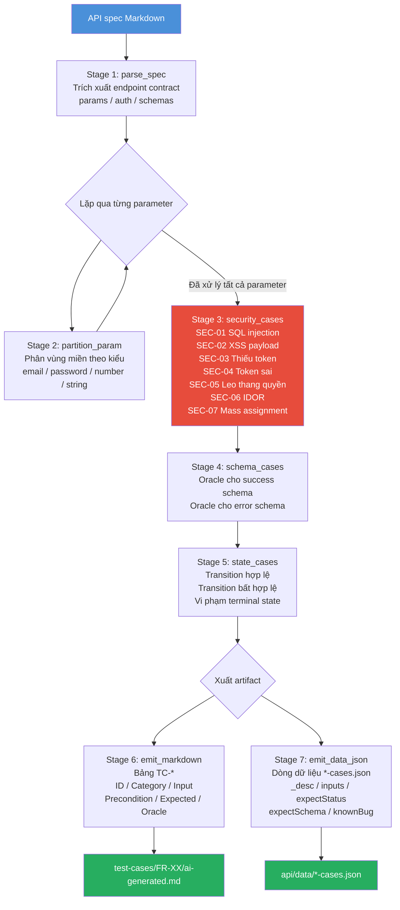

# Sơ đồ AI-driven API Test Generator

File này là bản Mermaid Markdown của sơ đồ thiết kế AI test-generator. Bản PNG dùng để nộp nằm ở `diagrams/test-generator.png`; file nguồn chỉnh sửa Draw.io nằm ở `diagrams/test-generator.drawio`.

## Ghi chú

- `parse_spec` đọc đặc tả API và tạo contract cho endpoint.
- `partition_param` sinh các lớp tương đương và giá trị biên cho từng tham số.
- `security_cases`, `schema_cases`, và `state_cases` thêm oracle về bảo mật, schema response, và state machine.
- `emit_markdown` và `emit_data_json` tạo artifact để review và chạy Newman data-driven.
