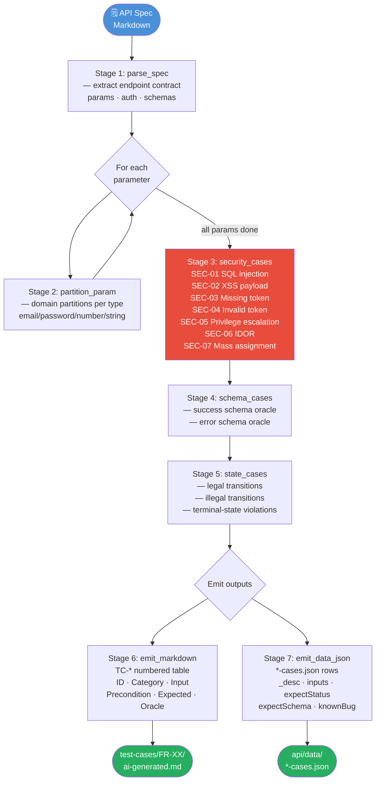

```mermaid
flowchart TD
    A([🗒️ API Spec\nMarkdown]) --> B[Stage 1: parse_spec\n— extract endpoint contract\nparams · auth · schemas]

    B --> C{For each\nparameter}
    C --> D[Stage 2: partition_param\n— domain partitions per type\nemail/password/number/string]
    D --> C
    C -- all params done --> E[Stage 3: security_cases\nSEC-01 SQL injection\nSEC-02 XSS payload\nSEC-03 Missing token\nSEC-04 Invalid token\nSEC-05 Privilege escalation\nSEC-06 IDOR\nSEC-07 Mass assignment]
    E --> F[Stage 4: schema_cases\n— success schema oracle\n— error schema oracle]
    F --> G[Stage 5: state_cases\n— legal transitions\n— illegal transitions\n— terminal-state violations]

    G --> H{Emit outputs}
    H --> I[Stage 6: emit_markdown\nTC-* numbered table\nID · Category · Input\nPrecondition · Expected · Oracle]
    H --> J[Stage 7: emit_data_json\n*-cases.json rows\n_desc · inputs · expectStatus\nexpectSchema · knownBug]

    I --> K([test-cases/FR-XX/\nai-generated.md])
    J --> L([api/data/\n*-cases.json])

    style A fill:#4A90D9,color:#fff
    style K fill:#27AE60,color:#fff
    style L fill:#27AE60,color:#fff
    style E fill:#E74C3C,color:#fff
```