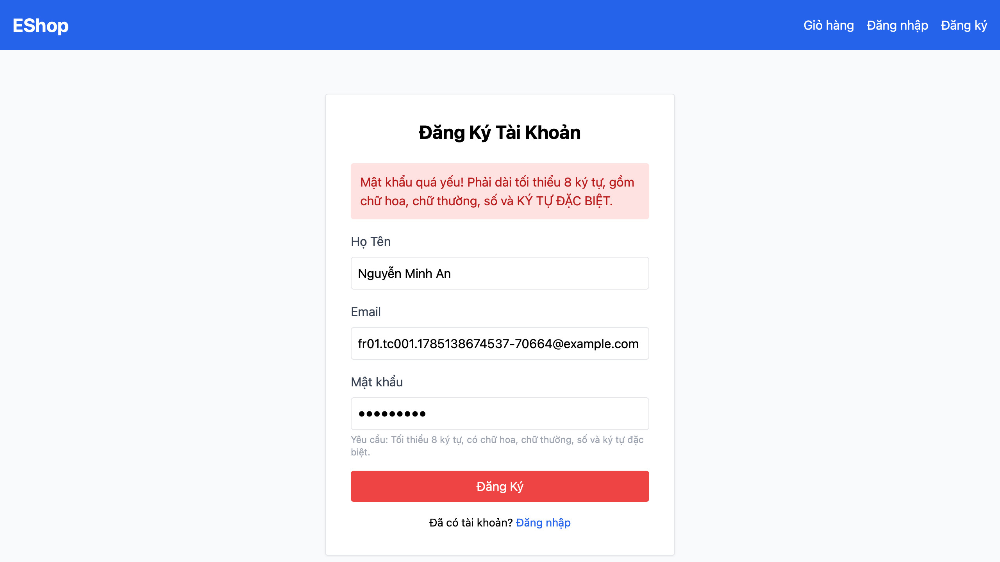

# [BUG][Register] Hệ thống từ chối mật khẩu mạnh hợp lệ

## Found by Test Case

FR01-TC-001  
FR01-TC-007

## Requirement liên quan

FR-01 — Mật khẩu tối thiểu 8 ký tự, có ít nhất 1 chữ hoa, 1 chữ thường, 1 chữ số và 1 ký tự đặc biệt thuộc `@`, `$`, `!`, `%`, `*`, `?`, `&`. Sau khi đăng ký thành công, người dùng được chuyển tới trang Đăng nhập.

## Severity / Priority

Major / P1

## Environment

- Browser: Chromium, Firefox, WebKit
- OS: macOS 26.5.2 (Build 25F84), arm64
- URL: `http://127.0.0.1:5173/register`
- Playwright: 1.62.0
- Base commit: `969e1566f2c1195effaf95fbb322052292cec08a`
- Test build: working tree hiện tại có thay đổi chưa commit

## Steps to reproduce

1. Mở trang Đăng ký tại `http://127.0.0.1:5173/register`.
2. Nhập họ tên hợp lệ.
3. Nhập email chưa tồn tại và đúng định dạng.
4. Nhập mật khẩu `Valid123@` hoặc mật khẩu đúng biên 8 ký tự `Aa1@aaaa`.
5. Bấm Đăng Ký.

## Expected result

Mật khẩu được chấp nhận và người dùng được chuyển tới trang `/login`.

## Actual result

Hệ thống vẫn ở trang `/register` và hiển thị thông báo mật khẩu quá yếu, dù mật khẩu đã thỏa mãn đầy đủ FR-01.

## Evidence

