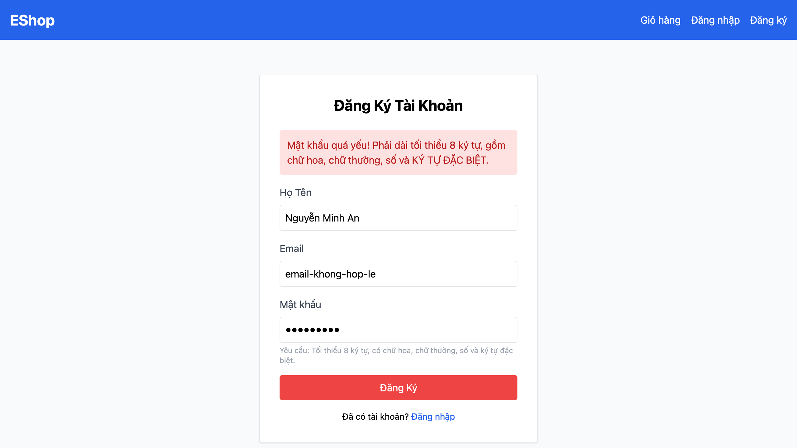

# [BUG][Register] Trường Email không kiểm tra đúng định dạng

## Found by Test Case

FR01-TC-005

## Requirement liên quan

FR-01 — Email phải có định dạng hợp lệ `user@domain.com`.

## Severity / Priority

Major / P1

## Environment

- Browser: Chromium, Firefox, WebKit
- OS: macOS 26.5.2 (Build 25F84), arm64
- URL: `http://127.0.0.1:5173/register`
- Playwright: 1.62.0
- Base commit: `969e1566f2c1195effaf95fbb322052292cec08a`
- Test build: working tree hiện tại có thay đổi chưa commit

## Steps to reproduce

1. Mở trang Đăng ký tại `http://127.0.0.1:5173/register`.
2. Nhập họ tên hợp lệ.
3. Nhập `email-khong-hop-le` vào trường Email.
4. Nhập mật khẩu và xác nhận mật khẩu theo dữ liệu kiểm thử.
5. Bấm Đăng Ký.

## Expected result

Trường Email bị đánh dấu không hợp lệ, form không được gửi và người dùng vẫn ở trang `/register`.

## Actual result

Trình duyệt xem giá trị `email-khong-hop-le` là hợp lệ (`checkValidity() === true`) vì trường Email đang dùng `type="text"` thay vì `type="email"`.

## Evidence

