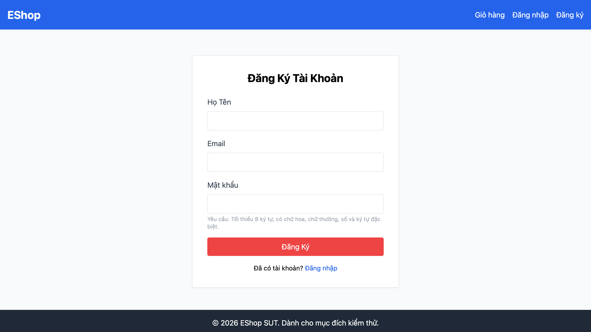

# [BUG][Register] Thiếu trường Xác nhận mật khẩu

## Found by Test Case

FR01-TC-014  
FR01-TC-015

## Requirement liên quan

FR-01 — Form phải có trường Xác nhận mật khẩu và hệ thống phải từ chối khi mật khẩu với xác nhận mật khẩu không khớp.

## Severity / Priority

Major / P1

## Environment

- Browser: Chromium, Firefox, WebKit
- OS: macOS 26.5.2 (Build 25F84), arm64
- URL: `http://127.0.0.1:5173/register`
- Playwright: 1.62.0
- Base commit: `969e1566f2c1195effaf95fbb322052292cec08a`
- Test build: working tree hiện tại có thay đổi chưa commit

## Steps to reproduce

1. Mở trang Đăng ký tại `http://127.0.0.1:5173/register`.
2. Quan sát các trường trên form.
3. Nhập họ tên, email và mật khẩu.
4. Tìm trường Xác nhận mật khẩu để nhập một giá trị khác mật khẩu.

## Expected result

Form có trường Xác nhận mật khẩu dạng `password`. Khi hai mật khẩu không khớp, hệ thống từ chối đăng ký và hiển thị lỗi phù hợp.

## Actual result

Form chỉ có Họ Tên, Email và Mật khẩu. Không có trường Xác nhận mật khẩu nên người dùng không thể nhập hoặc kiểm tra hai giá trị mật khẩu.

## Evidence

