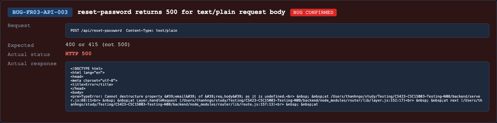

## Found by Test Case
TC-FR03-API-SCH-010

## Requirement liên quan
FR-03, SEC-05

## Severity / Priority
Major / P2

## Environment
Backend API URL: `http://localhost:3000`

Tool: Newman `6.2.2`

Run date: 21/08/2026

## Steps to reproduce
1. Send `POST /api/reset-password`.
2. Set request header `Content-Type: text/plain`.
3. Send a JSON-looking plaintext body containing `email`, `resetToken`, and `newPassword`.

## Expected result
The API rejects the unsupported content type with a client error such as `400` or `415`, and must not crash or expose an unexpected server error.

## Actual result
The API returns `500 Internal Server Error`.

## Evidence
- Newman HTML report: `reports/newman/hw06-fr03-reset-password.html`
- Newman JSON report: `reports/newman/hw06-fr03-reset-password.json`
- Newman CLI log: `reports/newman/hw06-fr03-reset-password-cli.txt`
- CLI failures:
  - `TC-FR03-API-SCH-010 status matches expected`: expected `400 or 415`, got `500`.
  - `TC-FR03-API-SCH-010 no unexpected 5xx`: expected `500` to be below `500`.

- Screenshot: 

## GitHub Issue
https://github.com/lmchkhi/CS423-CSC15003-Testing-N08/issues/270
