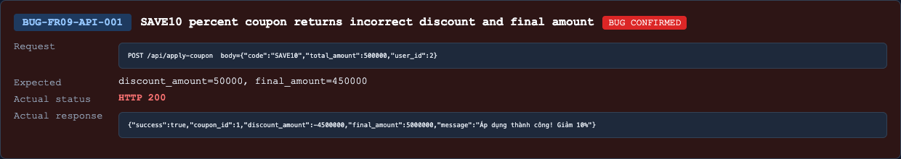

## Found by Test Case
TC-FR09-API-DOM-001, TC-FR09-API-SEC-008, TC-FR09-API-WF-005, TC-FR09-API-WF-006, TC-FR09-API-WF-007, TC-FR09-API-WF-008, TC-FR09-API-SCH-003

## Requirement liên quan
FR-09 C1-C5, FR-09 percent formula, API spec `POST /api/apply-coupon`

## Severity / Priority
Major / P1

## Environment
Backend API URL: `http://localhost:3000`

OS: macOS, local Newman run

Commit/build: `69eaa9b`

Tool: Newman with `htmlextra` and JSON reporter

Required header: `X-Student-Id: 23127475`

## Steps to reproduce
1. Login as a normal user and obtain a valid JWT.
2. Send `POST /api/apply-coupon` with header `Authorization: Bearer <userToken>` and `X-Student-Id: 23127475`.
3. Use request body `{"code":"SAVE10","total_amount":500000,"user_id":<currentUserId>}`.
4. Observe `discount_amount` and `final_amount`.

## Expected result
For `SAVE10`, FR-09 defines `percent` discount as `discount_amount = total * discount_value / 100`.

With `total_amount = 500000` and `discount_value = 10`, expected:

- `discount_amount = 50000`
- `final_amount = 450000`

## Actual result
API returns success but calculates the amount incorrectly:

```json
{
  "success": true,
  "coupon_id": 1,
  "discount_amount": -4500000,
  "final_amount": 5000000,
  "message": "Áp dụng thành công! Giảm 10%"
}
```

## Evidence
Newman HTML report: `reports/newman/hw06-fr09-apply-coupon.html`

Newman JSON report: `reports/newman/hw06-fr09-apply-coupon.json`

Newman CLI output: `reports/newman/hw06-fr09-apply-coupon-cli.txt`

Representative assertion failures:

- `TC-FR09-API-DOM-001`: expected `discount_amount = 50000`, got `-4500000`; expected `final_amount = 450000`, got `5000000`.
- `TC-FR09-API-SCH-003`: expected `discount_amount = 33333`, got `-2999970`; expected `final_amount = 299997`, got `3333300`.


- Screenshot: 

## GitHub Issue
https://github.com/lmchkhi/CS423-CSC15003-Testing-N08/issues/271
