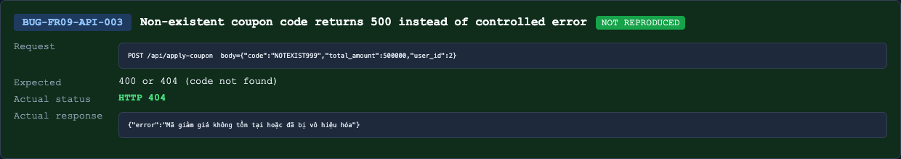

## Found by Test Case
TC-FR09-API-SEC-001, TC-FR09-API-SEC-002, TC-FR09-API-SEC-003, TC-FR09-API-SEC-010

## Requirement liên quan
FR-09 C4, SEC-02

## Severity / Priority
Critical / P1

## Environment
Backend API URL: `http://localhost:3000`

OS: macOS, local Newman run

Commit/build: `69eaa9b`

Tool: Newman with `htmlextra` and JSON reporter

Required header: `X-Student-Id: 23127475`

## Steps to reproduce
1. Prepare a valid user ID through blackbox registration/login setup.
2. Send `POST /api/apply-coupon` with `X-Student-Id: 23127475`.
3. Omit `Authorization`, or send malformed/invalid authorization values such as `Bearer`, `Bearer invalid.token.value`, or a raw token without the `Bearer` prefix.
4. Use body `{"code":"SAVE10","total_amount":500000,"user_id":<userId>}`.

## Expected result
Because FR-09 C4 requires a valid JWT token and SEC-02 requires protected APIs to validate JWT, the API should reject unauthenticated/malformed-token requests with `401` and no discount result.

## Actual result
The API accepts requests without a valid Bearer JWT and returns a success response.

Representative response without `Authorization`:

```json
{
  "success": true,
  "coupon_id": 1,
  "discount_amount": -4500000,
  "final_amount": 5000000,
  "message": "Áp dụng thành công! Giảm 10%"
}
```

## Evidence
Newman HTML report: `reports/newman/hw06-fr09-apply-coupon.html`

Newman JSON report: `reports/newman/hw06-fr09-apply-coupon.json`

Newman CLI output: `reports/newman/hw06-fr09-apply-coupon-cli.txt`

Representative assertion failures:

- `TC-FR09-API-SEC-001`: expected `401`, got `200`.
- `TC-FR09-API-SEC-002`: expected `401`, got `200`.
- `TC-FR09-API-SEC-003`: expected `401`, got `200`.
- `TC-FR09-API-SEC-010`: expected `401`, got `200`.


- Screenshot: 

## GitHub Issue
https://github.com/lmchkhi/CS423-CSC15003-Testing-N08/issues/273
