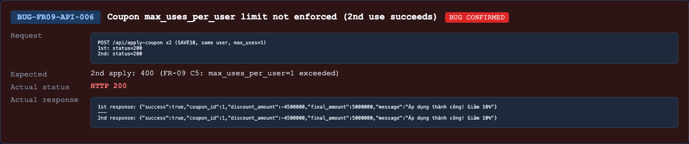

## Found by Test Case
TC-FR09-API-WF-001, TC-FR09-API-WF-004

## Requirement liên quan
FR-09 C5

## Severity / Priority
Major / P1

## Environment
Backend API URL: `http://localhost:3000`

OS: macOS, local Newman run

Commit/build: `69eaa9b`

Tool: Newman with `htmlextra` and JSON reporter

Required header: `X-Student-Id: 23127475`

## Steps to reproduce
1. Register/login a fresh user through public APIs.
2. Apply `SAVE10` successfully once, then apply `SAVE10` again for the same user.
3. Register/login another fresh user.
4. Apply `VIP100` twice successfully, then apply `VIP100` a third time for the same user.

## Expected result
FR-09 C5 states the number of times a user has used a coupon must be less than `max_uses_per_user`.

- `SAVE10` has `max_uses_per_user = 1`, so the second use by the same user should be rejected.
- `VIP100` has `max_uses_per_user = 2`, so the third use by the same user should be rejected.

## Actual result
The API returns `200 OK` and success discount fields after the documented per-user limit is exceeded.

Representative second-use response:

```json
{
  "success": true,
  "coupon_id": 1,
  "discount_amount": -4500000,
  "final_amount": 5000000,
  "message": "Áp dụng thành công! Giảm 10%"
}
```

## Evidence
Newman HTML report: `reports/newman/hw06-fr09-apply-coupon.html`

Newman JSON report: `reports/newman/hw06-fr09-apply-coupon.json`

Newman CLI output: `reports/newman/hw06-fr09-apply-coupon-cli.txt`

Representative assertion failures:

- `TC-FR09-API-WF-001`: expected second `SAVE10` apply to return `400`, got `200`.
- `TC-FR09-API-WF-004`: expected third `VIP100` apply to return `400`, got `200`.


- Screenshot: 

## GitHub Issue
https://github.com/lmchkhi/CS423-CSC15003-Testing-N08/issues/276
