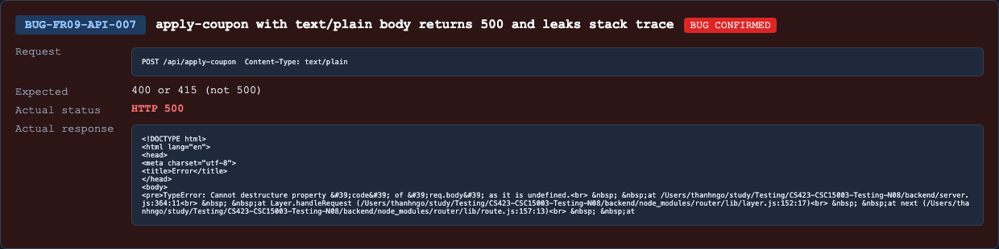

## Found by Test Case
TC-FR09-API-SCH-009

## Requirement liên quan
FR-09, SEC-05, schema/error handling for `POST /api/apply-coupon`

## Severity / Priority
Major / P2

## Environment
Backend API URL: `http://localhost:3000`

OS: macOS, local Newman run

Commit/build: `69eaa9b`

Tool: Newman with `htmlextra` and JSON reporter

Required header: `X-Student-Id: 23127475`

## Steps to reproduce
1. Login as a normal user and obtain a valid JWT.
2. Send `POST /api/apply-coupon` with `Authorization: Bearer <userToken>` and `X-Student-Id: 23127475`.
3. Set `Content-Type: text/plain`.
4. Send JSON-looking raw body `{"code":"SAVE10","total_amount":500000,"user_id":<userId>}`.

## Expected result
Unsupported or invalid request content type should be rejected safely with `400` or `415`.

The response should not be `5xx` and should not leak stack trace/internal file paths.

## Actual result
The API returns `500 Internal Server Error` and an HTML error page with stack trace details.

Representative response excerpt:

```text
TypeError: Cannot destructure property 'code' of 'req.body' as it is undefined.
```

## Evidence
Newman HTML report: `reports/newman/hw06-fr09-apply-coupon.html`

Newman JSON report: `reports/newman/hw06-fr09-apply-coupon.json`

Newman CLI output: `reports/newman/hw06-fr09-apply-coupon-cli.txt`

Representative assertion failures:

- `TC-FR09-API-SCH-009`: expected `400` or `415`, got `500`.
- `TC-FR09-API-SCH-009`: expected no unexpected `5xx`, got `500`.


- Screenshot: 

## GitHub Issue
https://github.com/lmchkhi/CS423-CSC15003-Testing-N08/issues/277
