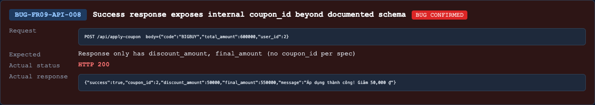

## Found by Test Case
TC-FR09-API-SCH-010

## Requirement liên quan
API spec `POST /api/apply-coupon`, HW06 schema validation requirement

## Severity / Priority
Major / P2

## Environment
Backend API URL: `http://localhost:3000`

OS: macOS, local Newman run

Commit/build: `69eaa9b`

Tool: Newman with `htmlextra` and JSON reporter

Required header: `X-Student-Id: 23127475`

## Steps to reproduce
1. Login as a normal user and obtain a valid JWT.
2. Send `POST /api/apply-coupon` with a valid fixed coupon request.
3. Example body: `{"code":"BIGBUY","total_amount":600000,"user_id":<currentUserId>}`.
4. Inspect success response fields.

## Expected result
API specification states the response contains `discount_amount` and `final_amount`.

For exact schema validation, success response should not expose internal coupon identifiers/configuration fields such as `coupon_id`.

## Actual result
The success response includes `coupon_id`.

Representative response:

```json
{
  "success": true,
  "coupon_id": 2,
  "discount_amount": 50000,
  "final_amount": 550000,
  "message": "Áp dụng thành công! Giảm 50,000 ₫"
}
```

## Evidence
Newman HTML report: `reports/newman/hw06-fr09-apply-coupon.html`

Newman JSON report: `reports/newman/hw06-fr09-apply-coupon.json`

Newman CLI output: `reports/newman/hw06-fr09-apply-coupon-cli.txt`

Representative assertion failure:

- `TC-FR09-API-SCH-010`: expected response not to have property `coupon_id`.


- Screenshot: 

## GitHub Issue
https://github.com/lmchkhi/CS423-CSC15003-Testing-N08/issues/278
