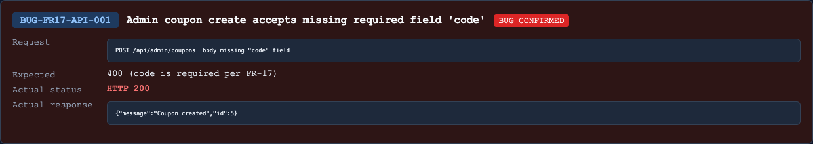

## Found by Test Case
TC-FR17-API-DOM-003, TC-FR17-API-DOM-004, TC-FR17-API-DOM-005, TC-FR17-API-DOM-006, TC-FR17-API-DOM-007, TC-FR17-API-DOM-009, TC-FR17-API-DOM-010, TC-FR17-API-DOM-011, TC-FR17-API-DOM-012, TC-FR17-API-DOM-013, TC-FR17-API-DOM-014, TC-FR17-API-DOM-015, TC-FR17-API-DOM-016, TC-FR17-API-DOM-017, TC-FR17-API-DOM-019, TC-FR17-API-DOM-020, TC-FR17-API-DOM-021, TC-FR17-API-DOM-022, TC-FR17-API-DOM-024, TC-FR17-API-DOM-026, TC-FR17-API-DOM-027, TC-FR17-API-DOM-028, TC-FR17-API-DOM-029, TC-FR17-API-DOM-030, TC-FR17-API-DOM-031, TC-FR17-API-DOM-032, TC-FR17-API-SEC-006, TC-FR17-API-WF-005, TC-FR17-API-SCH-003

## Requirement liên quan
FR-17 Coupon CRUD: required fields `code`, `type`, `discount_value`, `expired_at`, `min_order_amount`, `max_uses_per_user`; `type` must be `percent/fixed`; `discount_value` must be positive; `min_order_amount >= 0`; `max_uses_per_user >= 1`.

## Severity / Priority
Critical / P0

## Environment
Backend API URL: `http://localhost:3000`

OS: macOS, local Newman run

Commit/build: `0af3548`

Tool: Newman with `htmlextra` and JSON reporter

Required header: `X-Student-Id: 23127475`

## Steps to reproduce
1. Login as admin and obtain a JWT.
2. Send `POST /api/admin/coupons` with `Authorization: Bearer <adminToken>` and `X-Student-Id: 23127475`.
3. Use an invalid body, for example missing `code`:

```json
{
  "type": "fixed",
  "discount_value": 10000,
  "min_order_amount": 0,
  "expired_at": "2099-12-31",
  "max_uses_per_user": 1
}
```

4. Repeat with other invalid partitions: null/empty/wrong-type `code`, invalid `type`, missing/null/zero/negative/wrong-type numeric fields, missing/null/malformed `expired_at`.

## Expected result
API returns `400` with a safe JSON error body and does not create a coupon for invalid FR-17 fields.

## Actual result
API returns `200 OK` and creates coupons for invalid request bodies. Newman also verified rejected/removed codes are present in the coupon list for many invalid partitions.

Representative Newman failures:

- `TC-FR17-API-DOM-003`: expected `400`, got `200`.
- `TC-FR17-API-DOM-026`: expected `400`, got `200`; created coupon remained visible in list before cleanup.
- `TC-FR17-API-SEC-006`: invalid SQLi-like `type` was accepted and listed.

## Evidence
Newman HTML report: `reports/newman/hw06-fr17-admin-coupons.html`

Newman JSON report: `reports/newman/hw06-fr17-admin-coupons.json`

Newman CLI output: `reports/newman/hw06-fr17-admin-coupons-cli.txt`


- Screenshot: 

## GitHub Issue
https://github.com/lmchkhi/CS423-CSC15003-Testing-N08/issues/282
