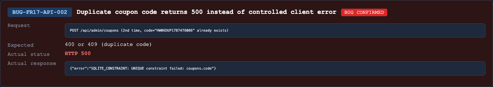

## Found by Test Case
TC-FR17-API-DOM-008, TC-FR17-API-WF-002, TC-FR17-API-WF-007

## Requirement liên quan
FR-17 Coupon CRUD: `code` must be unique. Duplicate create should be rejected safely.

## Severity / Priority
Major / P1

## Environment
Backend API URL: `http://localhost:3000`

OS: macOS, local Newman run

Commit/build: `0af3548`

Tool: Newman with `htmlextra` and JSON reporter

Required header: `X-Student-Id: 23127475`

## Steps to reproduce
1. Login as admin and obtain a JWT.
2. Create a coupon with a unique code, for example `HW06DUP_<runId>`.
3. Send a second `POST /api/admin/coupons` request using the same `code`.
4. Observe the response status.

## Expected result
API returns `400` or `409` with a safe JSON error body. The server must not crash and must not overwrite the original coupon.

## Actual result
API returns `500 Internal Server Error` for duplicate coupon create.

Representative Newman failures:

- `TC-FR17-API-DOM-008`: expected `[400,409]`, got `500`.
- `TC-FR17-API-WF-002`: expected `[400,409]`, got `500`.
- `TC-FR17-API-WF-007`: expected `[400,409]`, got `500`.

## Evidence
Newman HTML report: `reports/newman/hw06-fr17-admin-coupons.html`

Newman JSON report: `reports/newman/hw06-fr17-admin-coupons.json`

Newman CLI output: `reports/newman/hw06-fr17-admin-coupons-cli.txt`

- Screenshot: 

## GitHub Issue
https://github.com/lmchkhi/CS423-CSC15003-Testing-N08/issues/280
