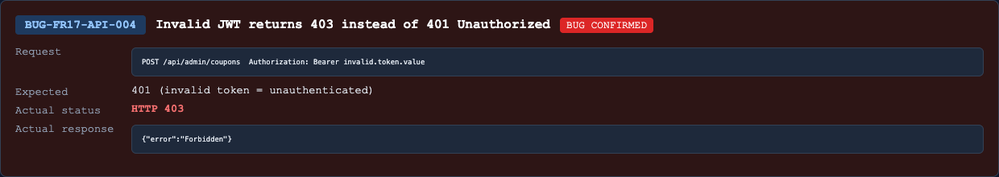

## Found by Test Case
TC-FR17-API-SEC-003

## Requirement liên quan
FR-12 Access Control, SEC-02.

Admin APIs must require a valid JWT token. Invalid token should fail authentication.

## Severity / Priority
Minor / P2

## Environment
Backend API URL: `http://localhost:3000`

OS: macOS, local Newman run

Commit/build: `0af3548`

Tool: Newman with `htmlextra` and JSON reporter

Required header: `X-Student-Id: 23127475`

## Steps to reproduce
1. Send `POST /api/admin/coupons` with header `Authorization: Bearer invalid.token.value`.
2. Include `X-Student-Id: 23127475`.
3. Use an otherwise valid coupon body.

## Expected result
API returns `401 Unauthorized` because the token is invalid.

## Actual result
API returns `403 Forbidden`.

Representative Newman failure:

- `TC-FR17-API-SEC-003`: expected `401`, got `403`.

## Evidence
Newman HTML report: `reports/newman/hw06-fr17-admin-coupons.html`

Newman JSON report: `reports/newman/hw06-fr17-admin-coupons.json`

Newman CLI output: `reports/newman/hw06-fr17-admin-coupons-cli.txt`

- Screenshot: 

## GitHub Issue
https://github.com/lmchkhi/CS423-CSC15003-Testing-N08/issues/279
