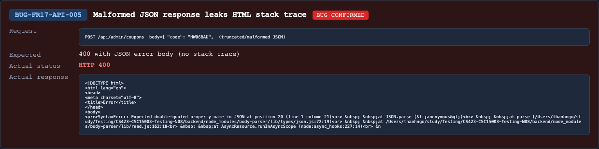

## Found by Test Case
TC-FR17-API-SCH-004

## Requirement liên quan
FR-17 Coupon CRUD, schema validation, SEC-05 safe error handling.

## Severity / Priority
Major / P1

## Environment
Backend API URL: `http://localhost:3000`

OS: macOS, local Newman run

Commit/build: `0af3548`

Tool: Newman with `htmlextra` and JSON reporter

Required header: `X-Student-Id: 23127475`

## Steps to reproduce
1. Login as admin and obtain a JWT.
2. Send `POST /api/admin/coupons` with `Content-Type: application/json`.
3. Include malformed JSON body:

```text
{ "code": "HW06BAD",
```

## Expected result
API returns `400` with safe JSON error body, for example a `message` or `error` string, and no stack trace/internal path.

## Actual result
API returns `400 Bad Request`, but response is `text/html; charset=utf-8` and includes parser stack trace details.

Representative Newman failures:

- Expected `Content-Type` to include `application/json`, got `text/html; charset=utf-8`.
- Expected response to contain `message` or `error`, got HTML stack trace.

## Evidence
Newman HTML report: `reports/newman/hw06-fr17-admin-coupons.html`

Newman JSON report: `reports/newman/hw06-fr17-admin-coupons.json`

Newman CLI output: `reports/newman/hw06-fr17-admin-coupons-cli.txt`


- Screenshot: 

## GitHub Issue
https://github.com/lmchkhi/CS423-CSC15003-Testing-N08/issues/281
