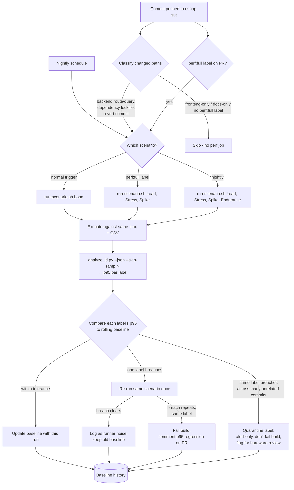

# HW05 Task 3 - Đề xuất Continuous Performance Testing (G9.6)

## 1. Mô hình đề xuất

Không chạy performance test trên mọi commit - chi phí một lần chạy Spike
đầy đủ ở quy mô của bài này đã là hơn 300s và gần 470k mẫu (`reports/run-manifest.md`).
Mô hình đề xuất là một pipeline theo dõi commit của SUT (`eshop-sut`), phân
loại commit đó bằng đường dẫn file thay đổi, quyết định có cần chạy hay
không và chạy kịch bản nào, rồi so kết quả với baseline theo từng label -
tái dùng nguyên vẹn hạ tầng đã có ở bài này thay vì dựng công cụ mới:

- **Test plan**: chính 4 file `.jmx` đã chấm điểm
  (`perf/plans/jmeter/23127300_{Load,Stress,Spike,Endurance}_20260814.jmx`)
  - không nhân bản, không viết lại cho CI.
- **Dữ liệu**: cùng `perf/data/accounts.csv` / `products.csv`, tái tạo bằng
  `perf/scripts/seed-accounts.sh` mỗi lần chạy để không cạn dữ liệu qua
  nhiều lần CI (đúng nguyên tắc data-driven §6 và bài học "mỗi VU một hàng
  riêng" đã áp dụng ở Task 1).
- **Bộ thực thi**: `perf/scripts/run-scenario.sh <Scenario> [--fresh]` -
  script này đã tự reset lockout trước khi chạy và ghi `.jtl`/HTML
  dashboard/resource trace cùng một stem, nên CI chỉ cần gọi đúng lệnh đã
  dùng thủ công ở Task 1.
- **Bộ so sánh**: `perf/scripts/analyze_jtl.py --json --skip-ramp N` - đã
  có sẵn chế độ output máy đọc được (`--json`) và chế độ bỏ ramp-up, đúng
  hai thứ một job CI cần để so p95 theo từng label mà không phải viết lại
  logic phân tích.

Không có thành phần nào trong mô hình là công cụ mới; nó là cách lắp lại
đúng 4 mảnh đã kiểm chứng ở Task 1/2 thành một vòng lặp tự động.

## 2. Lưu đồ

## 3. Tiêu chí quyết định chạy test

| Tín hiệu từ commit | Hành động | Lý do |
|---|---|---|
| Sửa route/handler hoặc câu truy vấn ở backend | Chạy full (Load + Stress + Spike) | Đây chính là tầng mà 3 kịch bản của HW05 đo - thay đổi ở đây có khả năng cao nhất làm dịch p95 hoặc error % theo từng label. |
| Đổi dependency lockfile (`package-lock.json` hoặc tương đương) | Chạy full | Nâng cấp một thư viện (driver DB, HTTP framework...) có thể đổi hành vi hiệu năng mà không đổi một dòng code nghiệp vụ nào - diff code sẽ trống nhưng rủi ro hiệu năng thì không. |
| Chỉ sửa frontend hoặc tài liệu (`docs/`, `README`, `*.md`) | Bỏ qua (skip) | Không chạm tới bất kỳ endpoint nào trong 7 sampler của Workflow 5; chạy vẫn tốn tài nguyên runner mà không sinh tín hiệu mới. |
| PR gắn nhãn `perf:full` | Ép chạy full, bất kể phân loại đường dẫn | Van thoát cho người review - một thay đổi "nhìn có vẻ an toàn" theo đường dẫn vẫn có thể cần đo nếu người viết PR nghi ngờ tác động hiệu năng. |
| Lịch nightly | Luôn chạy full + Endurance | Đây là chỗ duy nhất chạy Endurance (15 phút) - quá tốn để chạy theo từng PR, nhưng cần chạy đều đặn để bắt trôi dạt chậm (rò rỉ bộ nhớ) mà một lần chạy PR ngắn không thấy được, đúng như mục 2.7 của báo cáo chính đã đo. |
| Commit revert | Chạy full | Xác nhận việc revert thật sự đưa hệ thống về lại đúng baseline hiệu năng trước đó, không chỉ về lại đúng code - một revert sai vị trí (revert nhầm phần không liên quan) vẫn có thể để lại tác động hiệu năng. |

## 4. Phát hiện hồi quy p95

- **Baseline**: median trượt của N=7 lần chạy xanh gần nhất, cùng runner
  class (không trộn số từ máy khác cấu hình khác). Chọn 7 chứ không phải 1
  vì chính bộ dữ liệu HW05 đã cho thấy một lần chạy đơn lẻ dao động do phần
  cứng dùng chung: `07 POST /api/checkout` p95 đi từ 7ms đến 9ms xuyên suốt
  sweep calibration 25–300 luồng dù không có gì thay đổi ở SUT
  (`perf/results/calibration/calibration-20260814.md`, bảng "Knee sweep") -
  lấy 1 lần chạy làm baseline sẽ khoá vào đúng lúc dao động đó. Median của
  7 lần đủ để lọc dao động đơn lẻ mà vẫn phản ứng trong vòng một tuần làm
  việc bình thường.
- **So sánh theo từng label, không theo tổng hợp**: đúng bài học rút ra ở
  Task 2 (`reports/ai-analysis-review.md` mục 2.2) - p95 gộp cả 7 sampler
  che mất việc một label cụ thể (ví dụ checkout) trượt trong khi các label
  khác kéo trung bình xuống. So sánh phải chạy trên chính output theo-label
  của `analyze_jtl.py`, không phải dòng `ALL`.
- **Ngưỡng báo động**: vượt baseline **40%** *và* vượt một sàn tuyệt đối
  **+3ms**, cả hai điều kiện cùng đúng mới báo. Lý do cần cả hai: các
  sampler đọc (`04`, `05`) và transactional (`06`) ở p95 dưới 10ms trong cả
  4 lần chạy đã chấm điểm (`reports/run-manifest.md`) - với độ trễ nhỏ cỡ
  này, một dao động 2ms do phần cứng dùng chung (như bảng knee-sweep ở trên)
  đã là 20–30% tương đối, đủ để một ngưỡng phần trăm thuần tuý báo động giả
  liên tục; sàn tuyệt đối +3ms lọc bỏ đúng loại nhiễu đó. Ngược lại, với
  label chậm như `01 POST /api/forgot-password` ở Spike (p95 152ms), sàn
  tuyệt đối 3ms gần như luôn bị vượt - phần trăm 40% mới là điều kiện có ý
  nghĩa ở quy mô đó.
- **Hai lần vi phạm liên tiếp mới fail build**: một lần vi phạm chạy lại
  ngay (`RETRY` trong lưu đồ); chỉ khi lần chạy lại vẫn vi phạm đúng label
  đó mới fail. Cơ sở: chính bộ khung đo của bài này chạy JMeter và SUT
  **chung 12 lõi** (`perf/results/calibration/calibration-20260814.md` mục
  "Hardware and harness") - một CI runner dùng chung tài nguyên với job
  khác cũng sẽ có kiểu nhiễu tương tự, và yêu cầu lặp lại trước khi fail là
  cách rẻ nhất để phân biệt nhiễu runner một lần khỏi hồi quy thật.

## 5. Đánh đổi

| Đánh đổi | Thảo luận |
|---|---|
| Chi phí | Full (Load+Stress+Spike) tốn khoảng 22 phút wall-clock theo đúng thời lượng đã đo ở 4 lần chạy chấm điểm (362s+607s+306s ≈ 21 phút, chưa kể Endurance 903s nếu chạy nightly) - không rẻ để chạy trên mọi PR, đây là lý do bảng phân loại ở mục 3 chỉ chạy full khi tín hiệu commit thật sự đáng ngờ, và để Load-only (ngắn hơn nhiều, 362s) làm mặc định cho các PR "an toàn" theo phân loại nhưng vẫn chạm backend. |
| Báo động giả | Ngưỡng hai điều kiện (phần trăm + sàn tuyệt đối) và yêu cầu 2 lần vi phạm liên tiếp (mục 4) trực tiếp nhắm vào loại nhiễu mà chính calibration của bài này đã đo được (dao động p95 2ms trên sampler dưới 10ms, JMeter và SUT tranh chấp cùng 12 lõi) - không phải suy đoán, mà lấy thẳng biên độ nhiễu đã quan sát làm cơ sở đặt ngưỡng. |
| Độ trễ phản hồi cho dev | Load-only trên PR thường (362s ≈ 6 phút) đủ nhanh để nằm trong vòng lặp review bình thường; full chỉ kích hoạt khi phân loại đường dẫn hoặc nhãn `perf:full` báo hiệu rủi ro cao hơn, nên phần lớn PR không phải chờ 22 phút. Cái giá phải trả: một PR đổi route backend nhưng bị phân loại nhầm là "an toàn" sẽ không có full run cho tới nightly - độ trễ phát hiện tối đa là một ngày thay vì một PR. |
| Nhiễu do phần cứng runner | Cùng một máy 12 lõi dùng cho cả HW05 đã cho thấy JMeter tự tốn tới 168.6% CPU ở 300 luồng và cạnh tranh trực tiếp với SUT (`perf/results/calibration/calibration-20260814.md`) - một CI runner chia sẻ (đặc biệt là runner ảo hoá dùng chung với job khác) sẽ nhiễu hơn máy cá nhân này, không kém đi. Cơ chế quarantine ở lưu đồ (một label liên tục báo động qua nhiều commit không liên quan) là van an toàn cho đúng trường hợp này: chuyển label đó sang chỉ-cảnh-báo thay vì chặn build, và đánh dấu cần xem lại runner class thay vì code. |
