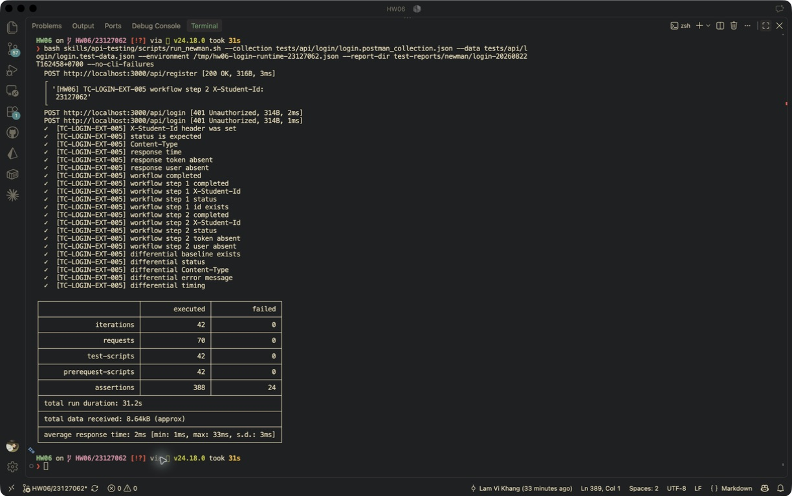
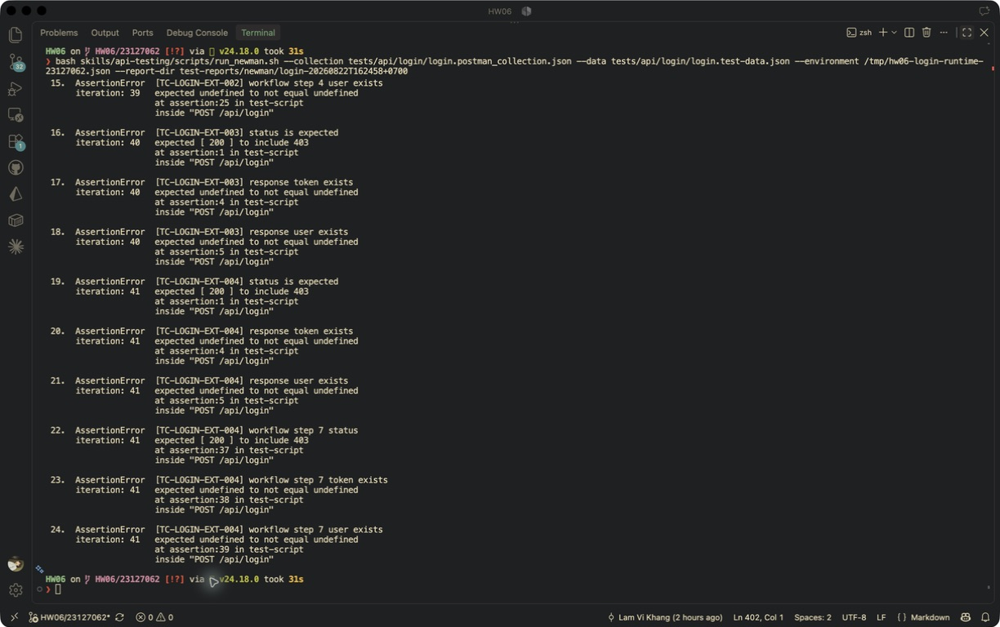
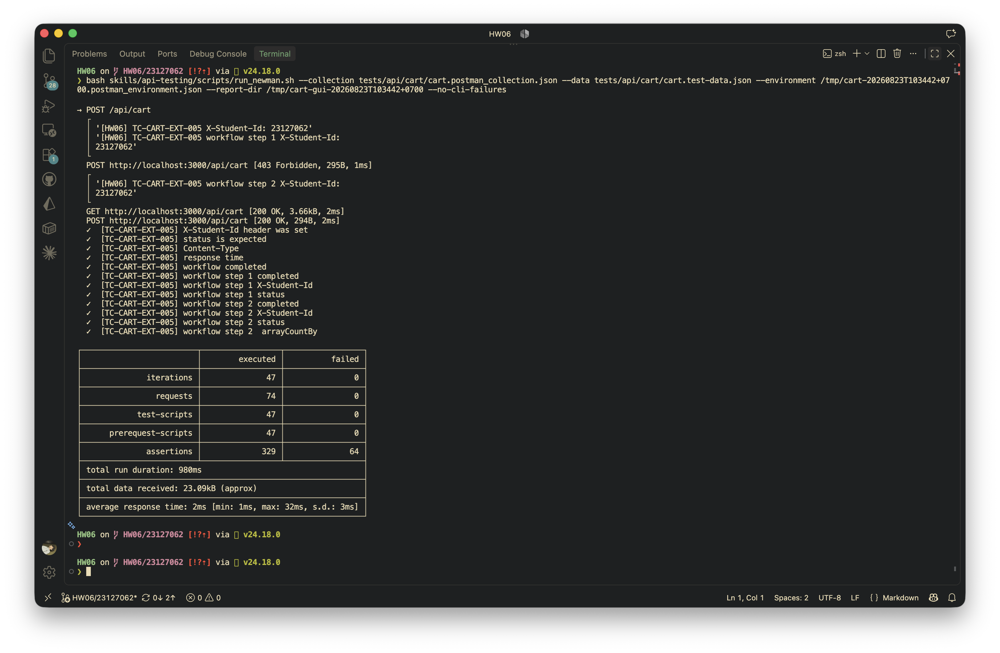

# HW06 - API Testing

## Thông tin chung

| Mục            | Thông tin                                               |
| -------------- | ------------------------------------------------------- |
| Họ và tên      | Lâm Vĩ Khang                                            |
| MSSV           | 23127062                                                |
| Lớp            | 23KTPM3                                                 |
| Nhóm           | N08                                                     |
| Repository     | <https://github.com/lmchkhi/CS423-CSC15003-Testing-N08> |
| Ngày thực hiện | 18/08/2026 - 23/08/2026                                 |

## 1. Giới thiệu

### 1.1. Mục tiêu

Mục tiêu của bài tập là sử dụng AI theo từng bước để sinh test case từ API specification của SUT, sau đó thực hiện human review, hiệu chỉnh và bổ sung các trường hợp AI bỏ sót. Bộ kiểm thử cần bao phủ domain partition, state transition, security (SEC-01 đến SEC-07) và response schema validation; được thực thi bằng Postman/Newman với evidence thực tế và dùng để báo cáo các lỗi xác nhận được. Bài tập đồng thời yêu cầu tích hợp test suite vào CI/CD và thiết kế một AI-driven API test generator dưới dạng Agent Skill, qua đó thể hiện các năng lực Bloom-AI G9.2 đến G9.5.

### 1.2. System Under Test

| Mục                            | Thông tin                                                                                                                                                                      |
| ------------------------------ | ------------------------------------------------------------------------------------------------------------------------------------------------------------------------------ |
| Tên hệ thống                   | EShop                                                                                                                                                                          |
| Repository gốc                 | <https://github.com/ttbhanh/eshop-sut>                                                                                                                                         |
| Phiên bản/commit được kiểm thử | `85af3ba875c88283615e22cb108f13e2fccaf0e9`                                                                                                                                     |
| Base URL                       | `http://localhost:3000`                                                                                                                                                        |
| Môi trường kiểm thử            | Local trên macOS 26.5.2; backend Node.js 24.18.0, Express 5.2.1 và SQLite 3 (package `sqlite3` 6.0.1); chạy API test bằng Newman 6.2.2 với `newman-reporter-htmlextra` 1.23.1. |

### 1.3. Công cụ sử dụng

| Công cụ      | Phiên bản       | Mục đích        |
| ------------ | --------------- | --------------- |
| `{{TOOL_1}}` | `{{VERSION_1}}` | `{{PURPOSE_1}}` |
| `{{TOOL_2}}` | `{{VERSION_2}}` | `{{PURPOSE_2}}` |
| `{{TOOL_3}}` | `{{VERSION_3}}` | `{{PURPOSE_3}}` |

## 2. Lựa chọn API

Ba API được chọn thuộc ba pool khác nhau và không trùng với lựa chọn của thành viên khác trong nhóm.

| API   | Pool   | Feature                                 | Method và endpoint          |
| ----- | ------ | --------------------------------------- | --------------------------- |
| API 1 | Pool A | FR-02 - Login and account lockout       | `POST /api/login`           |
| API 2 | Pool B | FR-07 - Giỏ hàng (Shopping Cart)        | `POST /api/cart`            |
| API 3 | Pool C | FR-15 - Quản lý sản phẩm (Product CRUD) | `{{METHOD_ENDPOINT_API_3}}` |

## 3. API 1 - `POST /api/login`

### 3.1. Đặc tả và phạm vi kiểm thử

- Feature/requirement: FR-02 - Login and account lockout
- Tham số path: Không có; endpoint cố định là `/api/login`.
- Tham số query: Đặc tả không định nghĩa query parameter. Suite có một negative test với query thừa `debug=true` để kiểm tra tham số này không bypass credentials sai.
- Headers: `Content-Type: application/json` và `X-Student-Id: 23127062` theo yêu cầu bài tập. API đăng nhập là public nên không yêu cầu `Authorization`; suite kiểm tra login hợp lệ khi không gửi header này.
- Request body: JSON object gồm hai trường `email` và `password`. Coverage bao gồm credentials hợp lệ, sai, thiếu trường, `null`, chuỗi rỗng, whitespace, sai kiểu dữ liệu, body không phải object, body bị bỏ qua và các tổ hợp tương tác.
- Response schema: Khi thành công, API trả HTTP `200` và JSON object chứa `token` dạng JWT cùng object `user`; `user` phải có `id`, `email`, `role` và không được chứa `password`. Đặc tả chưa quy định chính xác status/schema cho nhiều response lỗi, vì vậy các oracle tương ứng được đánh dấu `INCOMPLETE` thay vì tự kết luận là product defect.
- Yêu cầu bảo mật áp dụng: SEC-01 (không lưu hoặc trả mật khẩu plaintext) và SEC-05 (Parameterized Query/chống SQL injection). Suite còn bao phủ information leakage, user enumeration, XSS/CRLF/NoSQL-style injection, unknown field `role`, oversized input và Content-Type confusion.
- Trạng thái và transition liên quan: tài khoản ban đầu ở trạng thái không khóa; mỗi lần sai tăng bộ đếm đúng một; sau hai lần sai vẫn chưa khóa; từ lần sai thứ ba tài khoản bị khóa 30 giây; đăng nhập đúng trước ngưỡng phải thành công và reset chuỗi sai; đăng nhập khi đang khóa phải bị từ chối; sau thời hạn khóa phải đăng nhập lại được.

Nguồn thiết kế phạm vi: [API specification](../api_specification.md), [FR-02 và security requirements](../README.md), [coverage matrix](../tests/api/login/coverage-matrix.md).

### 3.2. Generate with AI

Yêu cầu ban đầu cung cấp endpoint `POST /api/login` và MSSV `23127062`, sau đó reusable skill `api-testing` chia quy trình sinh test thành các bước có kiểm soát:

1. Đọc API specification để xác nhận method, route, request body và success response; đọc FR-02 cùng SEC-01 đến SEC-07 để xác lập oracle.
2. Lập coverage matrix cho path, query, headers, từng trường body, top-level body, response schema và trạng thái khóa tài khoản.
3. Phân hoạch dữ liệu thành valid, invalid, missing, `null`, empty, whitespace, type confusion, boundary và interaction; bổ sung các nhóm security và schema validation.
4. Không tự đặt expected behavior cho phần đặc tả còn mơ hồ. Những ca thiếu status/schema lỗi chính xác được gắn agent audit `INCOMPLETE` và chờ human review.
5. Materialize 37 test case gắn nguồn `ai-generated` thành suite manifest và các file Markdown riêng, sau đó validate cấu trúc suite và sinh collection/data-driven artifacts. Skill không sinh trước phần Extend; các case do sinh viên bổ sung chỉ được thêm sau khi sinh viên tự viết và cung cấp nội dung.

Danh sách và metadata đầy đủ được lưu trong [suite manifest](../tests/api/login/suite.manifest.json) và [thư mục test case Login](../tests/test-cases/login/).

| Nhóm coverage     | Số test case | Ghi chú                                                                                                                                                                                |
| ----------------- | -----------: | -------------------------------------------------------------------------------------------------------------------------------------------------------------------------------------- |
| Domain partition  |           31 | Bao phủ credentials, missing/null/empty/whitespace, type confusion, body shape, boundary và query/header interaction.                                                                  |
| State transition  |            1 | TC-LOGIN-001 kiểm tra transition từ chưa xác thực/tài khoản không khóa sang đã xác thực bằng JWT. Các transition lockout sâu hơn được để lại cho phần Extend do sinh viên tự thiết kế. |
| Security          |           17 | Bao phủ SEC-01, SEC-04/SEC-05 và các nguy cơ injection, leakage, mass assignment, oversized input, Content-Type confusion.                                                             |
| Schema validation |            5 | Kiểm tra JWT, object `user`, các trường bắt buộc và cấm lộ `password`.                                                                                                                 |
| Tổng AI-generated |           37 | Các coverage family có thể chồng lấp; một test case có thể thuộc nhiều nhóm.                                                                                                           |

### 3.3. Audit - Human review

| Kết quả audit | Số lượng | Test case                                |
| ------------- | -------: | ---------------------------------------- |
| VALID         |        6 | TC-LOGIN-001, 002, 027, 028, 029, 037    |
| INVALID       |        2 | TC-LOGIN-005, 031                        |
| INCOMPLETE    |       29 | TC-LOGIN-003, 004, 006-026, 030, 032-036 |

| Test case    | Kết quả    | Lý do và điều chỉnh                                                                                                                                |
| ------------ | ---------- | -------------------------------------------------------------------------------------------------------------------------------------------------- |
| TC-LOGIN-001 | VALID      | Đúng FR-02 và SEC-01: credentials hợp lệ phải trả JWT, user object và không lộ password.                                                           |
| TC-LOGIN-002 | VALID      | Đúng FR-02 cho tài khoản admin; oracle thành công và schema JWT/user phù hợp.                                                                      |
| TC-LOGIN-003 | INCOMPLETE | Oracle email viết hoa phải đăng nhập thành công không có trong đặc tả; đã đổi thành email thiếu `@` và chấp nhận các status từ chối 4xx phù hợp.   |
| TC-LOGIN-004 | INCOMPLETE | Đặc tả không quy định trim email; đã đổi thành email thiếu domain và kiểm tra request bị từ chối, không cấp token.                                 |
| TC-LOGIN-005 | INVALID    | Case cũ dùng email không tồn tại nên không kiểm được ảnh hưởng của khoảng trắng trong password; đã sửa dùng email hợp lệ.                          |
| TC-LOGIN-006 | INCOMPLETE | Đặc tả không quy định status/schema lỗi cho email chưa đăng ký; đã bỏ schema `error` tự suy diễn và dùng oracle 4xx không cấp token.               |
| TC-LOGIN-007 | INCOMPLETE | Case cũ trùng partition email chưa đăng ký; đã đổi sang email tồn tại với password sai và kiểm tra không cấp token.                                |
| TC-LOGIN-008 | INCOMPLETE | Thiếu email phải bị từ chối nhưng đặc tả không chốt status/schema; đã dùng nhóm 4xx và bỏ schema lỗi tự suy diễn.                                  |
| TC-LOGIN-009 | INCOMPLETE | Thiếu password phải bị từ chối nhưng đặc tả không chốt status/schema; đã dùng nhóm 4xx và bỏ schema lỗi tự suy diễn.                               |
| TC-LOGIN-010 | INCOMPLETE | Thiếu cả hai trường chưa có error contract; đã giữ negative partition và chỉ yêu cầu 4xx, không token/user.                                        |
| TC-LOGIN-011 | INCOMPLETE | Email `null` chưa có error contract; đã bỏ kỳ vọng chính xác 400 và trường `error`.                                                                |
| TC-LOGIN-012 | INCOMPLETE | Password `null` chưa có error contract; đã bỏ kỳ vọng chính xác 400 và trường `error`.                                                             |
| TC-LOGIN-013 | INCOMPLETE | Email rỗng chưa có error contract; đã dùng oracle từ chối 4xx và không cấp token.                                                                  |
| TC-LOGIN-014 | INCOMPLETE | Password rỗng chưa có error contract; đã dùng oracle từ chối 4xx và không cấp token.                                                               |
| TC-LOGIN-015 | INCOMPLETE | Email whitespace chưa có quy tắc normalize; đã yêu cầu từ chối thay vì suy diễn schema lỗi.                                                        |
| TC-LOGIN-016 | INCOMPLETE | Password whitespace là credentials sai nhưng status chưa được quy định; đã chấp nhận nhóm 4xx và kiểm tra không cấp token.                         |
| TC-LOGIN-017 | INCOMPLETE | Email number phải bị từ chối nhưng status/schema chưa được mô tả; đã bỏ oracle error object tự suy diễn.                                           |
| TC-LOGIN-018 | INCOMPLETE | Password number phải bị từ chối nhưng status/schema chưa được mô tả; đã bỏ oracle error object tự suy diễn.                                        |
| TC-LOGIN-019 | INCOMPLETE | Email boolean phải bị từ chối nhưng status/schema chưa được mô tả; đã dùng oracle 4xx không token/user.                                            |
| TC-LOGIN-020 | INCOMPLETE | Password boolean phải bị từ chối nhưng status/schema chưa được mô tả; đã dùng oracle 4xx không token/user.                                         |
| TC-LOGIN-021 | INCOMPLETE | Email object là type-confusion hợp lệ nhưng error contract bị tự suy diễn; đã giữ payload và nới oracle về 4xx.                                    |
| TC-LOGIN-022 | INCOMPLETE | Password object là type-confusion hợp lệ nhưng error contract bị tự suy diễn; đã giữ payload và nới oracle về 4xx.                                 |
| TC-LOGIN-023 | INCOMPLETE | Top-level `null` phải bị từ chối an toàn nhưng đặc tả không chốt response; đã bỏ schema lỗi bắt buộc.                                              |
| TC-LOGIN-024 | INCOMPLETE | Top-level array phải bị từ chối an toàn nhưng đặc tả không chốt response; đã bỏ schema lỗi bắt buộc.                                               |
| TC-LOGIN-025 | INCOMPLETE | Top-level string phải bị từ chối an toàn nhưng đặc tả không chốt response; đã bỏ schema lỗi bắt buộc.                                              |
| TC-LOGIN-026 | INCOMPLETE | Request không body phải bị từ chối nhưng error contract chưa có; đã dùng oracle 4xx không token/user.                                              |
| TC-LOGIN-027 | VALID      | Body contract chỉ có email/password; field `role` thừa không được nâng quyền và role trả về phải theo tài khoản thực.                              |
| TC-LOGIN-028 | VALID      | Payload SQL injection ở email kiểm trực tiếp SEC-05 và yêu cầu không bypass authentication.                                                        |
| TC-LOGIN-029 | VALID      | Payload SQL injection ở password kiểm trực tiếp SEC-05 và yêu cầu không bypass authentication.                                                     |
| TC-LOGIN-030 | INCOMPLETE | Ý tưởng injection hợp lệ nhưng status/schema lỗi chưa được đặc tả; đã dùng nhóm 4xx và không token/user.                                           |
| TC-LOGIN-031 | INVALID    | SEC-04 áp dụng tại UI boundary, không phải oracle trực tiếp cho login API; đã bỏ mapping SEC-04 và đổi mục tiêu thành không bypass authentication. |
| TC-LOGIN-032 | INCOMPLETE | CRLF payload cần bị từ chối nhưng exact status/schema chưa có; đã dùng nhóm 4xx và không token/user.                                               |
| TC-LOGIN-033 | INCOMPLETE | Không có giới hạn độ dài email cụ thể; đã giữ robustness case và chấp nhận 400/401/413/422/429 thay vì ép 400.                                     |
| TC-LOGIN-034 | INCOMPLETE | Đặc tả chỉ yêu cầu body JSON, không định nghĩa response cho `text/plain`; đã chấp nhận 400/415/422 và bỏ schema lỗi tự suy diễn.                   |
| TC-LOGIN-035 | INCOMPLETE | Đặc tả không nói cách xử lý bearer token thừa; đã sửa thành kiểm tra login public hoạt động khi không gửi Authorization.                           |
| TC-LOGIN-036 | INCOMPLETE | Đặc tả không nói query thừa phải bị bỏ qua ở success path; đã sửa để kiểm tra query không bypass credentials sai.                                  |
| TC-LOGIN-037 | VALID      | Schema success phải có JWT/user và không được làm lộ password; oracle phù hợp FR-02 và yêu cầu bảo mật.                                            |

### 3.4. Extend - Test case do sinh viên bổ sung

| Test case ID       | Mô tả                                                                                                                                                                                                                                                             | Coverage                                                 | Vì sao AI bỏ sót                                                                                                                                                    |
| ------------------ | ----------------------------------------------------------------------------------------------------------------------------------------------------------------------------------------------------------------------------------------------------------------- | -------------------------------------------------------- | ------------------------------------------------------------------------------------------------------------------------------------------------------------------- |
| `TC-LOGIN-EXT-001` | Kiểm tra đăng nhập thành công reset bộ đếm sai: nhập sai 2 lần, đăng nhập đúng, tiếp tục nhập sai 2 lần rồi đăng nhập đúng; cả hai lần dùng credentials đúng phải trả `200`, cấp JWT và tài khoản không bị khóa.                                                  | State transition / Security / Interaction                | Baseline chỉ kiểm tra transition đăng nhập thành công độc lập, chưa tạo chuỗi request có lịch sử để chứng minh lần thành công reset số lần sai liên tiếp.           |
| `TC-LOGIN-EXT-002` | Kiểm tra đúng ngưỡng khóa: lần sai thứ 1 và 2 bị từ chối nhưng chưa khóa; lần sai thứ 3 chuyển tài khoản sang trạng thái locked; đăng nhập đúng ngay sau đó vẫn bị từ chối, không trả `token` hoặc `user`.                                                        | State transition / Security / BVA                        | Các negative case hiện tại chạy độc lập và chấp nhận nhiều mã `4xx`, nên chưa phân biệt trạng thái trước ngưỡng với transition xảy ra chính xác tại lần sai thứ 3.  |
| `TC-LOGIN-EXT-003` | Kiểm tra biên thời gian mở khóa: sau khi kích hoạt lockout, credentials đúng vẫn bị từ chối trước mốc 30 giây nhưng được chấp nhận từ mốc 30 giây trở đi và trả JWT hợp lệ.                                                                                       | State transition / Security / Temporal BVA               | Baseline data-driven không có bước chờ và quan sát trạng thái theo thời gian, do đó chưa kiểm tra timeout 30 giây hoặc lỗi lệch biên thời gian.                     |
| `TC-LOGIN-EXT-004` | Kiểm tra bộ đếm được cô lập theo tài khoản: xen kẽ các lần đăng nhập sai của hai tài khoản, sau đó dùng credentials đúng của từng tài khoản; lỗi của tài khoản A không được làm tăng bộ đếm hoặc khóa tài khoản B.                                                | State transition / Security / Multi-user interaction     | Baseline sử dụng từng account như precondition độc lập, chưa mô hình hóa hai state machine đăng nhập chạy xen kẽ để phát hiện counter dùng chung hoặc gắn sai user. |
| `TC-LOGIN-EXT-005` | So sánh cặp request “email tồn tại + password sai” và “email không tồn tại”: status, Content-Type, cấu trúc và thông báo lỗi phải tương đương, không trả `token`/`user`, đồng thời không có chênh lệch thời gian phản hồi ổn định đủ để suy ra tài khoản tồn tại. | Security / Information disclosure / Differential testing | TC-LOGIN-006 và TC-LOGIN-007 chỉ kiểm tra riêng lẻ; baseline chưa có differential oracle đối chiếu trực tiếp nội dung lỗi và timing để phát hiện user enumeration.  |

### 3.5. Execute

- Công cụ chạy: Newman 6.2.2 và `newman-reporter-htmlextra` 1.23.1.
- Collection/data/environment: [Postman collection](../tests/api/login/login.postman_collection.json), [data file](../tests/api/login/login.test-data.json); runtime environment chứa credentials được tạo tạm với permission `0600` và đã xóa sau khi chạy.
- Run ID: `20260822T162458+0700`
- Thời gian chạy và múi giờ: `2026-08-22T16:24:58+07:00` (Asia/Ho_Chi_Minh).
- Header `X-Student-Id`: 42/42 main request và 28/28 workflow subrequest pass assertion `X-Student-Id: 23127062`; xem [CLI log](../test-reports/newman/login-20260822T162458+0700/cli.log).
- Newman/HTML report: [newman-report.html](../test-reports/newman/login-20260822T162458+0700/newman-report.html) và [newman-report.json](../test-reports/newman/login-20260822T162458+0700/newman-report.json).
- Screenshot tổng kết và header:

  

- Screenshot failure state transition:

  

| Tổng | Passed | Failed | Blocked |
| ---: | -----: | -----: | ------: |
|   42 |     32 |     10 |       0 |

Newman thực thi 42 testcase bằng 70 HTTP request (42 request chính và 28 workflow subrequest), với 388 assertions và 24 failed assertions. 32 testcase pass và 10 testcase fail. Sáu failure baseline giữ nguyên: năm testcase login thành công (TC-LOGIN-001, 002, 027, 035, 037) làm lộ `user.password` theo issue #69; TC-LOGIN-034 trả HTTP 500 và stack trace theo issue #267. Trong phần Extend, TC-LOGIN-EXT-001, 002 và 004 tái hiện lỗi khóa sớm sau hai lần sai của issue #71; TC-LOGIN-EXT-003 tái hiện lockout kéo dài quá 30 giây của issue #73; TC-LOGIN-EXT-005 pass toàn bộ differential assertions chống user enumeration. Không phát hiện credentials hoặc JWT chưa redaction trong các artifacts được giữ lại.

### 3.6. Bug reports

| Bug ID        | Mô tả                                                     | Test case phát hiện                                 | Evidence                                                     | GitHub Issue                                                                   |
| ------------- | --------------------------------------------------------- | --------------------------------------------------- | ------------------------------------------------------------ | ------------------------------------------------------------------------------ |
| BUG-LOGIN-001 | Response đăng nhập trả plaintext `user.password`          | TC-LOGIN-001; đồng thời TC-LOGIN-002, 027, 035, 037 | [Bug report và raw evidence](../bugs/login/BUG-LOGIN-001.md) | [Issue #69](https://github.com/lmchkhi/CS423-CSC15003-Testing-N08/issues/69)   |
| BUG-LOGIN-002 | `Content-Type: text/plain` gây HTTP 500 và lộ stack trace | TC-LOGIN-034                                        | [Bug report và raw evidence](../bugs/login/BUG-LOGIN-002.md) | [Issue #267](https://github.com/lmchkhi/CS423-CSC15003-Testing-N08/issues/267) |
| BUG-LOGIN-003 | Tài khoản bị khóa sau 2 lần sai thay vì 3 lần             | TC-LOGIN-EXT-002; đồng thời EXT-001 và EXT-004      | [Bug report và raw evidence](../bugs/login/BUG-LOGIN-003.md) | [Issue #71](https://github.com/lmchkhi/CS423-CSC15003-Testing-N08/issues/71)   |
| BUG-LOGIN-004 | Tài khoản vẫn bị khóa sau mốc 30 giây                     | TC-LOGIN-EXT-003                                    | [Bug report và raw evidence](../bugs/login/BUG-LOGIN-004.md) | [Issue #73](https://github.com/lmchkhi/CS423-CSC15003-Testing-N08/issues/73)   |

BUG-LOGIN-001, BUG-LOGIN-003 và BUG-LOGIN-004 lần lượt trùng root cause với issue #69, #71 và #73. BUG-LOGIN-002 không có duplicate và đã được publish thành issue #267.

## 4. API 2 - `POST /api/cart`

### 4.1. Đặc tả và phạm vi kiểm thử

- Feature/requirement: FR-07 - Giỏ hàng (Shopping Cart)
- Tham số path/query: không có; endpoint cố định là `/api/cart`.
- Headers: `Authorization: Bearer <token>`, `Content-Type: application/json` và header bài tập `X-Student-Id: 23127062`.
- Request body: JSON object gồm `id`, `name`, `price`, `quantity`. Suite bao phủ missing/null/empty/wrong type/boundary, top-level body, unknown fields và Content-Type confusion.
- Response schema: đặc tả không chốt exact success/error status hoặc response body. Các oracle conventional 4xx được đánh dấu `INCOMPLETE`; state của cart được đối chiếu qua `GET /api/cart` trong workflow.
- Yêu cầu bảo mật áp dụng: SEC-02; đồng thời kiểm tra mass assignment, account isolation, type confusion, injection probes và safe content-type handling.
- Trạng thái và transition liên quan: cart rỗng → có item; thêm lại cùng product phải merge và cộng quantity; cart của user/admin phải độc lập.

Nguồn thiết kế phạm vi: [API specification](../api_specification.md), [FR-06/FR-07 và security requirements](../README.md), [coverage matrix](../tests/api/cart/coverage-matrix.md).

### 4.2. Generate with AI

Skill `api-testing` xác nhận endpoint và MSSV, dựng coverage model trước khi sinh 42 case, giữ toàn bộ case ở nguồn `ai-generated`, đặt `humanReview.status = PENDING`, rồi validate manifest và sinh 42 Markdown testcase cùng Postman collection/data-driven data file. Các behavior chưa được tài liệu chốt exact status/schema được giữ là `INCOMPLETE`, không tự động nâng thành product bug.

| Nhóm coverage     | Số test case | Ghi chú                                                                                            |
| ----------------- | -----------: | -------------------------------------------------------------------------------------------------- |
| Domain partition  |           30 | Body fields, missing/null/empty/type confusion/boundary và valid partitions.                       |
| State transition  |            2 | Account isolation và repeated-add merge transition.                                                |
| Security          |           15 | SEC-02, mass assignment, injection probes, type/content confusion.                                 |
| Schema validation |           28 | JSON/error contract và state assertions qua workflow.                                              |
| Tổng AI-generated |           42 | [Suite manifest](../tests/api/cart/suite.manifest.json) và [testcases](../tests/test-cases/cart/). |

### 4.3. Audit - Human review

| Kết quả audit | Số lượng | Test case                              | Lý do/điều chỉnh                                                                                                                                   |
| ------------- | -------: | -------------------------------------- | -------------------------------------------------------------------------------------------------------------------------------------------------- |
| VALID         |       12 | TC-CART-001–004, 025–031, 037           | Hai workflow state-transition đúng thứ tự pre-request; valid partitions phù hợp body contract; quantity bám FR-06 và Bearer rỗng phải bị SEC-02 từ chối. |
| INVALID       |        3 | TC-CART-008, 039, 040                   | Oracle chưa kiểm đúng mục tiêu hoặc security requirement được ánh xạ sai boundary; các case này đã được chỉnh workflow và requirement mapping trước khi chạy lại. |
| INCOMPLETE    |       27 | TC-CART-005–007, 009–024, 032–036, 038, 041–042 | Ý tưởng kiểm thử hợp lý nhưng đặc tả chưa quy định đầy đủ validation rule, status code, error schema, normalization hoặc quyền dùng cart của admin. |

| Test case/nhóm | Kết quả    | Lý do và điều chỉnh                                                                                                                                                              |
| -------------- | ---------- | -------------------------------------------------------------------------------------------------------------------------------------------------------------------------------- |
| TC-CART-001    | VALID      | Workflow chạy ở pre-request trước main request; đã đổi assertion từ độ dài toàn giỏ sang kiểm không có product ID của admin trong giỏ user để loại bỏ phụ thuộc trạng thái nền.          |
| TC-CART-002    | VALID      | Ý tưởng bám trực tiếp FR-07; đã đổi assertion theo product ID thay vì độ dài/vị trí mảng để không phụ thuộc dữ liệu từ iteration trước.                                                   |
| TC-CART-003–004 | VALID     | Payload đúng cấu trúc tài liệu và bao phủ hai partition quantity hợp lệ (`1` và `>1`); chấp nhận `200/201` vì API specification không chốt một success status duy nhất.              |
| TC-CART-005–007 | INCOMPLETE | Unicode, decimal price và số lớn là các partition hữu ích nhưng thiếu quy tắc normalization, precision và upper bound để xác định oracle chính xác.                              |
| TC-CART-008    | INVALID    | Case chỉ kiểm response thành công, chưa chứng minh `user_id`/`role` không làm đổi chủ sở hữu. Bổ sung `GET /api/cart` bằng hai token và đối chiếu item chỉ nằm trong giỏ của token gửi request. |
| TC-CART-009–024 | INCOMPLETE | Body example cho biết các field cần có và kiểu dữ liệu thông thường, nhưng chưa phải JSON Schema chính thức và không quy định error contract; giữ case nhưng cần xác nhận oracle với đặc tả bổ sung. |
| TC-CART-025–031 | VALID     | FR-06 quy định quantity phải là số nguyên dương tối thiểu `1`; missing, `null`, `0`, âm, thập phân, string và array đều phải bị từ chối mà không được ghi vào giỏ.                  |
| TC-CART-032–034 | INCOMPLETE | Empty object, array và missing body phải được xử lý an toàn, nhưng tài liệu chưa chốt status, Content-Type và cấu trúc response lỗi.                                               |
| TC-CART-035–036 | INCOMPLETE | SEC-02 yêu cầu JWT hợp lệ nên request phải bị từ chối, nhưng exact `401/403` và trường `error` chưa được đặc tả; cần bỏ schema lỗi tự suy diễn hoặc bổ sung API contract.           |
| TC-CART-037    | VALID      | Bearer token rỗng chắc chắn không phải JWT hợp lệ; oracle từ chối bằng `401/403` phù hợp SEC-02 và không phụ thuộc nội dung thông báo lỗi.                                         |
| TC-CART-038    | INCOMPLETE | Tài liệu chỉ nói API cần người dùng đã xác thực, chưa xác định role admin có được dùng giỏ hàng như user hay không.                                                               |
| TC-CART-039    | INVALID    | Việc API chấp nhận chuỗi giống SQL trong `name` không trực tiếp chứng minh SEC-05 vì cart dùng state in-memory. Bỏ mapping SEC-05 và chuyển mục tiêu thành robustness/data preservation. |
| TC-CART-040    | INVALID    | XSS chỉ có thể kết luận tại UI render boundary; response POST thành công không chứng minh payload được escape. Chuyển case sang UI test hoặc chỉ kiểm API lưu/trả chuỗi nguyên vẹn. |
| TC-CART-041–042 | INCOMPLETE | Body được mô tả là JSON nhưng tài liệu chưa bắt buộc cụ thể media type hoặc status khi thiếu/sai `Content-Type`; cần bổ sung request contract trước khi chốt oracle.               |

### 4.4. Extend - Test case do sinh viên bổ sung

| Test case ID      | Mô tả                                                                                                                                                                                                                                         | Coverage                                              | Vì sao AI bỏ sót                                                                                                                                                       |
| ----------------- | --------------------------------------------------------------------------------------------------------------------------------------------------------------------------------------------------------------------------------------------- | ----------------------------------------------------- | ---------------------------------------------------------------------------------------------------------------------------------------------------------------------- |
| `TC-CART-EXT-001` | Kiểm tra tính atomic khi request bị từ chối: lưu snapshot giỏ, gửi item có `quantity = 0`, sau đó gọi `GET /api/cart`; response phải là `4xx` và toàn bộ giỏ phải giữ nguyên, không thêm item mới hoặc sửa quantity của item cũ.                 | State transition / Validation / Atomicity             | Baseline chỉ kiểm status của payload sai, chưa đối chiếu trạng thái trước và sau request để phát hiện API trả lỗi nhưng vẫn ghi dữ liệu một phần.                       |
| `TC-CART-EXT-002` | Thêm lại cùng `id` nhưng gửi `name` và `price` khác; giỏ vẫn chỉ có một dòng, quantity được cộng dồn, còn thông tin sản phẩm phải tuân theo một quy tắc nhất quán và không bị client tùy ý thay đổi dữ liệu sản phẩm đã có.                      | State transition / Data integrity / Interaction       | TC-CART-002 chỉ lặp lại payload giống nhau, chưa kiểm xung đột giữa product identity và các thuộc tính mô tả trong lần thêm tiếp theo.                                  |
| `TC-CART-EXT-003` | Gửi đồng thời nhiều request thêm cùng một product với các quantity đã biết; sau khi tất cả request hoàn tất, giỏ chỉ có một dòng và quantity cuối bằng tổng các lần thêm, không mất cập nhật hoặc tạo dòng trùng.                                | Concurrency / State transition / Race condition       | Baseline chỉ thực hiện hai request tuần tự nên không phát hiện lost update hoặc race condition trong thao tác read-modify-write.                                        |
| `TC-CART-EXT-004` | Dùng hai tài khoản user thông thường: mỗi tài khoản thêm một product riêng rồi đọc giỏ xen kẽ; mỗi response chỉ chứa item của đúng JWT tương ứng, kể cả khi hai product có cùng `id`.                                                           | Security / Multi-user isolation / State transition    | Baseline so sánh user với admin, trong khi quyền sử dụng cart của admin còn mơ hồ; chưa kiểm tra trực tiếp hai user có cùng quyền và cùng product ID.                   |
| `TC-CART-EXT-005` | Tạo JWT hợp lệ đã hết hạn, ghi nhận snapshot giỏ rồi gửi `POST /api/cart`; API phải trả `401/403`, không thêm item và trạng thái giỏ khi đọc lại bằng token còn hiệu lực phải không đổi.                                                       | Security / Authentication / State integrity           | Các case authentication hiện tại chỉ bao phủ token thiếu, token sai và Bearer rỗng; chưa kiểm expired-token branch hoặc tác động phụ lên state khi xác thực thất bại. |

### 4.5. Execute

- Công cụ chạy: Newman 6.2.2 và `newman-reporter-htmlextra` 1.23.1.
- Collection/data/environment: [collection](../tests/api/cart/cart.postman_collection.json), [data](../tests/api/cart/cart.test-data.json); runtime environment chứa JWT chỉ nằm ở `/tmp` và không được commit.
- Run ID: `20260823T103442+0700`.
- Thời gian chạy và múi giờ: `2026-08-23T10:34:42+07:00` (Asia/Ho_Chi_Minh).
- Header `X-Student-Id`: 47/47 main requests và 27/27 workflow subrequests không có assertion failure; tổng cộng 74 HTTP requests.
- Newman/HTML report: [HTML](../test-reports/newman/cart-20260823T103442+0700/newman-report.html), [JSON](../test-reports/newman/cart-20260823T103442+0700/newman-report.json), [CLI](../test-reports/newman/cart-20260823T103442+0700/cli.log).
- Test-run summary: [cart-20260823T103442+0700.md](../tests/test-runs/cart-20260823T103442+0700.md).
- Minimal reproduction của extension failures: [evidence](../test-reports/evidence/cart/extension-reproduction-20260823T103442+0700.txt).
- Console screenshot: 

| Tổng | Passed | Failed | Blocked |
| ---: | -----: | -----: | ------: |
|   47 |     15 |     32 |       0 |

Newman thực thi 47 iterations bằng 74 HTTP requests và 329 assertions; 64 assertions fail. Trong 32 testcase Failed, 13 case liên quan ba SUT defects đã xác nhận và 19 case giữ phân loại specification gap/INCOMPLETE. TC-CART-EXT-001 xác nhận lỗi quantity còn làm thay đổi state; TC-CART-EXT-002 và TC-CART-EXT-003 xác nhận merge vẫn lỗi với metadata xung đột và concurrent requests. TC-CART-EXT-004 và TC-CART-EXT-005 pass, xác nhận cô lập hai user và từ chối expired JWT.

### 4.6. Bug reports

| Bug ID       | Mô tả                                         | Test case phát hiện | Evidence                                        | GitHub Issue                                                                   |
| ------------ | --------------------------------------------- | ------------------- | ----------------------------------------------- | ------------------------------------------------------------------------------ |
| BUG-CART-001 | Thêm lại cùng product tạo dòng trùng          | TC-CART-002, EXT-002–003 | [Report/evidence](../bugs/cart/BUG-CART-001.md) | [Issue #151](https://github.com/lmchkhi/CS423-CSC15003-Testing-N08/issues/151) |
| BUG-CART-002 | Chấp nhận quantity không phải số nguyên dương | TC-CART-025–031, EXT-001 | [Report/evidence](../bugs/cart/BUG-CART-002.md) | [Issue #285](https://github.com/lmchkhi/CS423-CSC15003-Testing-N08/issues/285) |
| BUG-CART-003 | Chấp nhận non-JSON Content-Type và lưu null   | TC-CART-041–042     | [Report/evidence](../bugs/cart/BUG-CART-003.md) | [Issue #286](https://github.com/lmchkhi/CS423-CSC15003-Testing-N08/issues/286) |

## 5. API 3 - `{{METHOD_ENDPOINT_API_3}}`

### 5.1. Đặc tả và phạm vi kiểm thử

- Feature/requirement: FR-15 - Quản lý sản phẩm (Product CRUD)
- Tham số path: `{{PATH_PARAMETERS_API_3}}`
- Tham số query: `{{QUERY_PARAMETERS_API_3}}`
- Headers: `{{HEADERS_API_3}}`
- Request body: `{{REQUEST_BODY_API_3}}`
- Response schema: `{{RESPONSE_SCHEMA_API_3}}`
- Yêu cầu bảo mật áp dụng: `{{SECURITY_REQUIREMENTS_API_3}}`
- Trạng thái và transition liên quan: `{{STATE_TRANSITIONS_API_3}}`

### 5.2. Generate with AI

`{{MO_TA_QUY_TRINH_PROMPT_TUNG_BUOC_API_3}}`

| Nhóm coverage     |                        Số test case | Ghi chú                                |
| ----------------- | ----------------------------------: | -------------------------------------- |
| Domain partition  |  `{{DOMAIN_PARTITION_COUNT_API_3}}` | `{{DOMAIN_PARTITION_NOTE_API_3}}`      |
| State transition  |  `{{STATE_TRANSITION_COUNT_API_3}}` | `{{STATE_TRANSITION_NOTE_API_3}}`      |
| Security          |          `{{SECURITY_COUNT_API_3}}` | `{{SECURITY_NOTE_API_3}}`              |
| Schema validation | `{{SCHEMA_VALIDATION_COUNT_API_3}}` | `{{SCHEMA_VALIDATION_NOTE_API_3}}`     |
| Tổng AI-generated |      `{{AI_GENERATED_COUNT_API_3}}` | `{{AI_GENERATED_ARTIFACT_LINK_API_3}}` |

### 5.3. Audit - Human review

| Kết quả audit |                     Số lượng | Các test case tiêu biểu      | Lý do/điều chỉnh                   |
| ------------- | ---------------------------: | ---------------------------- | ---------------------------------- |
| VALID         |      `{{VALID_COUNT_API_3}}` | `{{VALID_CASES_API_3}}`      | `{{VALID_REASON_API_3}}`           |
| INVALID       |    `{{INVALID_COUNT_API_3}}` | `{{INVALID_CASES_API_3}}`    | `{{INVALID_CORRECTIONS_API_3}}`    |
| INCOMPLETE    | `{{INCOMPLETE_COUNT_API_3}}` | `{{INCOMPLETE_CASES_API_3}}` | `{{INCOMPLETE_CORRECTIONS_API_3}}` |

`{{NHAN_XET_AUDIT_API_3}}`

### 5.4. Extend - Test case do sinh viên bổ sung

| Test case ID                  | Mô tả                               | Coverage                         | Vì sao AI bỏ sót            |
| ----------------------------- | ----------------------------------- | -------------------------------- | --------------------------- |
| `{{EXTENSION_TC_ID_API_3_1}}` | `{{EXTENSION_DESCRIPTION_API_3_1}}` | `{{EXTENSION_COVERAGE_API_3_1}}` | `{{WHY_AI_MISSED_API_3_1}}` |
| `{{EXTENSION_TC_ID_API_3_2}}` | `{{EXTENSION_DESCRIPTION_API_3_2}}` | `{{EXTENSION_COVERAGE_API_3_2}}` | `{{WHY_AI_MISSED_API_3_2}}` |
| `{{EXTENSION_TC_ID_API_3_3}}` | `{{EXTENSION_DESCRIPTION_API_3_3}}` | `{{EXTENSION_COVERAGE_API_3_3}}` | `{{WHY_AI_MISSED_API_3_3}}` |
| `{{EXTENSION_TC_ID_API_3_4}}` | `{{EXTENSION_DESCRIPTION_API_3_4}}` | `{{EXTENSION_COVERAGE_API_3_4}}` | `{{WHY_AI_MISSED_API_3_4}}` |
| `{{EXTENSION_TC_ID_API_3_5}}` | `{{EXTENSION_DESCRIPTION_API_3_5}}` | `{{EXTENSION_COVERAGE_API_3_5}}` | `{{WHY_AI_MISSED_API_3_5}}` |

### 5.5. Execute

- Công cụ chạy: `{{EXECUTION_TOOL_API_3}}`
- Collection/data/environment: `{{EXECUTION_ARTIFACTS_API_3}}`
- Run ID: `{{RUN_ID_API_3}}`
- Thời gian chạy và múi giờ: `{{RUN_TIMESTAMP_TIMEZONE_API_3}}`
- Header `X-Student-Id`: `{{X_STUDENT_ID_EVIDENCE_API_3}}`
- Newman/HTML report: `{{NEWMAN_HTML_REPORT_LINK_API_3}}`
- Console screenshot: `{{CONSOLE_SCREENSHOT_LINK_API_3}}`

|                       Tổng |                   Passed |                   Failed |                   Blocked |
| -------------------------: | -----------------------: | -----------------------: | ------------------------: |
| `{{EXECUTED_COUNT_API_3}}` | `{{PASSED_COUNT_API_3}}` | `{{FAILED_COUNT_API_3}}` | `{{BLOCKED_COUNT_API_3}}` |

`{{NHAN_XET_KET_QUA_CHAY_API_3}}`

### 5.6. Bug reports

| Bug ID             | Mô tả                       | Test case phát hiện      | Evidence                 | GitHub Issue             |
| ------------------ | --------------------------- | ------------------------ | ------------------------ | ------------------------ |
| `{{BUG_ID_API_3}}` | `{{BUG_DESCRIPTION_API_3}}` | `{{BUG_FOUND_BY_API_3}}` | `{{BUG_EVIDENCE_API_3}}` | `{{GITHUB_ISSUE_API_3}}` |

`{{GHI_CHU_NEU_KHONG_CO_BUG_API_3}}`

## 6. Postman/Newman features đã sử dụng

| Feature              | Cách sử dụng                      | Evidence/artifact                    |
| -------------------- | --------------------------------- | ------------------------------------ |
| Workspace            | `{{POSTMAN_WORKSPACE_USAGE}}`     | `{{POSTMAN_WORKSPACE_EVIDENCE}}`     |
| Collection           | `{{POSTMAN_COLLECTION_USAGE}}`    | `{{POSTMAN_COLLECTION_EVIDENCE}}`    |
| Variables            | `{{POSTMAN_VARIABLES_USAGE}}`     | `{{POSTMAN_VARIABLES_EVIDENCE}}`     |
| Environment          | `{{POSTMAN_ENVIRONMENT_USAGE}}`   | `{{POSTMAN_ENVIRONMENT_EVIDENCE}}`   |
| Data-driven run      | `{{POSTMAN_DATA_DRIVEN_USAGE}}`   | `{{POSTMAN_DATA_DRIVEN_EVIDENCE}}`   |
| Pre-request script   | `{{POSTMAN_PRE_REQUEST_USAGE}}`   | `{{POSTMAN_PRE_REQUEST_EVIDENCE}}`   |
| Test script          | `{{POSTMAN_TEST_SCRIPT_USAGE}}`   | `{{POSTMAN_TEST_SCRIPT_EVIDENCE}}`   |
| Newman/HTML reporter | `{{NEWMAN_REPORTER_USAGE}}`       | `{{NEWMAN_REPORTER_EVIDENCE}}`       |
| Monitor              | `{{POSTMAN_MONITOR_USAGE_OR_NA}}` | `{{POSTMAN_MONITOR_EVIDENCE_OR_NA}}` |
| Mock server          | `{{POSTMAN_MOCK_USAGE_OR_NA}}`    | `{{POSTMAN_MOCK_EVIDENCE_OR_NA}}`    |

## 7. Báo cáo tích hợp CI/CD

### 7.1. Cấu hình pipeline

- Nền tảng CI/CD: `{{CICD_PLATFORM}}`
- File cấu hình: `{{CICD_CONFIG_FILE_LINK}}`
- Trigger: `{{CICD_TRIGGERS}}`
- Các bước chính: `{{CICD_PIPELINE_STEPS}}`
- Cách quản lý environment/secrets: `{{CICD_ENVIRONMENT_AND_SECRETS}}`
- Cách xuất và lưu test report: `{{CICD_REPORT_ARTIFACT_CONFIG}}`

### 7.2. Sample run - tất cả test case pass

| Mục          | Thông tin                         |
| ------------ | --------------------------------- |
| Commit       | `{{ALL_PASS_COMMIT_SHA_AND_URL}}` |
| Pipeline run | `{{ALL_PASS_PIPELINE_RUN_URL}}`   |
| Kết quả      | `{{ALL_PASS_RESULT}}`             |
| Screenshot   | `{{ALL_PASS_SCREENSHOT_LINK}}`    |

### 7.3. Sample run - có một test case fail

| Mục            | Thông tin                         |
| -------------- | --------------------------------- |
| Commit         | `{{ONE_FAIL_COMMIT_SHA_AND_URL}}` |
| Pipeline run   | `{{ONE_FAIL_PIPELINE_RUN_URL}}`   |
| Test case fail | `{{ONE_FAIL_TEST_CASE_ID}}`       |
| Kết quả        | `{{ONE_FAIL_RESULT}}`             |
| Screenshot     | `{{ONE_FAIL_SCREENSHOT_LINK}}`    |

### 7.4. Nhận xét

`{{CICD_REPORT_DISCUSSION}}`

## 8. AI-driven API Test Generator - Agent Skill

### 8.1. Mục tiêu và input/output

- Mục tiêu: `{{AGENT_SKILL_OBJECTIVE}}`
- Input: `{{AGENT_SKILL_INPUTS}}`
- Output: `{{AGENT_SKILL_OUTPUTS}}`
- Giới hạn: `{{AGENT_SKILL_LIMITATIONS}}`

### 8.2. Thiết kế

`{{MO_TA_THIET_KE_AGENT_SKILL}}`

### 8.3. Sơ đồ tự vẽ

> Sơ đồ phải do sinh viên tự thiết kế và không được AI tạo trực tiếp.

`{{SELF_DRAWN_DIAGRAM_LINK}}`

### 8.4. Pseudocode

```text
{{AGENT_SKILL_PSEUDOCODE}}
```

### 8.5. Agent Skill và video demo

- Source/Skill: `{{AGENT_SKILL_SOURCE_LINK}}`
- Video demonstration: `{{AGENT_SKILL_DEMO_VIDEO_URL}}`

## 9. Test summary

| Chỉ số            | API 1 | API 2 |                            API 3 |                             Tổng |
| ----------------- | ----: | ----: | -------------------------------: | -------------------------------: |
| AI-generated      |    37 |    42 | `{{SUMMARY_AI_GENERATED_API_3}}` | `{{SUMMARY_AI_GENERATED_TOTAL}}` |
| Sinh viên bổ sung |     5 |     5 |     `{{SUMMARY_EXTENDED_API_3}}` |     `{{SUMMARY_EXTENDED_TOTAL}}` |
| Executed          |    42 |    47 |     `{{SUMMARY_EXECUTED_API_3}}` |     `{{SUMMARY_EXECUTED_TOTAL}}` |
| Passed            |    32 |    15 |       `{{SUMMARY_PASSED_API_3}}` |       `{{SUMMARY_PASSED_TOTAL}}` |
| Failed            |    10 |    32 |       `{{SUMMARY_FAILED_API_3}}` |       `{{SUMMARY_FAILED_TOTAL}}` |
| Blocked           |     0 |     0 |      `{{SUMMARY_BLOCKED_API_3}}` |      `{{SUMMARY_BLOCKED_TOTAL}}` |
| Bugs              |     4 |     3 |         `{{SUMMARY_BUGS_API_3}}` |         `{{SUMMARY_BUGS_TOTAL}}` |

`{{TEST_SUMMARY_DISCUSSION}}`
