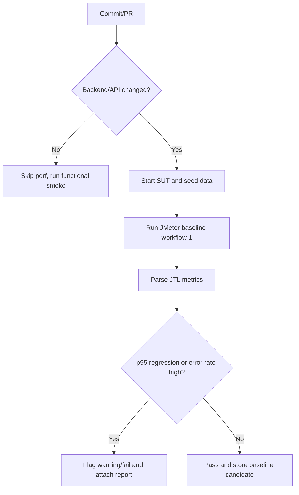

# HW05 - Performance Testing Main Report

## 1. Thông tin chung

| Mục | Giá trị |
| --- | --- |
| Họ tên sinh viên | Ngô Hồng Thanh |
| MSSV | 23127475 |
| Lớp / Khoá | CS423 / CSC13003 |
| Bài tập | HW05 - Performance Testing |
| SUT | EShop backend API |
| Base URL | `http://localhost:3000` |
| Tool performance testing | JMeter |
| Resource monitor | `htop` / Activity Monitor |
| AI tool | Codex |
| Workflow chọn | Workflow 1 - Người dùng có sẵn mua hàng lần đầu |
| Ngày chạy | TODO |
| Video demo | TODO |

## 2. Tóm tắt workflow và phạm vi

Workflow đo hiệu năng chính:

```text
POST /api/login
-> GET /api/categories
-> GET /api/products?search=${keyword}
-> GET /api/products/${productId}
-> POST /api/cart
-> POST /api/checkout
```

Mapping nhóm endpoint:

| Nhóm | Endpoint |
| --- | --- |
| Auth-heavy | `POST /api/login` |
| Read-heavy | `GET /api/categories`, `GET /api/products?search=${keyword}`, `GET /api/products/${productId}` |
| Transactional | `POST /api/cart`, `POST /api/checkout` |

`POST /api/register` được dùng để chuẩn bị account test trong CSV, không đưa vào measured workflow vì workflow đã chọn là người dùng có sẵn mua hàng lần đầu.

## 3. Môi trường và phần cứng

| Thành phần | Thông tin |
| --- | --- |
| OS | TODO |
| CPU | TODO |
| RAM | TODO |
| Java | TODO |
| JMeter | TODO |
| Backend process | TODO |
| Database / data state | TODO |

Evidence phần cứng:

- TODO: path screenshot/spec table.

## 4. Test data

CSV:

- `testing-artifacts/hw05/data/workflow1_users.csv`

Header:

```csv
email,password,keyword,productId,productName,productPrice,quantity,totalAmount,shippingAddress
```

Data strategy:

- Mỗi VU nên dùng account riêng để tránh tranh chấp giỏ hàng/đơn hàng.
- Account được tạo bằng `POST /api/register` trước khi chạy JMeter.
- `productName` và `productPrice` dùng dữ liệu seed thật để payload `POST /api/cart` nhất quán với SUT.

## 5. Thiết kế test plan

| Scenario | Mục tiêu | VUs | Ramp-up | Duration | Timer | Listener/report view |
| --- | --- | ---: | --- | --- | --- | --- |
| Load | Baseline dưới tải kỳ vọng | TODO | TODO | TODO | TODO | Summary Report |
| Stress | Tìm điểm gãy hoặc vùng suy giảm | TODO | TODO | TODO | TODO | Aggregate Report |
| Spike | Tải tăng đột ngột | TODO | TODO | TODO | TODO | View Results Tree |
| Endurance | Ngưỡng ổn định 10-15 phút | TODO | TODO | TODO | TODO | Summary/HTML Dashboard |

Các thành phần JMeter cần có:

- CSV Data Set Config.
- HTTP Request Defaults.
- HTTP Header Manager `Content-Type: application/json`.
- JSON Extractor lấy `token`.
- Authorization header `Bearer ${token}` cho cart/checkout.
- Assertions cho status code và field quan trọng.
- Think time phù hợp Load/Stress, giảm mạnh cho Spike.
- Raw `.jtl` và HTML Dashboard cho từng scenario.

## 6. AI-assisted design và human review

### 6.1 AI đã hỗ trợ gì

TODO: mô tả prompt chính, skill dùng, output AI tạo ra.

### 6.2 Human review và chỉnh sửa

| Vấn đề AI sai/thiếu | Vì sao có vấn đề | Cách sửa của sinh viên |
| --- | --- | --- |
| TODO | TODO | TODO |

Các điểm cần nhấn mạnh:

- Không đưa register vào measured workflow.
- Không dùng chung một account cho mọi VU khi chạy chính thức.
- Không chỉ dựa vào average response time.
- Không bỏ qua account lockout hoặc lỗi do test data.
- Không kết luận bug SUT khi lỗi đến từ sandbox/JMeter plan.

## 7. Smoke test API

| API | Kết quả | Ghi chú |
| --- | --- | --- |
| `POST /api/register` | `200 OK` | Tạo account setup thành công |
| `POST /api/login` | `200 OK` | Trả JWT token |
| `GET /api/categories` | `200 OK` | TODO |
| `GET /api/products?search=phone` | `200 OK` | Trả `iPhone 15 Pro Max` |
| `GET /api/products/1` | `200 OK` | TODO |
| `POST /api/cart` | `200 OK` | Cần Authorization |
| `GET /api/cart` | `200 OK` | Cần Authorization |
| `POST /api/checkout` | `200 OK` | Trả `orderId` |

Ghi chú: sandbox Codex có thể chặn request localhost có Authorization; kết quả chính thức cần xác nhận bằng cURL/JMeter thật ngoài sandbox.

## 8. Execution evidence

| Scenario | Plan | Raw JTL | HTML report | Screenshot | Notes |
| --- | --- | --- | --- | --- | --- |
| Load | TODO | TODO | TODO | TODO | TODO |
| Stress | TODO | TODO | TODO | TODO | TODO |
| Spike | TODO | TODO | TODO | TODO | TODO |
| Endurance | TODO | TODO | TODO | TODO | TODO |

## 9. Kết quả metric

| Scenario | VUs | Samples | Error rate | Avg ms | p50 | p90 | p95 | p99 | Throughput/RPS | CPU/RAM note |
| --- | ---: | ---: | ---: | ---: | ---: | ---: | ---: | ---: | ---: | --- |
| Load | TODO | TODO | TODO | TODO | TODO | TODO | TODO | TODO | TODO | TODO |
| Stress | TODO | TODO | TODO | TODO | TODO | TODO | TODO | TODO | TODO | TODO |
| Spike | TODO | TODO | TODO | TODO | TODO | TODO | TODO | TODO | TODO | TODO |
| Endurance | TODO | TODO | TODO | TODO | TODO | TODO | TODO | TODO | TODO | TODO |

## 10. Phân tích từng scenario

### 10.1 Load

TODO.

### 10.2 Stress

TODO.

### 10.3 Spike

TODO.

### 10.4 Endurance

TODO.

## 11. Endurance threshold

| Metric | Giá trị |
| --- | --- |
| Mức tải ổn định cao nhất | TODO |
| RPS/TPS trung bình | TODO |
| p95 | TODO |
| Error rate | TODO |
| CPU ceiling | TODO |
| RAM ceiling | TODO |
| Dấu hiệu phải dừng/tăng tải | TODO |

Kết luận: TODO.

## 12. Bug reports và GitHub issues

| Bug report | GitHub Issue | Severity / Priority | Evidence |
| --- | --- | --- | --- |
| TODO | TODO | TODO | TODO |

Nếu không phát hiện bug thật, ghi rõ: không tạo bug report vì không có lỗi SUT được xác nhận; các lỗi do test data/script/sandbox đã được phân loại riêng.

## 13. AI analysis và misinterpretation hunt

### 13.1 Prompt phân tích bằng AI

TODO.

### 13.2 AI output tóm tắt

TODO.

### 13.3 Human review: AI misinterpretation

| AI nói | Giá trị đúng từ raw `.jtl` | Vì sao sai | Kết luận đã sửa |
| --- | --- | --- | --- |
| TODO | TODO | TODO | TODO |

## 14. Đánh giá đề xuất tối ưu của AI

| Đề xuất AI | Phân loại | Lý do |
| --- | --- | --- |
| TODO | Feasible / Needs evidence / Hallucinated | TODO |

## 15. Continuous performance testing proposal



Trade-off:

- Cost: TODO.
- False alarms: TODO.
- Data stability: TODO.
- Runner variability: TODO.
- Coverage limitation: TODO.

## 16. Demo video

Link: TODO.

Nội dung video:

- Giới thiệu SUT, workflow, JMeter.
- Mở CSV data.
- Mở JMeter plan và chỉ token extractor/header/assertions/listeners.
- Chạy hoặc trình bày Load/Stress/Spike/Endurance cùng resource monitor.
- Mở HTML dashboard và bảng metric.
- Trình bày AI audit, human review, bug report nếu có.
- Kết luận CI performance testing.

## 17. AI Audit Report

File: `reports/ai-audit-report.md`

Tóm tắt việc dùng AI:

- TODO.

## 18. AI Critique 200-300 từ

TODO: viết đoạn 200-300 từ bằng tiếng Việt, nêu AI sai/thiếu ở đâu, vì sao không phát hiện, và nguyên tắc rút ra khi cộng tác với AI.

## 19. Submission checklist

- [ ] JMX Load/Stress/Spike đúng tên `{StudentID}_{ScenarioType}_{YYYYMMDD}`.
- [ ] CSV data-driven.
- [ ] Ba listener/report views khác nhau.
- [ ] Raw `.jtl` đầy đủ.
- [ ] HTML report folders.
- [ ] Screenshot tool + resource monitor.
- [ ] Hardware evidence.
- [ ] Endurance threshold 10-15 phút.
- [ ] Bug reports/GitHub issues nếu có bug thật.
- [ ] AI analysis + human misinterpretation hunt.
- [ ] Continuous performance testing proposal + flow chart.
- [ ] AI Audit Report.
- [ ] AI Critique 200-300 từ.
- [ ] Video demo YouTube unlisted tối thiểu 6 phút.
