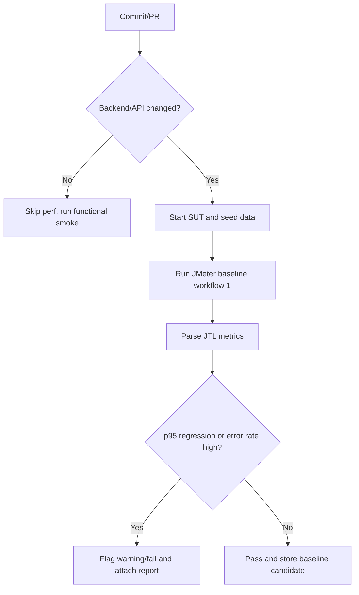

# HW05 - Performance Testing Main Report

## 1. Thông tin chung

| Mục | Giá trị |
| --- | --- |
| Họ tên sinh viên | Ngô Hồng Thanh |
| MSSV | 23127475 |
| Lớp / Khoá | CS423 / CSC13003 |
| Bài tập | HW05 - Performance Testing |
| SUT | EShop backend API |
| Base URL | `http://localhost:3000` |
| Tool performance testing | JMeter |
| Resource monitor | `htop` / Activity Monitor |
| AI tool | Codex |
| Workflow chọn | Workflow 1 - Người dùng có sẵn mua hàng lần đầu |
| Ngày chạy | 2026-08-15 |
| Public GitHub repository | [https://github.com/lmchkhi/CS423-CSC15003-Testing-N08](https://github.com/lmchkhi/CS423-CSC15003-Testing-N08) |
| README.md | [/reports/README.md](/reports/README.md) |
| Video demo | [https://youtu.be/AcoNQVMlhS4](https://youtu.be/AcoNQVMlhS4) |

## 2. Tóm tắt workflow và phạm vi

Workflow đo hiệu năng chính:

```text
POST /api/login
-> GET /api/categories
-> GET /api/products?search=${keyword}
-> GET /api/products/${productId}
-> POST /api/cart
-> POST /api/checkout
```

Mapping nhóm endpoint:

| Nhóm | Endpoint |
| --- | --- |
| Auth-heavy | `POST /api/login` |
| Read-heavy | `GET /api/categories`, `GET /api/products?search=${keyword}`, `GET /api/products/${productId}` |
| Transactional | `POST /api/cart`, `POST /api/checkout` |

`POST /api/register` được dùng để chuẩn bị account test trong CSV, không đưa vào measured workflow vì workflow đã chọn là người dùng có sẵn mua hàng lần đầu.

## 3. Môi trường và phần cứng

| Thành phần | Thông tin |
| --- | --- |
| OS | macOS 26.5.2 build 25F84 |
| CPU | Apple M3 Pro, 11 cores (5 Performance + 6 Efficiency) |
| RAM | 36 GB |
| Java | Java 25.0.4 LTS |
| JMeter | Apache JMeter 5.6.3 |
| Backend process | Đã xác nhận backend đang phục vụ `http://localhost:3000` khi chạy smoke |
| Database / data state | Account CSV đã setup lại bằng `/api/register`; product seed id 1-5 |

Evidence phần cứng:

- Hardware spec: `testing-artifacts/hw05/evidence/hardware/system-profiler-hardware-20260815.txt`.
- Screenshot Load CLI + htop: `testing-artifacts/hw05/evidence/screenshots/load-cli-htop-20260815.png`.
- Screenshot Stress CLI + htop: `testing-artifacts/hw05/evidence/screenshots/stress-cli-htop-20260815.png`.
- Load test `top` snapshots: `testing-artifacts/hw05/evidence/hardware/top-load-midrun-20260815.txt`, `testing-artifacts/hw05/evidence/hardware/top-load-steady-20260815.txt`, `testing-artifacts/hw05/evidence/hardware/top-load-postrun-20260815.txt`.
- Stress test `top` snapshots: `testing-artifacts/hw05/evidence/hardware/top-stress-ramp-20260815.txt`, `testing-artifacts/hw05/evidence/hardware/top-stress-steady-20260815.txt`, `testing-artifacts/hw05/evidence/hardware/top-stress-postrun-20260815.txt`.
- Spike test `top` snapshots: `testing-artifacts/hw05/evidence/hardware/top-spike-ramp-20260815.txt`, `testing-artifacts/hw05/evidence/hardware/top-spike-peak-20260815.txt`, `testing-artifacts/hw05/evidence/hardware/top-spike-postrun-20260815.txt`.
- Endurance test `top` snapshots: `testing-artifacts/hw05/evidence/hardware/top-endurance-start-20260815.txt`, `testing-artifacts/hw05/evidence/hardware/top-endurance-mid-20260815.txt`, `testing-artifacts/hw05/evidence/hardware/top-endurance-late-20260815.txt`, `testing-artifacts/hw05/evidence/hardware/top-endurance-postrun-20260815.txt`.
- Process snapshots: `testing-artifacts/hw05/evidence/hardware/process-load-midrun-20260815.txt`, `testing-artifacts/hw05/evidence/hardware/process-stress-midrun-20260815.txt`, `testing-artifacts/hw05/evidence/hardware/process-spike-midrun-20260815.txt`, `testing-artifacts/hw05/evidence/hardware/process-endurance-midrun-20260815.txt`.
- Screenshot/video evidence vẫn cần bổ sung khi quay demo để thấy JMeter CLI và resource monitor cùng khung hình.

## 4. Test data

CSV:

- `testing-artifacts/hw05/data/workflow1_users.csv`

Header:

```csv
email,password,keyword,productId,productName,productPrice,quantity,totalAmount,shippingAddress
```

Data strategy:

- Mỗi VU nên dùng account riêng để tránh tranh chấp giỏ hàng/đơn hàng.
- Account được tạo bằng `POST /api/register` trước khi chạy JMeter.
- CSV hiện có 200 account để đủ cho scenario Spike 200 VUs; Load/Stress/Endurance dùng lại cùng pool account bằng chế độ recycle của CSV Data Set Config.
- `workflow1_users.csv` là test data snapshot tương ứng với database local tại thời điểm chạy. Script `skills/hw05-jmeter-workflow1/scripts/create_workflow1_accounts.py` tự gọi `/api/register` và ghi đè CSV này; nếu reset database hoặc chạy trên môi trường khác thì phải chạy lại script trước khi chạy JMeter.
- `productName` và `productPrice` dùng dữ liệu seed thật để payload `POST /api/cart` nhất quán với SUT.
- Prefix account hiện tại: `hw05-perf-20260815-1205-rerun-XXX@example.com`.

## 5. Thiết kế test plan

| Scenario | Mục tiêu | VUs | Ramp-up | Duration | Timer | Listener/report view |
| --- | --- | ---: | --- | --- | --- | --- |
| Load | Baseline dưới tải kỳ vọng | 50 | 60s | 300s | 1500ms + random 1500ms | Summary Report |
| Stress | Tìm điểm gãy hoặc vùng suy giảm | 150 | 120s | 420s | 800ms + random 800ms | Aggregate Report |
| Spike | Tải tăng đột ngột | 200 | 30s | 120s | 0ms | View Results Tree |
| Endurance | Ngưỡng ổn định 10-15 phút | 50 | 60s | 900s | 1500ms + random 1500ms | Summary/HTML Dashboard |
| Smoke | Kiểm tra end-to-end trước khi chạy chính thức | 1 | 1s | 15s | 100ms | Summary Report |

Test plan files:

- `testing-artifacts/hw05/plans/23127475_Load_20260815.jmx`
- `testing-artifacts/hw05/plans/23127475_Stress_20260815.jmx`
- `testing-artifacts/hw05/plans/23127475_Spike_20260815.jmx`
- `testing-artifacts/hw05/plans/23127475_Endurance_20260815.jmx`
- `testing-artifacts/hw05/plans/23127475_Smoke_20260815.jmx`

Các thành phần JMeter cần có:

- CSV Data Set Config.
- HTTP Request Defaults.
- HTTP Header Manager `Content-Type: application/json`.
- JSON Extractor lấy `token`.
- Authorization header `Bearer ${token}` cho cart/checkout.
- Assertions cho status code và field quan trọng.
- Think time phù hợp Load/Stress, giảm mạnh cho Spike.
- Raw `.jtl` và HTML Dashboard cho từng scenario.

## 6. AI-assisted design và human review

### 6.1 AI đã hỗ trợ gì

AI/Codex được dùng để đọc đề HW05, workflow đã chọn, API specification và sinh JMeter JMX skeleton cho Workflow 1. AI cũng hỗ trợ tạo CSV account setup, kiểm tra API smoke bằng cURL trước đó, và sinh script để tạo JMX nhất quán giữa các lần chạy.

### 6.2 Human review và chỉnh sửa

| Vấn đề AI sai/thiếu | Vì sao có vấn đề | Cách sửa của sinh viên |
| --- | --- | --- |
| Ban đầu giả định `/api/register` không ổn định | Kiểm tra trực tiếp cho thấy backend `/api/register` trả `200 OK`; lỗi register nếu có nhiều khả năng nằm ở frontend | Sửa workflow: dùng register làm bước setup account CSV, không đưa vào measured workflow |
| CSV ban đầu thiếu `productName` và `productPrice` | `POST /api/cart` cần payload sản phẩm nhất quán với seed data thật | Mở rộng CSV và JMX để đọc `productName`, `productPrice`; dùng sản phẩm seed id 1-5 |
| JMX generator ban đầu dùng property assertion sai `Asserion.test_strings` | JMeter có thể không nhận đúng assertion HTTP code nếu property sai | Sửa generator sang `Assertion.test_strings` và sinh lại toàn bộ JMX |
| JMX generator ban đầu chưa đặt rõ raw body cho POST | POST JSON có thể bị gửi sai dạng nếu không bật `HTTPSampler.postBodyRaw` | Thêm `HTTPSampler.postBodyRaw=true` cho login/cart/checkout |
| Login chỉ extract token, chưa assert field token tồn tại | Nếu login response không có token, các request sau sẽ fail nhưng nguyên nhân khó đọc | Thêm `JSONPathAssertion` kiểm `$.token` |
| File seminar `EShop_Workload_Model.jmx` có workload model hay nhưng hard-code account và dùng traffic mix | Không bảo đảm mọi VU đi đúng Workflow 1 end-to-end, chưa data-driven theo yêu cầu HW05 | Chỉ dùng file seminar làm reference; final plans sinh riêng theo Workflow 1, CSV và naming chuẩn |
| CSV account setup cũ không còn login được trên database đang chạy | JMeter smoke ngoài sandbox trả `401` ở login và `403` ở cart/checkout | Tạo lại CSV 200 account bằng `/api/register`, sau đó smoke pass 0% lỗi |

Các điểm cần nhấn mạnh:

- Không đưa register vào measured workflow.
- Không dùng chung một account cho mọi VU khi chạy chính thức.
- Không chỉ dựa vào average response time.
- Không bỏ qua account lockout hoặc lỗi do test data.
- Không kết luận bug SUT khi lỗi đến từ sandbox/JMeter plan.

## 7. Smoke test API

| API | Kết quả | Ghi chú |
| --- | --- | --- |
| `POST /api/register` | `200 OK` | Tạo account setup thành công |
| `POST /api/login` | `200 OK` | Trả JWT token |
| `GET /api/categories` | `200 OK` | Trả danh sách category |
| `GET /api/products?search=phone` | `200 OK` | Trả `iPhone 15 Pro Max` |
| `GET /api/products/1` | `200 OK` | Trả chi tiết sản phẩm seed id 1 |
| `POST /api/cart` | `200 OK` | Cần Authorization |
| `GET /api/cart` | `200 OK` | Cần Authorization |
| `POST /api/checkout` | `200 OK` | Trả `orderId` |

JMeter smoke:

- Lượt chạy trong sandbox Codex bị `Operation not permitted` khi JMeter gọi localhost; phân loại là lỗi môi trường, không phải lỗi SUT.
- Lượt chạy ngoài sandbox với CSV cũ trả `401` ở login và `403` ở cart/checkout; phân loại là lỗi test data cũ.
- Sau khi tạo lại 200 account qua `/api/register`, smoke chính thức pass: 20 samples, 0 errors, avg 3.9 ms, p95 6.55 ms, throughput 1.4232 RPS.
- Evidence: `testing-artifacts/hw05/evidence/notes/smoke-20260815.md`.

## 8. Execution evidence

| Scenario | Plan | Raw JTL | HTML report | Resource evidence | Notes |
| --- | --- | --- | --- | --- | --- |
| Smoke | `testing-artifacts/hw05/plans/23127475_Smoke_20260815.jmx` | `testing-artifacts/hw05/results/smoke/23127475_Smoke_20260815_pass.jtl` | `testing-artifacts/hw05/html/smoke-pass/index.html` | TODO screenshot/video | Pass 20 samples, 0 errors |
| Load | `testing-artifacts/hw05/plans/23127475_Load_20260815.jmx` | `testing-artifacts/hw05/results/load/23127475_Load_20260815.jtl` | `testing-artifacts/hw05/html/load/index.html` | `testing-artifacts/hw05/evidence/notes/load-20260815.md`; screenshot: `testing-artifacts/hw05/evidence/screenshots/load-cli-htop-20260815.png` | Pass 1176 samples, 0 errors |
| Stress | `testing-artifacts/hw05/plans/23127475_Stress_20260815.jmx` | `testing-artifacts/hw05/results/stress/23127475_Stress_20260815.jtl` | `testing-artifacts/hw05/html/stress/index.html` | `testing-artifacts/hw05/evidence/notes/stress-20260815.md`; screenshot: `testing-artifacts/hw05/evidence/screenshots/stress-cli-htop-20260815.png` | Pass 8930 samples, 0 errors |
| Spike | `testing-artifacts/hw05/plans/23127475_Spike_20260815.jmx` | Raw local: `testing-artifacts/hw05/results/spike/23127475_Spike_20260815.jtl`; compressed commit/submission artifact: `testing-artifacts/hw05/results/spike/23127475_Spike_20260815.jtl.gz` | `testing-artifacts/hw05/html/spike/index.html` | `testing-artifacts/hw05/evidence/notes/spike-20260815.md` | Pass 1,225,240 samples, 0 errors; raw JTL 156 MB được nén gzip còn 7.4 MB để commit/nộp |
| Endurance | `testing-artifacts/hw05/plans/23127475_Endurance_20260815.jmx` | `testing-artifacts/hw05/results/endurance/23127475_Endurance_20260815.jtl` | `testing-artifacts/hw05/html/endurance/index.html` | `testing-artifacts/hw05/evidence/notes/endurance-20260815.md` | Pass 3837 samples, 0 errors |

## 9. Kết quả metric

| Scenario | VUs | Samples | Error rate | Avg ms | p50 | p90 | p95 | p99 | Throughput/RPS | CPU/RAM note |
| --- | ---: | ---: | ---: | ---: | ---: | ---: | ---: | ---: | ---: | --- |
| Load | 50 | 1176 | 0.00% | 2.91 | 3 | 4 | 5 | 6 | 4.0384 | Steady `top`: 27.14% user, 16.44% sys, 56.41% idle; PhysMem 35G used, 0 swap |
| Stress | 150 | 8930 | 0.00% | 1.89 | 2 | 3 | 4 | 5 | 21.6052 | Steady `top`: 16.81% user, 11.57% sys, 71.60% idle; PhysMem 33G used |
| Spike | 200 | 1,225,240 | 0.00% | 17.14 | 16 | 31 | 37 | 55 | 10212.2907 | Peak `top`: 26.73% user, 22.81% sys, 50.44% idle; backend `node` about 122.6% CPU |
| Endurance | 50 | 3837 | 0.00% | 2.42 | 2 | 4 | 4 | 5 | 4.3127 | Late `top`: 12.4% user, 13.43% sys, 74.52% idle; PhysMem 34G used |

## 10. Phân tích từng scenario

### 10.1 Load

Load test chạy đủ 5 phút từ 02:46:08 đến 02:51:08 ngày 2026-08-15 với 50 VUs, ramp-up 60s và think time 1500ms + random 1500ms. Kết quả baseline ổn định: 1176 samples, 0 errors, overall p95 5 ms, p99 6 ms và throughput 4.0384 RPS.

Theo từng bước workflow, `POST /api/checkout` là request chậm nhất nhưng vẫn rất thấp: avg 4.33 ms, p95 6 ms, p99 7 ms. `POST /api/login` có max 33 ms nhưng p95 chỉ 4 ms, nên đây là outlier nhỏ chứ không phải xu hướng suy giảm. Không có HTTP 4xx/5xx, timeout, lỗi token hoặc account lockout trong Load run.

Resource snapshot steady-state lúc 02:47:46 ghi nhận CPU còn 56.41% idle và không có swapins/swapouts, nên ở mức Load này máy local và SUT chưa có dấu hiệu chạm trần. Kết quả Load được dùng làm baseline để so sánh với Stress/Spike; chưa tạo bug report.

### 10.2 Stress

Stress test chạy đủ 7 phút từ 04:00:29 đến 04:07:29 ngày 2026-08-15 với 150 VUs, ramp-up 120s và think time 800ms + random 800ms. Kết quả đạt 8930 samples, 0 errors, overall p95 4 ms, p99 5 ms và throughput 21.6052 RPS.

So với Load baseline, Stress tăng throughput từ 4.0384 RPS lên 21.6052 RPS nhưng không làm tăng error rate. Latency vẫn thấp; request chậm nhất theo p95 là `POST /api/checkout` với p95 5 ms và p99 6 ms. Không có dấu hiệu token lỗi, account lockout, HTTP 4xx/5xx hoặc timeout.

Resource snapshot steady-state lúc 04:02:32 ghi nhận CPU còn 71.60% idle và memory vẫn còn 2798M unused. Vì vậy ở mức 150 VUs chưa tìm thấy điểm gãy của SUT/hardware. Kết luận report cho Stress là hệ thống vẫn ổn định ở workload này; chưa tạo bug report.

### 10.3 Spike

Spike test chạy đủ 2 phút từ 04:37:05 đến 04:39:05 ngày 2026-08-15 với 200 VUs, ramp-up 30s và think time 0ms. Đây là workload đột ngột nhất hiện tại: 1,225,240 samples, 0 errors, throughput 10212.2907 RPS, p95 37 ms và p99 55 ms.

So với Stress, Spike tăng throughput từ 21.6052 RPS lên hơn 10k RPS vì bỏ think time hoàn toàn. Latency tăng rõ rệt nhưng chưa tạo timeout hay HTTP 4xx/5xx. Request chậm nhất theo p95 là `POST /api/checkout` với p95 54 ms và p99 64 ms; `POST /api/login` cũng tăng lên p95 37 ms và p99 51 ms.

Artifact lưu ý: raw Spike JTL có kích thước 156 MB nên bản gốc `23127475_Spike_20260815.jtl` được giữ local để tái phân tích khi cần. Bản nén gzip `23127475_Spike_20260815.jtl.gz` có kích thước 7.4 MB và được dùng làm raw result artifact phù hợp để commit/nộp kèm.

Resource snapshot peak lúc 04:38:02 ghi nhận CPU còn 50.44% idle, nhưng process snapshot cho thấy backend `node server.js` lên khoảng 122.6% CPU. Kết luận: hệ thống chịu được spike ngắn 200 VUs/0 think time mà không lỗi, nhưng latency nhạy hơn rõ rệt dưới tải đột ngột. Không tạo bug report vì chưa có lỗi SUT; dùng kết quả này làm input cho Endurance threshold và phần phân tích tối ưu sau.

### 10.4 Endurance

Endurance test chạy đủ 15 phút từ 05:32:40 đến 05:47:40 ngày 2026-08-15 với 50 VUs, ramp-up 60s và think time 1500ms + random 1500ms. Kết quả đạt 3837 samples, 0 errors, overall p95 4 ms, p99 5 ms và throughput 4.3127 RPS.

So với Load baseline cùng mức 50 VUs nhưng duration dài hơn, Endurance không làm tăng error rate hoặc latency. `POST /api/checkout` vẫn là bước chậm nhất theo p95 với p95 5 ms và p99 6 ms, nhưng không có drift theo thời gian. Không có HTTP 4xx/5xx, timeout, token issue hoặc account lockout.

Resource snapshots cho thấy hệ thống còn headroom trong toàn bộ run: CPU idle từ 68.73% ở mid-run đến 74.52% ở late-run; memory vẫn còn unused memory dù giảm từ 1795M lúc start xuống 1482M ở late-run. Không quan sát thấy swap pressure hoặc dấu hiệu resource ceiling. Kết quả này xác nhận 50 VUs là mức ổn định trong 15 phút trên máy cá nhân hiện tại.

## 11. Endurance threshold

| Metric | Giá trị |
| --- | --- |
| Mức tải ổn định cao nhất | 50 VUs trong 15 phút với think time 1500ms + random 1500ms |
| RPS/TPS trung bình | 4.3127 RPS |
| p95 | 4 ms |
| Error rate | 0.00% |
| CPU ceiling | Chưa chạm trần; late-run CPU còn 74.52% idle |
| RAM ceiling | Chưa chạm trần; late-run PhysMem 34G used, 1482M unused |
| Dấu hiệu phải dừng/tăng tải | Không có timeout/5xx/lockout; có thể tăng tải trong run bổ sung nếu cần tìm ngưỡng cao hơn |

Kết luận: 50 VUs là mức tải ổn định cao nhất đã kiểm chứng bằng Endurance trong phạm vi HW05 hiện tại.

## 12. Bug reports và GitHub issues

| Bug report | GitHub Issue | Severity / Priority | Evidence |
| --- | --- | --- | --- |
| Không có | Không có | N/A | Tất cả run chính thức Load/Stress/Spike/Endurance đều 0% error; không có HTTP 4xx/5xx, timeout hoặc backend crash |

Không tạo bug report vì không có lỗi SUT được xác nhận. Các lỗi trước đó đã được phân loại riêng: sandbox Codex chặn JMeter/cURL gọi localhost có Authorization, và CSV account cũ không còn hợp lệ với database đang chạy.

## 13. AI analysis và misinterpretation hunt

### 13.1 Prompt phân tích bằng AI

```text
Phân tích các summary CSV của HW05 JMeter Workflow 1 gồm Load, Stress,
Spike và Endurance. Hãy nhận xét p95, p99, throughput, error rate, resource
evidence, điểm gãy nếu có, endurance threshold và đề xuất tối ưu backend.
Không sửa code SUT, đây là blackbox performance testing.
```

### 13.2 AI output tóm tắt

AI/Codex draft analysis:

- Cả 4 scenario chính đều có error rate 0.00%, nên chưa có bug hiệu năng dạng timeout/5xx/backend crash.
- Load 50 VUs là baseline nhẹ: 1176 samples, p95 5 ms, throughput 4.0384 RPS.
- Stress 150 VUs tăng throughput lên 21.6052 RPS, p95 4 ms, chưa tìm thấy điểm gãy.
- Spike 200 VUs không think time tạo tải rất cao: 1,225,240 samples, throughput 10212.2907 RPS, p95 37 ms, p99 55 ms. Latency tăng rõ nhưng vẫn chưa có lỗi.
- Endurance 50 VUs trong 15 phút ổn định: 3837 samples, p95 4 ms, p99 5 ms, throughput 4.3127 RPS.
- Endpoint chậm nhất thường là `POST /api/checkout`, đặc biệt trong Spike với p95 54 ms và p99 64 ms.
- Có thể cân nhắc tối ưu checkout/write path, cache dữ liệu read-heavy, hoặc chạy Node.js nhiều worker hơn nếu workload thực tế cần RPS cao hơn.

### 13.3 Human review: AI misinterpretation

| AI nói | Giá trị đúng từ raw `.jtl` | Vì sao sai | Kết luận đã sửa |
| --- | --- | --- | --- |
| "Stress chưa tìm thấy điểm gãy, vậy hệ thống không có vấn đề hiệu năng." | Stress chỉ kiểm chứng 150 VUs, p95 4 ms, p99 5 ms, 0% error. Spike mới làm latency tăng lên p95 37 ms, p99 55 ms. | Kết luận quá rộng so với phạm vi test; chưa tìm thấy điểm gãy không có nghĩa là không có bottleneck ở tải cao hơn. | Viết lại: trong phạm vi 150 VUs Stress, chưa thấy điểm gãy; Spike cho thấy latency nhạy với tải đột ngột. |
| "Spike throughput 10212 RPS chứng minh backend xử lý production traffic rất tốt." | Spike dùng local machine, local network, dataset nhỏ, SQLite/demo data, duration 120s và 0 think time. | Không thể suy rộng từ môi trường local/demo sang production; thiếu network, DB thật, concurrency thực tế và profiling. | Viết lại: Spike chứng minh SUT local chịu được burst ngắn rất cao trong điều kiện HW05, không phải production capacity. |
| "Endpoint checkout là bottleneck cần tối ưu ngay." | Spike checkout p95 54 ms, p99 64 ms, max 108 ms, nhưng error 0 và CPU/RAM chưa chạm trần. | Checkout là endpoint chậm nhất tương đối, nhưng số tuyệt đối vẫn thấp và chưa có lỗi; chưa đủ bằng chứng để gọi là bug/bottleneck nghiêm trọng. | Viết lại: checkout là ứng viên cần theo dõi/profiling nếu tăng tải thêm, không tạo bug report hiện tại. |
| "Endurance threshold là mức chịu tải tối đa của hệ thống." | Endurance chỉ chạy 50 VUs, 15 phút, p95 4 ms, throughput 4.3127 RPS, CPU late-run còn 74.52% idle. | Đây là mức ổn định cao nhất đã kiểm chứng, không phải mức tối đa tuyệt đối; còn headroom để chạy tải cao hơn nếu có thời gian. | Viết lại: threshold hiện tại là 50 VUs ổn định đã được kiểm chứng trong phạm vi bài. |

## 14. Đánh giá đề xuất tối ưu của AI

| Đề xuất AI | Phân loại | Lý do |
| --- | --- | --- |
| Theo dõi riêng `POST /api/checkout` và profiling write path nếu tăng tải thêm | Feasible | Checkout là request chậm nhất trong Load/Stress/Spike/Endurance, nhưng hiện chưa đủ bằng chứng để xem là bug. |
| Thêm cache cho dữ liệu read-heavy như categories/products | Needs evidence | Read endpoints có p95 thấp trong mọi run; cache có thể hợp lý về kiến trúc nhưng chưa được dữ liệu hiện tại chứng minh là cần thiết. |
| Xem xét Node.js clustering/multiple workers nếu cần duy trì spike RPS cao | Needs evidence | Trong Spike, process `node server.js` đạt khoảng 122.6% CPU, nhưng tổng CPU vẫn còn idle; cần profiling và test cao hơn trước khi kết luận. |
| Tối ưu SQLite/write concurrency hoặc WAL cho checkout/order write | Needs evidence | Có thể hợp lý với stack demo nếu write contention tăng, nhưng blackbox test hiện tại không thấy 5xx/timeout/lock contention. |
| Tối ưu frontend image lazy loading để giảm p95 API | Hallucinated | Test đo backend API blackbox, không chạy frontend rendering; tối ưu frontend không giải thích trực tiếp p95 API. |
| Dùng Kubernetes autoscaling/CDN ngay cho bài này | Hallucinated | Không có bằng chứng về cloud deployment hoặc static asset bottleneck; vượt phạm vi local HW05. |

## 15. Continuous performance testing proposal

Mục tiêu của continuous performance testing là phát hiện regression hiệu năng sớm khi backend/API thay đổi, không thay thế cho full benchmark thủ công. Pipeline đề xuất dùng một subset ngắn của Workflow 1, chạy trong CI hoặc pre-release job trên môi trường ổn định.



Baseline đề xuất:

| Metric gate | Baseline dùng trong bài | Warning | Fail |
| --- | ---: | ---: | ---: |
| Workflow p95 | Load p95 = 5 ms | p95 tăng > 20% so với baseline trong 2 lần chạy liên tiếp | p95 tăng > 50% hoặc vượt SLA nội bộ |
| Error rate | 0% | > 0% nhưng không lặp lại | > 1% hoặc có HTTP 5xx/timeout lặp lại |
| Throughput | Load RPS = 4.0384 | giảm > 15% khi cấu hình tải giữ nguyên | giảm > 30% khi cấu hình tải giữ nguyên |
| Checkout p95 | Theo dõi riêng vì là endpoint chậm nhất tương đối | tăng rõ rệt so với baseline endpoint | có 5xx/timeout hoặc tăng mạnh kèm CPU/RAM bất thường |

Cấu hình CI gợi ý:

- Trigger: chạy full functional tests cho mọi PR; chỉ chạy performance subset khi thay đổi `backend`, API contract, database schema, dependency runtime hoặc cấu hình deployment.
- Setup: start backend trên runner cố định, seed dữ liệu, tạo account test bằng `/api/register` nếu chưa tồn tại.
- Test subset: dùng JMeter CLI với Workflow 1 ở mức Load rút gọn, ví dụ 20-50 VUs trong 3-5 phút; không dùng Spike làm gate mặc định vì dễ nhiễu.
- Parse metric: dùng script `skills/hw05-performance-report/scripts/summarize_jtl.py` để lấy p95/p99/error rate/throughput từ `.jtl`.
- Artifact: lưu `.jtl`, JMeter log, HTML dashboard và summary CSV cho mỗi CI run.
- Decision: fail build khi error rate > 1% hoặc có regression p95 nghiêm trọng; warning khi regression nhẹ để reviewer kiểm tra thêm.
- Baseline update: chỉ cập nhật baseline sau khi run pass ổn định và thay đổi được reviewer xác nhận không phải regression.

Trade-off:

- Cost: performance test làm CI lâu hơn functional smoke, nên không nên chạy Load/Stress/Spike/Endurance đầy đủ trên mọi commit.
- False alarms: runner local/CI có nhiễu CPU/RAM, vì vậy warning nên dựa trên nhiều lần chạy hoặc ngưỡng đủ rộng thay vì chỉ một spike nhỏ.
- Data stability: dữ liệu seed/account phải cố định; nếu account bị thiếu hoặc token/auth sai thì kết quả là lỗi test setup, không phải regression hiệu năng.
- Runner variability: baseline nên được đo trên cùng loại runner và cùng cấu hình SUT; không so trực tiếp số local macOS với CI cloud nếu môi trường khác nhau.
- Coverage limitation: subset Workflow 1 chỉ bao phủ login, read endpoints, cart và checkout; các workflow khác như admin/reporting/payment nếu có vẫn cần test riêng.
- Maintenance: khi API thay đổi, JMeter plan và extractor/assertion phải được cập nhật cùng PR để tránh false fail.

## 16. Demo video

Link video demo YouTube unlisted: [https://youtu.be/AcoNQVMlhS4](https://youtu.be/AcoNQVMlhS4)

Nội dung video:

- Giới thiệu SUT, workflow, JMeter.
- Mở CSV data.
- Mở JMeter plan và chỉ token extractor/header/assertions/listeners.
- Chạy hoặc trình bày Load/Stress/Spike/Endurance cùng resource monitor.
- Mở HTML dashboard và bảng metric.
- Trình bày AI audit, human review, bug report nếu có.
- Kết luận CI performance testing.

## 17. AI Audit Report

File: [`reports/ai-audit-report.md`](./ai-audit-report.md)

## 18. AI Critique 200-300 từ

File: [`reports/ai-critique.md`](./ai-critique.md)

## 19. Submission checklist

- [ ] JMX Load/Stress/Spike đúng tên `{StudentID}_{ScenarioType}_{YYYYMMDD}`.
- [ ] CSV data-driven.
- [ ] Ba listener/report views khác nhau.
- [ ] Raw `.jtl` đầy đủ.
- [ ] Spike raw result có bản nén `23127475_Spike_20260815.jtl.gz` vì file gốc 156 MB.
- [ ] HTML report folders.
- [ ] Screenshot tool + resource monitor.
- [ ] Hardware evidence.
- [ ] Endurance threshold 10-15 phút.
- [ ] Bug reports/GitHub issues nếu có bug thật.
- [ ] AI analysis + human misinterpretation hunt.
- [ ] Continuous performance testing proposal + flow chart.
- [ ] AI Audit Report.
- [ ] AI Critique 200-300 từ.
- [ ] Video demo YouTube unlisted tối thiểu 6 phút.
