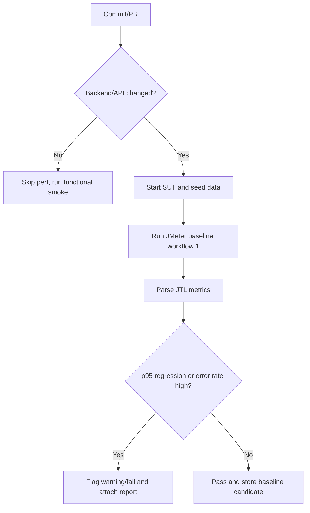

# HW05 - Performance Testing Main Report

## 1. Thông tin chung

| Mục | Giá trị |
| --- | --- |
| Họ tên sinh viên | Ngô Hồng Thanh |
| MSSV | 23127475 |
| Lớp / Khoá | CS423 / CSC13003 |
| Bài tập | HW05 - Performance Testing |
| SUT | EShop backend API |
| Base URL | `http://localhost:3000` |
| Tool performance testing | JMeter |
| Resource monitor | `htop` / Activity Monitor |
| AI tool | Codex |
| Workflow chọn | Workflow 1 - Người dùng có sẵn mua hàng lần đầu |
| Ngày chạy | 2026-08-15 |
| Video demo | TODO |

## 2. Tóm tắt workflow và phạm vi

Workflow đo hiệu năng chính:

```text
POST /api/login
-> GET /api/categories
-> GET /api/products?search=${keyword}
-> GET /api/products/${productId}
-> POST /api/cart
-> POST /api/checkout
```

Mapping nhóm endpoint:

| Nhóm | Endpoint |
| --- | --- |
| Auth-heavy | `POST /api/login` |
| Read-heavy | `GET /api/categories`, `GET /api/products?search=${keyword}`, `GET /api/products/${productId}` |
| Transactional | `POST /api/cart`, `POST /api/checkout` |

`POST /api/register` được dùng để chuẩn bị account test trong CSV, không đưa vào measured workflow vì workflow đã chọn là người dùng có sẵn mua hàng lần đầu.

## 3. Môi trường và phần cứng

| Thành phần | Thông tin |
| --- | --- |
| OS | macOS local |
| CPU | TODO |
| RAM | TODO |
| Java | Java 25.0.4 LTS |
| JMeter | Apache JMeter 5.6.3 |
| Backend process | Đã xác nhận backend đang phục vụ `http://localhost:3000` khi chạy smoke |
| Database / data state | Account CSV đã setup lại bằng `/api/register`; product seed id 1-5 |

Evidence phần cứng:

- TODO: path screenshot/spec table.

## 4. Test data

CSV:

- `testing-artifacts/hw05/data/workflow1_users.csv`

Header:

```csv
email,password,keyword,productId,productName,productPrice,quantity,totalAmount,shippingAddress
```

Data strategy:

- Mỗi VU nên dùng account riêng để tránh tranh chấp giỏ hàng/đơn hàng.
- Account được tạo bằng `POST /api/register` trước khi chạy JMeter.
- CSV hiện có 200 account để đủ cho scenario Spike 200 VUs; Load/Stress/Endurance dùng lại cùng pool account bằng chế độ recycle của CSV Data Set Config.
- `productName` và `productPrice` dùng dữ liệu seed thật để payload `POST /api/cart` nhất quán với SUT.
- Prefix account hiện tại: `hw05-perf-20260815-023132-XXX@example.com`.

## 5. Thiết kế test plan

| Scenario | Mục tiêu | VUs | Ramp-up | Duration | Timer | Listener/report view |
| --- | --- | ---: | --- | --- | --- | --- |
| Load | Baseline dưới tải kỳ vọng | 50 | 60s | 300s | 1500ms + random 1500ms | Summary Report |
| Stress | Tìm điểm gãy hoặc vùng suy giảm | 150 | 120s | 420s | 800ms + random 800ms | Aggregate Report |
| Spike | Tải tăng đột ngột | 200 | 30s | 120s | 0ms | View Results Tree |
| Endurance | Ngưỡng ổn định 10-15 phút | 50 | 60s | 900s | 1500ms + random 1500ms | Summary/HTML Dashboard |
| Smoke | Kiểm tra end-to-end trước khi chạy chính thức | 1 | 1s | 15s | 100ms | Summary Report |

Test plan files:

- `testing-artifacts/hw05/plans/23127475_Load_20260815.jmx`
- `testing-artifacts/hw05/plans/23127475_Stress_20260815.jmx`
- `testing-artifacts/hw05/plans/23127475_Spike_20260815.jmx`
- `testing-artifacts/hw05/plans/23127475_Endurance_20260815.jmx`
- `testing-artifacts/hw05/plans/23127475_Smoke_20260815.jmx`

Các thành phần JMeter cần có:

- CSV Data Set Config.
- HTTP Request Defaults.
- HTTP Header Manager `Content-Type: application/json`.
- JSON Extractor lấy `token`.
- Authorization header `Bearer ${token}` cho cart/checkout.
- Assertions cho status code và field quan trọng.
- Think time phù hợp Load/Stress, giảm mạnh cho Spike.
- Raw `.jtl` và HTML Dashboard cho từng scenario.

## 6. AI-assisted design và human review

### 6.1 AI đã hỗ trợ gì

AI/Codex được dùng để đọc đề HW05, workflow đã chọn, API specification và sinh JMeter JMX skeleton cho Workflow 1. AI cũng hỗ trợ tạo CSV account setup, kiểm tra API smoke bằng cURL trước đó, và sinh script để tạo JMX nhất quán giữa các lần chạy.

### 6.2 Human review và chỉnh sửa

| Vấn đề AI sai/thiếu | Vì sao có vấn đề | Cách sửa của sinh viên |
| --- | --- | --- |
| Ban đầu giả định `/api/register` không ổn định | Kiểm tra trực tiếp cho thấy backend `/api/register` trả `200 OK`; lỗi register nếu có nhiều khả năng nằm ở frontend | Sửa workflow: dùng register làm bước setup account CSV, không đưa vào measured workflow |
| CSV ban đầu thiếu `productName` và `productPrice` | `POST /api/cart` cần payload sản phẩm nhất quán với seed data thật | Mở rộng CSV và JMX để đọc `productName`, `productPrice`; dùng sản phẩm seed id 1-5 |
| JMX generator ban đầu dùng property assertion sai `Asserion.test_strings` | JMeter có thể không nhận đúng assertion HTTP code nếu property sai | Sửa generator sang `Assertion.test_strings` và sinh lại toàn bộ JMX |
| JMX generator ban đầu chưa đặt rõ raw body cho POST | POST JSON có thể bị gửi sai dạng nếu không bật `HTTPSampler.postBodyRaw` | Thêm `HTTPSampler.postBodyRaw=true` cho login/cart/checkout |
| Login chỉ extract token, chưa assert field token tồn tại | Nếu login response không có token, các request sau sẽ fail nhưng nguyên nhân khó đọc | Thêm `JSONPathAssertion` kiểm `$.token` |
| File seminar `EShop_Workload_Model.jmx` có workload model hay nhưng hard-code account và dùng traffic mix | Không bảo đảm mọi VU đi đúng Workflow 1 end-to-end, chưa data-driven theo yêu cầu HW05 | Chỉ dùng file seminar làm reference; final plans sinh riêng theo Workflow 1, CSV và naming chuẩn |
| CSV account setup cũ không còn login được trên database đang chạy | JMeter smoke ngoài sandbox trả `401` ở login và `403` ở cart/checkout | Tạo lại CSV 200 account bằng `/api/register`, sau đó smoke pass 0% lỗi |

Các điểm cần nhấn mạnh:

- Không đưa register vào measured workflow.
- Không dùng chung một account cho mọi VU khi chạy chính thức.
- Không chỉ dựa vào average response time.
- Không bỏ qua account lockout hoặc lỗi do test data.
- Không kết luận bug SUT khi lỗi đến từ sandbox/JMeter plan.

## 7. Smoke test API

| API | Kết quả | Ghi chú |
| --- | --- | --- |
| `POST /api/register` | `200 OK` | Tạo account setup thành công |
| `POST /api/login` | `200 OK` | Trả JWT token |
| `GET /api/categories` | `200 OK` | Trả danh sách category |
| `GET /api/products?search=phone` | `200 OK` | Trả `iPhone 15 Pro Max` |
| `GET /api/products/1` | `200 OK` | Trả chi tiết sản phẩm seed id 1 |
| `POST /api/cart` | `200 OK` | Cần Authorization |
| `GET /api/cart` | `200 OK` | Cần Authorization |
| `POST /api/checkout` | `200 OK` | Trả `orderId` |

JMeter smoke:

- Lượt chạy trong sandbox Codex bị `Operation not permitted` khi JMeter gọi localhost; phân loại là lỗi môi trường, không phải lỗi SUT.
- Lượt chạy ngoài sandbox với CSV cũ trả `401` ở login và `403` ở cart/checkout; phân loại là lỗi test data cũ.
- Sau khi tạo lại 200 account qua `/api/register`, smoke chính thức pass: 20 samples, 0 errors, avg 3.9 ms, p95 6.55 ms, throughput 1.4232 RPS.
- Evidence: `testing-artifacts/hw05/evidence/notes/smoke-20260815.md`.

## 8. Execution evidence

| Scenario | Plan | Raw JTL | HTML report | Screenshot | Notes |
| --- | --- | --- | --- | --- | --- |
| Smoke | `testing-artifacts/hw05/plans/23127475_Smoke_20260815.jmx` | `testing-artifacts/hw05/results/smoke/23127475_Smoke_20260815_pass.jtl` | `testing-artifacts/hw05/html/smoke-pass/index.html` | TODO | Pass 20 samples, 0 errors |
| Load | `testing-artifacts/hw05/plans/23127475_Load_20260815.jmx` | TODO | TODO | TODO | Pha 1: generated + XML validated |
| Stress | `testing-artifacts/hw05/plans/23127475_Stress_20260815.jmx` | TODO | TODO | TODO | Pha 1: generated + XML validated |
| Spike | `testing-artifacts/hw05/plans/23127475_Spike_20260815.jmx` | TODO | TODO | TODO | Pha 1: generated + XML validated |
| Endurance | `testing-artifacts/hw05/plans/23127475_Endurance_20260815.jmx` | TODO | TODO | TODO | Pha 1: generated + XML validated |

## 9. Kết quả metric

| Scenario | VUs | Samples | Error rate | Avg ms | p50 | p90 | p95 | p99 | Throughput/RPS | CPU/RAM note |
| --- | ---: | ---: | ---: | ---: | ---: | ---: | ---: | ---: | ---: | --- |
| Load | TODO | TODO | TODO | TODO | TODO | TODO | TODO | TODO | TODO | TODO |
| Stress | TODO | TODO | TODO | TODO | TODO | TODO | TODO | TODO | TODO | TODO |
| Spike | TODO | TODO | TODO | TODO | TODO | TODO | TODO | TODO | TODO | TODO |
| Endurance | TODO | TODO | TODO | TODO | TODO | TODO | TODO | TODO | TODO | TODO |

## 10. Phân tích từng scenario

### 10.1 Load

TODO.

### 10.2 Stress

TODO.

### 10.3 Spike

TODO.

### 10.4 Endurance

TODO.

## 11. Endurance threshold

| Metric | Giá trị |
| --- | --- |
| Mức tải ổn định cao nhất | TODO |
| RPS/TPS trung bình | TODO |
| p95 | TODO |
| Error rate | TODO |
| CPU ceiling | TODO |
| RAM ceiling | TODO |
| Dấu hiệu phải dừng/tăng tải | TODO |

Kết luận: TODO.

## 12. Bug reports và GitHub issues

| Bug report | GitHub Issue | Severity / Priority | Evidence |
| --- | --- | --- | --- |
| TODO | TODO | TODO | TODO |

Nếu không phát hiện bug thật, ghi rõ: không tạo bug report vì không có lỗi SUT được xác nhận; các lỗi do test data/script/sandbox đã được phân loại riêng.

## 13. AI analysis và misinterpretation hunt

### 13.1 Prompt phân tích bằng AI

TODO.

### 13.2 AI output tóm tắt

TODO.

### 13.3 Human review: AI misinterpretation

| AI nói | Giá trị đúng từ raw `.jtl` | Vì sao sai | Kết luận đã sửa |
| --- | --- | --- | --- |
| TODO | TODO | TODO | TODO |

## 14. Đánh giá đề xuất tối ưu của AI

| Đề xuất AI | Phân loại | Lý do |
| --- | --- | --- |
| TODO | Feasible / Needs evidence / Hallucinated | TODO |

## 15. Continuous performance testing proposal



Trade-off:

- Cost: TODO.
- False alarms: TODO.
- Data stability: TODO.
- Runner variability: TODO.
- Coverage limitation: TODO.

## 16. Demo video

Link: TODO.

Nội dung video:

- Giới thiệu SUT, workflow, JMeter.
- Mở CSV data.
- Mở JMeter plan và chỉ token extractor/header/assertions/listeners.
- Chạy hoặc trình bày Load/Stress/Spike/Endurance cùng resource monitor.
- Mở HTML dashboard và bảng metric.
- Trình bày AI audit, human review, bug report nếu có.
- Kết luận CI performance testing.

## 17. AI Audit Report

File: `reports/ai-audit-report.md`

Tóm tắt việc dùng AI:

- TODO.

## 18. AI Critique 200-300 từ

TODO: viết đoạn 200-300 từ bằng tiếng Việt, nêu AI sai/thiếu ở đâu, vì sao không phát hiện, và nguyên tắc rút ra khi cộng tác với AI.

## 19. Submission checklist

- [ ] JMX Load/Stress/Spike đúng tên `{StudentID}_{ScenarioType}_{YYYYMMDD}`.
- [ ] CSV data-driven.
- [ ] Ba listener/report views khác nhau.
- [ ] Raw `.jtl` đầy đủ.
- [ ] HTML report folders.
- [ ] Screenshot tool + resource monitor.
- [ ] Hardware evidence.
- [ ] Endurance threshold 10-15 phút.
- [ ] Bug reports/GitHub issues nếu có bug thật.
- [ ] AI analysis + human misinterpretation hunt.
- [ ] Continuous performance testing proposal + flow chart.
- [ ] AI Audit Report.
- [ ] AI Critique 200-300 từ.
- [ ] Video demo YouTube unlisted tối thiểu 6 phút.
