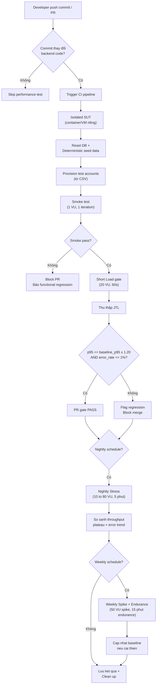
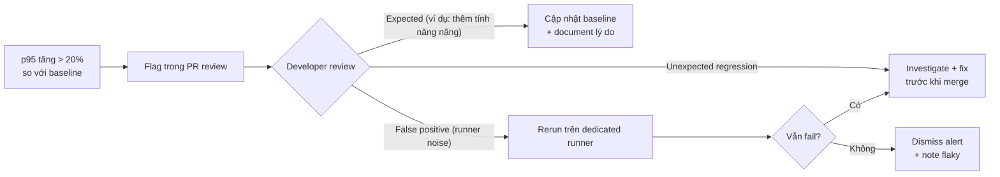

# Đề xuất Continuous Performance Testing — Returning Customer Search and Order

## Tổng quan

Đề xuất pipeline tự động theo dõi commit của SUT, quyết định có chạy performance test hay không, so sánh kết quả với baseline, và flag regression.

## Flowchart pipeline



## Chi tiết từng giai đoạn

### 1. Theo dõi commit

- Trigger: mỗi push hoặc PR vào branch `main` hoặc `develop`.
- **Điều kiện chạy performance test:** commit thay đổi file trong `src/eshop-sut/backend/` (server.js, database.js, package.json). Thay đổi chỉ frontend/docs/tests thì skip.
- Dùng GitHub Actions path filter hoặc tương đương.

### 2. Isolated SUT

- Khởi SUT trong container/VM riêng, không share resource với CI runner khác.
- Port binding cố định (3000).
- Lý do: tránh runner noise ảnh hưởng latency measurement.

### 3. Deterministic data

- Reset database bằng cách restart backend (SUT tự drop/recreate/seed).
- Provision account pool từ CSV cố định (20 account cho Load gate).
- Verify cart/orders rỗng trước mỗi run.

### 4. Smoke test (functional gate)

- 1 VU, 1 iteration, toàn bộ 7-step workflow.
- Kiểm tra: tất cả 7 HTTP response 200, correlation thành công, assertion pass.
- Fail → block PR, báo functional regression.

### 5. Short Load gate (proposed CI gate)

- **20 VU, 60 giây hold** (ramp-up 10 giây).
- Thu thập JTL, tính p95 và error rate.
- **Proposed CI gate:**
  ```
  error_rate > 1% OR p95 > baseline_p95 * 1.20
  → FLAG REGRESSION, block merge
  ```
- Baseline p95 hiện tại (từ D1 Load evidence): **9 ms** (HTTP).
- Threshold sẽ là: p95 > **10,8 ms** → flag.

> Lưu ý: Đây là **proposed CI gate**, không phải SLA chính thức. Baseline cần được cập nhật định kỳ.

### 6. Nightly Stress

- Chạy mỗi đêm trên branch `main`.
- Staircase 10→20→40→60→80 VU, mỗi bậc 60 giây.
- So sánh throughput plateau point và error trend với nightly trước.
- Không block merge; chỉ flag nếu throughput giảm >15% hoặc error rate xuất hiện.

### 7. Weekly Spike + Endurance

- Spike: 5→50→5 VU, kiểm tra recovery.
- Endurance: 20 VU, 15 phút.
- So sánh memory trend (working set cuối run) với tuần trước.
- Cập nhật baseline nếu p95/throughput cải thiện >5% liên tục 3 tuần.

### 8. Lưu trữ và baseline management

- Lưu JTL, resource CSV, HTML report mỗi run.
- Retention: 30 ngày cho nightly, 90 ngày cho weekly.
- Baseline drift: tự động cập nhật baseline khi code change được merge và verified qua nightly+weekly.

## Xử lý p95 regression



## Thảo luận trade-off

| Yếu tố                 | Đánh giá                                                                             | Giải pháp đề xuất                                                                                          |
| ---------------------- | ------------------------------------------------------------------------------------ | ---------------------------------------------------------------------------------------------------------- |
| **Chi phí CI**         | Smoke + short Load mỗi PR: ~2–3 phút. Nightly Stress: ~5 phút. Weekly full: ~20 phút | Chấp nhận được cho quy mô nhỏ. Scale lên: chỉ chạy Load gate cho PR, Stress/Spike/Endurance nightly/weekly |
| **Runner noise**       | Shared CI runner gây variance latency; p95 có thể dao động ±20–30%                   | Dùng dedicated runner hoặc container riêng. Threshold 1.20× đã tính margin cho noise                       |
| **False alarm**        | p95 variance cao trên SQLite đơn giản (latency thấp nên % change lớn)                | Dùng moving average baseline (3 lần chạy gần nhất thay vì single run). Alert khi fail 2/3 runs liên tiếp   |
| **Thời lượng chạy**    | Load gate 60s quá ngắn cho warm-up                                                   | Bao gồm 10s ramp-up + 60s hold; đo chỉ lấy steady-state 60s                                                |
| **Isolation**          | SUT và JMeter chạy cùng máy gây mutual interference                                  | Tách SUT container và JMeter runner nếu có resource                                                        |
| **Storage**            | JTL/HTML tích lũy nhanh                                                              | Retention policy: 30/90 ngày. Chỉ giữ statistics.json cho baseline comparison dài hạn                      |
| **Baseline drift**     | Code thay đổi làm baseline lỗi thời                                                  | Auto-update baseline khi PR merge thành công + nightly pass. Manual review khi delta >20%                  |
| **p95 variance**       | Trên SUT nhẹ (latency <10ms), variation 1–2ms = 10–20%                               | Dùng absolute threshold (ví dụ: p95 > 15ms) thay vì chỉ relative threshold cho latency rất thấp            |
| **State accumulation** | Cart/order tích lũy nếu không reset                                                  | Bắt buộc restart SUT trước mỗi run; mỗi restart drop/reseed DB                                             |
