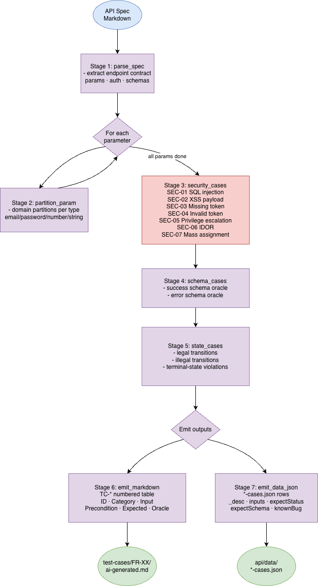

# HW06 – Thiết kế Agent Skill: AI-driven API Test Generator

**Sinh viên:** Hà Bảo Ngọc — 23127300, nhóm N08  
**Ngày:** 2026-08-20

---

## 1. Sơ đồ thiết kế

> **Lưu ý anti-cheat (§11):** Sơ đồ dưới đây được sinh viên tự vẽ và lưu tại
> `diagrams/test-generator.png`. Nguồn chỉnh sửa là `diagrams/test-generator.drawio`;
> phiên bản Mermaid ở `diagrams/test-generator.md`; pseudocode đầy đủ ở
> `diagrams/test-generator.py`.



---

## 2. Giải thích từng giai đoạn

### Stage 1 — `parse_spec`: Đọc đặc tả endpoint

**Đầu vào:** `api-specification.md` + tên endpoint (e.g. `POST /api/register`).  
**Đầu ra:** Bảng tham số (tên, kiểu, bắt buộc, ràng buộc), yêu cầu auth, schema success/error.

AI được prompt để trích xuất hợp đồng API theo cấu trúc — không đoán, không suy diễn.  
Kết quả giữ trong context để làm oracle cho các stage sau.

---

### Stage 2 — `partition_param`: Phân vùng miền mỗi tham số

**Kỹ thuật:** Domain partitioning (boundary value + equivalence class).  
**Thực hiện:** Mỗi tham số → một prompt riêng → AI liệt kê tất cả các lớp tương đương và
giá trị đại diện.

Danh sách phân vùng theo kiểu tham số:
- **Email:** valid / empty / missing / no-@ / no-domain / leading-space / duplicate / SQL-meta / XSS / very-long
- **Password:** valid / too-short / no-uppercase / no-digit / no-special / only-spaces / very-long
- **String:** valid / empty / missing / very-long / unicode / whitespace-only / special-chars / SQL-meta
- **Number:** positive / zero / negative / missing / non-numeric / float / huge / boundary-1

---

### Stage 3 — `security_cases`: Bộ quy tắc bảo mật SEC-01 → SEC-07

| Rule | Mô tả | Oracle |
|------|-------|--------|
| SEC-01 | SQL injection trong mọi string field | Được tham số hóa → neutralised, trả về 200/400 bình thường |
| SEC-02 | XSS payload trong mọi string field | Không thực thi script (stored nhưng escaped khi render) |
| SEC-03 | Không có auth token | 401 Unauthorized |
| SEC-04 | Token sai định dạng / hết hạn | 401 hoặc 403 |
| SEC-05 | User thường gọi endpoint chỉ dành cho admin | 403 Forbidden (SUT trả 200 = bug) |
| SEC-06 | IDOR — đọc resource của user khác khi không có auth | 403/404 |
| SEC-07 | Mass assignment — gửi thêm field đặc quyền | Bị ignore |

---

### Stage 4 — `schema_cases`: Oracle schema phản hồi

Xác thực chính xác cấu trúc body response:
- **Success path:** assert từng key trong schema đặc tả (vd `{message, id}`)
- **Error path:** assert body có key `message` kiểu string
- **Content-Type:** assert `application/json`

---

### Stage 5 — `state_cases`: Mô hình hóa chuyển trạng thái

Áp dụng cho endpoint tạo/cập nhật resource có vòng đời:

```
FR-10 Order State Machine:
  pending → confirmed → shipping → delivered   (legal)
  pending → shipping                            (illegal — skip)
  canceled → delivered                          (illegal — BUG-FR08-003)
  [any terminal] → [any]                        (illegal)
```

Mỗi cạnh trong đồ thị trạng thái → một test case; cạnh illegal bị chấp nhận bởi SUT được đánh dấu `knownBug: true`.

---

### Stage 6 — Audit: VALID / INVALID / INCOMPLETE

Sau khi AI tạo bảng TC-*, sinh viên review và gán nhãn cho mỗi case:
- **VALID:** Oracle đúng per spec và hành vi SUT
- **INVALID:** Oracle sai → cung cấp correction (đặc biệt: AI hay sai khi giả định SUT có validation)
- **INCOMPLETE:** Thiếu context hoặc assertion

---

### Stage 7 — Extend: ≥ 5 case sinh viên bổ sung

Các lỗ hổng điển hình AI bỏ qua trong dự án này:

| # | Case | Lý do AI bỏ qua |
|---|------|-----------------|
| 1 | Email trùng được chấp nhận | AI giả định database có ràng buộc UNIQUE |
| 2 | User thường tạo/xóa danh mục → 200 | AI giả định middleware có kiểm tra role |
| 3 | PUT/DELETE id không tồn tại → 200 (không 404) | AI giả định backend có kiểm tra affectedRows |
| 4 | Body rỗng `{}` vẫn được insert (NULL fields) | AI giả định có kiểm tra field bắt buộc |
| 5 | Plaintext password lộ qua `/api/login` | AI không đi theo chuỗi authentication |

---

## 3. Pseudocode

Pseudocode thiết kế tóm tắt (bản `.py` đầy đủ: `diagrams/test-generator.py`):
```python
parse_spec(spec_file, endpoint) -> EndpointSpec
partition_param(param: ParamSpec) -> list[TestCase]
security_cases(spec: EndpointSpec) -> list[TestCase]
schema_cases(spec: EndpointSpec) -> list[TestCase]
state_cases(spec: EndpointSpec) -> list[TestCase]
emit_markdown(cases, out) -> None   # → ai-generated.md
emit_data_json(cases, out) -> None  # → *-cases.json
```

---

## 4. Skill

File skill: [`.claude/skills/api-test-generator/SKILL.md`](../.claude/skills/api-test-generator/SKILL.md)

Skill chứa:
- Điều kiện kích hoạt
- Prompt pattern chi tiết cho mỗi stage
- Bảng phân vùng tham chiếu đầy đủ
- Ví dụ cụ thể trên FR-14 `POST /api/categories` (worked example end-to-end)
- Output contract: định dạng bảng TC-* và *-cases.json

---

## 5. Demo

Kịch bản quay chi tiết (phân cảnh + lời thoại + checklist §11) ở
[`reports/demo-video-script.md`](demo-video-script.md) — demo skill sinh case cho
FR-14 `POST /api/categories` rồi chạy Newman.

https://youtu.be/-0KjJiBCIiI
