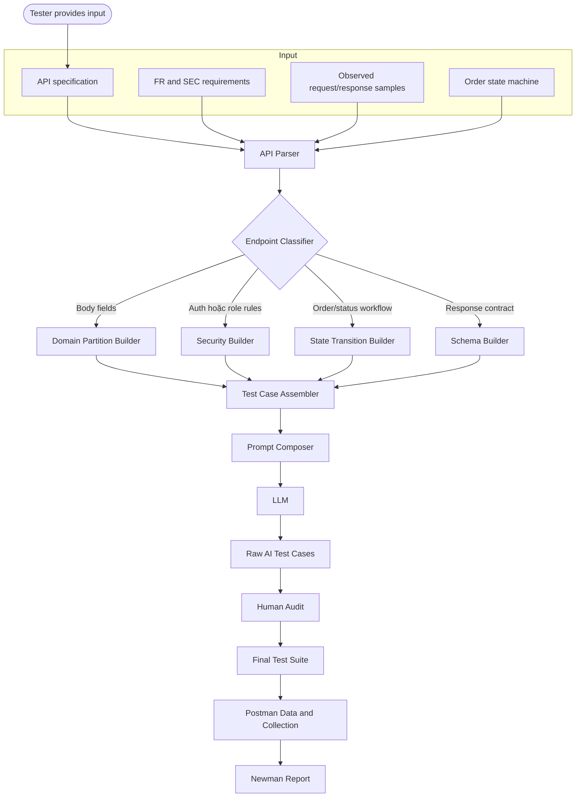

# AI-Driven Test Generator Design

Reference này lưu reusable design từ generator document của sinh viên. Giữ implementation theo blackbox: generator đọc API specs, FR/SEC requirements, và observed responses, không đọc source code.

## Architecture



## Pseudocode

```python
def main(api_spec, requirements, selected_endpoints):
    state_machine = {
        "pending": ["confirmed", "canceled"],
        "confirmed": ["shipping", "canceled"],
        "shipping": ["delivered"],
        "delivered": [],
        "canceled": [],
    }

    endpoints = parse_api_spec(api_spec, requirements)
    final_suite = []

    for endpoint in selected_endpoints:
        metadata = normalize_endpoint(endpoints[endpoint])
        seed_cases = []
        seed_cases += build_domain_partition_cases(metadata)
        seed_cases += build_security_cases(metadata)
        seed_cases += build_state_transition_cases(metadata, state_machine)
        seed_cases += build_schema_validation_cases(metadata)

        prompt = compose_stepwise_prompt(metadata, seed_cases)
        ai_cases = call_llm(prompt)
        audited_cases = human_audit(ai_cases)
        final_cases = add_human_extensions(audited_cases, min_count=5)
        final_suite.extend(final_cases)

    return export_plan(final_suite)
```

## Builder Rules

Domain builder:

- Với mỗi request field, tạo valid, missing, null, empty, wrong type, và boundary cases.
- Với unique fields như email hoặc coupon code, thêm duplicate cases.
- Với IDs, thêm existing ID, nonexistent ID, malformed ID, và ID của user khác khi relevant.

Security builder:

- Thêm `SEC-02` cases cho mọi protected endpoint: no token, malformed token, expired token.
- Thêm `SEC-03` cases cho mọi admin endpoint: normal user token phải fail với 403.
- Thêm IDOR cases cho user-owned resources.
- Thêm benign SQLi/XSS cases. Expected result có thể là 400/401/403, nhưng không được là 500, stack trace, hoặc data leak.
- Thêm `SEC-06` case cho profile update có `role`.
- Thêm `SEC-07` cases cho reset token one-time use, wrong email, weak password, và expired/invalid token khi observe được.

State builder:

- Generate mọi valid FR-10 transitions.
- Generate representative invalid transitions, gồm skips và final states.
- Generate user-cancel restrictions cho `shipping`.
- Include repeated actions, ví dụ cancel twice.

Schema builder:

- Thêm status code assertion.
- Thêm `Content-Type` assertion.
- Thêm required field và type assertions.
- Thêm error-body assertion cho negative cases.
- Thêm response time assertion, thường `< 1000ms`.

## Output contract

Mỗi generated case nên có:

```json
{
  "tc_id": "API_LOGIN_SEC_01",
  "source": "AI or Human",
  "group": "Security",
  "description": "No token is rejected",
  "precondition": "Endpoint requires auth",
  "request": "GET /api/users/me",
  "headers": {},
  "input": {},
  "expected_status": 401,
  "expected_fields": ["message"],
  "rationale": "SEC-02 requires protected APIs to reject missing JWT"
}
```

## Design notes

- Generator có thể yêu cầu LLM expand cases, nhưng final suite do human audit kiểm soát.
- Nếu spec và observed behavior mâu thuẫn, ghi lại conflict như potential bug hoặc assumption.
- Không generate trực tiếp final diagram image cho sinh viên. Chỉ cung cấp architecture logic và Mermaid/pseudocode; sinh viên phải tự author diagram nộp bài.
