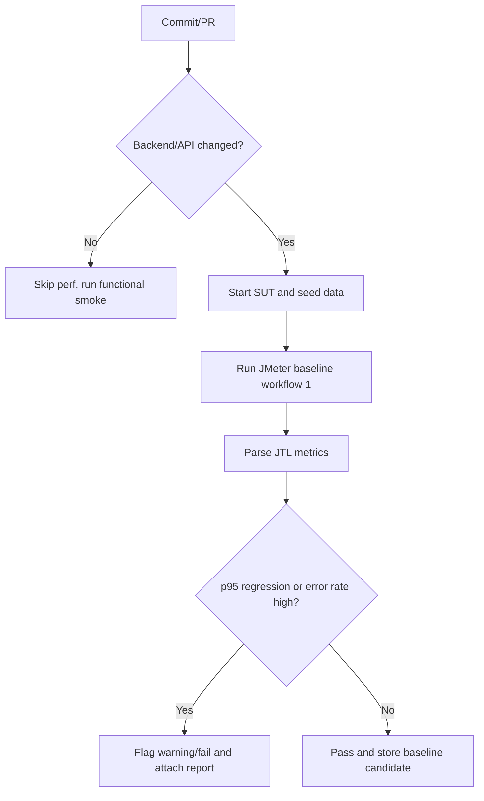

# HW05 Performance Report

## Mục tiêu

Biến artifact JMeter thành nội dung báo cáo HW05 có số liệu kiểm chứng được. Luôn trích số từ raw `.jtl` hoặc HTML dashboard; không chấp nhận phân tích AI nếu chưa đối chiếu.

## Tài liệu cần đọc

- `HW05-PerformanceTesting.md`: Task 1, Task 2, Task 3, AI Audit Report, AI Critique.
- `workflows.md`: Workflow 1 và gợi ý metric/workload từ slide.
- `references/report-structure.md`: khung báo cáo và checklist nội dung.

## Phân tích JTL nhanh

Dùng script:

```bash
python3 skills/hw05-performance-report/scripts/summarize_jtl.py \
  testing-artifacts/hw05/results/load/23127475_Load_20260815.jtl \
  --out testing-artifacts/hw05/analysis/load-summary.csv
```

Chạy cho Load, Stress, Spike và Endurance. Nếu JTL không phải CSV chuẩn của JMeter, mở file và xác định header trước khi kết luận.

## Metric phải báo cáo

Cho từng scenario, lập bảng:

- Threads/VUs, ramp-up, duration, timer.
- Total samples.
- Error count và error rate.
- Average response time.
- p50, p90, p95, p99.
- Throughput/RPS.
- Min/max response time.
- CPU/RAM quan sát từ evidence.

Tập trung thảo luận p95/p99, throughput và error rate. Average chỉ là phụ.

## Misinterpretation hunt

Sau khi nhờ AI phân tích `.jtl`, phải tự kiểm tra và ghi ít nhất các nhóm lỗi sau nếu có:

- AI đọc nhầm average thành p95 hoặc p99.
- AI bỏ qua HTTP 4xx/5xx/timeout.
- AI gộp lỗi test data/account lockout thành lỗi hiệu năng SUT.
- AI kết luận ngưỡng ổn định dù endurance có RAM tăng liên tục hoặc p95 drift.
- AI đề xuất tối ưu không dựa trên kiến trúc repo/API blackbox.

Mỗi misinterpretation phải có:

```text
AI nói:
Giá trị đúng từ raw .jtl:
Vì sao sai:
Cách sửa kết luận:
```

## Đánh giá đề xuất tối ưu

Phân loại từng đề xuất AI:

- `Feasible`: hợp lý với Node.js + Express + SQLite hoặc quan sát thực tế, ví dụ index cho truy vấn tìm kiếm nếu có bằng chứng read-heavy chậm, connection/pooling nếu phù hợp stack, SQLite WAL nếu có contention ghi.
- `Needs evidence`: có thể đúng nhưng thiếu log/profiling chứng minh.
- `Hallucinated`: bịa công nghệ không có trong SUT, yêu cầu cloud infra không liên quan, hoặc tối ưu frontend cho bottleneck backend API.

Vì đây là blackbox testing, không sửa code SUT; chỉ nêu recommendation và giới hạn bằng chứng.

## Bug report và GitHub issue

Khi phân tích `.jtl`/HTML report nếu phát hiện bug hoặc performance issue thật:

- Dùng `$hw05-bug-report` để tạo file Markdown trong `reports/bug-reports/` theo template `.github/ISSUE_TEMPLATE/bug-report-template.md`.
- Ghi evidence cụ thể: scenario, số sample lỗi, response code/message, p95/error rate, resource evidence, path `.jtl` và HTML report.
- Sau khi bug report local đã được review, dùng `$gh-create-bug-issues` nếu người dùng muốn tạo GitHub Issue và cập nhật ngược issue URL vào bug report/main report.
- Không biến nhận xét tối ưu chưa có bằng chứng thành bug report.

## Endurance threshold

Kết luận ngưỡng chịu tải bằng số cụ thể:

```text
Mức tải ổn định cao nhất:
RPS/TPS trung bình:
p95:
Error rate:
CPU/RAM ceiling:
Dấu hiệu phải dừng/tăng tải:
```

Nếu máy yếu, ghi rõ cấu hình phần cứng và vì sao chọn mức thấp hơn gợi ý slide.

## Continuous performance testing proposal

Đề xuất pipeline ở phần kết luận:

1. Watch commit/PR.
2. Chạy smoke API nhanh.
3. Quyết định có chạy perf test khi backend/API/dependency thay đổi.
4. Chạy subset workflow 1 ở tải baseline.
5. So sánh p95 và error rate với baseline đã lưu.
6. Fail hoặc warning nếu p95 regression vượt ngưỡng, ví dụ tăng > 20% hoặc error rate > 1%.
7. Lưu JTL/HTML report làm artifact CI.

Thêm flow chart dạng Mermaid trong report nếu được phép:



Thảo luận trade-off: chi phí thời gian CI, nhiễu do máy runner, false alarm, dữ liệu seed, và việc chỉ chạy subset nên có thể bỏ sót bottleneck.

## AI audit và critique

Ghi AI Audit Report theo từng interaction:

- Tên AI tool.
- Ngày giờ.
- Prompt.
- Output.
- Sinh viên đã review/sửa gì.

AI Critique phải dài 200-300 từ, tiếng Việt, trả lời: AI sai/thiếu ở đâu, vì sao không phát hiện, và nguyên tắc rút ra khi cộng tác với AI.

Trước final, dùng `$hw05-ai-audit-log` để append entry cho lượt hiện tại vào `reports/ai-audit-report.md`, nhất là khi có phân tích JTL, viết report, nhận xét AI hoặc chỉnh artifact.
