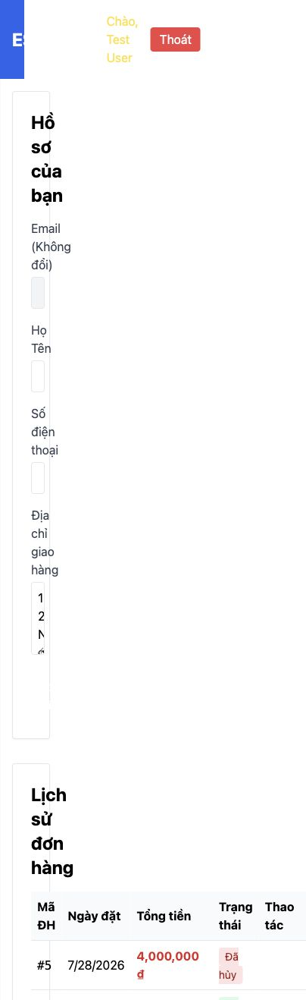

# [BUG][Profile] Trang hồ sơ bị cuộn ngang ở viewport mobile

## Found by Test Case
GUI-003

## Requirement liên quan
FR-21

## Severity / Priority
Major / P1

## Environment
**Browser:** Chrome 150.0.7871.182
**OS:** macOS 26.5.2
**Viewport:** 390 × 844
**URL:** http://127.0.0.1:5173/profile
**Commit:** `fc5acd6d9d858aba553addd8a4a84391c178b15d`

## Steps to reproduce
1. Đăng nhập và mở `/profile`.
2. Đặt viewport về `390 × 844`.
3. Quan sát chiều rộng tài liệu và khả năng cuộn ngang.

## Expected result
Nội dung reflow thành một cột và không tạo cuộn ngang toàn trang.

## Actual result
`window.innerWidth` là `390px` nhưng `document.documentElement.scrollWidth` là `404px`, tạo overflow ngang `14px`.

## Evidence

