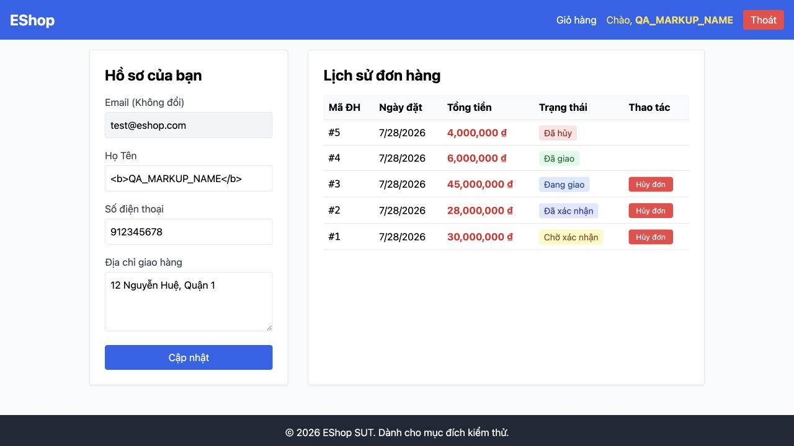

# [BUG][Profile] Tên người dùng được render như HTML trong navbar

## Found by Test Case
GUI-005

## Requirement liên quan
SEC-04

## Severity / Priority
Critical / P0

## Environment
**Browser:** Chrome 150.0.7871.182
**OS:** macOS 26.5.2
**URL:** http://127.0.0.1:5173/profile
**Commit:** `fc5acd6d9d858aba553addd8a4a84391c178b15d`

## Steps to reproduce
1. Đăng nhập bằng tài khoản người dùng.
2. Cập nhật Họ Tên thành `<b>QA_MARKUP_NAME</b>`.
3. Refresh `/profile`.
4. Kiểm tra HTML của link hồ sơ trên navbar.

## Expected result
Tên được hiển thị nguyên văn, không tạo phần tử HTML và không thực thi script.

## Actual result
Navbar tạo phần tử `<b>QA_MARKUP_NAME</b>` bên trong lời chào. Điều này chứng minh dữ liệu tên được đưa vào `innerHTML` thay vì escape.

## Evidence

