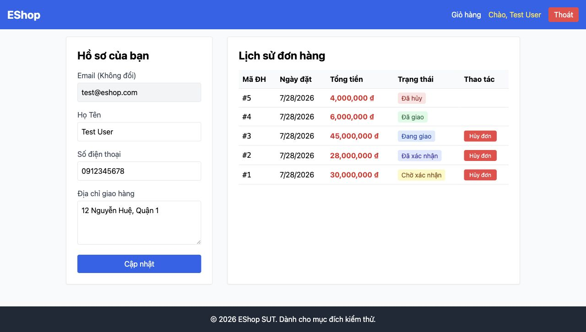

# [BUG][Profile] Nhãn form hồ sơ không liên kết chương trình với control

## Found by Test Case
GUI-009

## Requirement liên quan
FR-21, FR-22

## Severity / Priority
Major / P1

## Environment
**Browser:** Chrome 150.0.7871.182
**OS:** macOS 26.5.2
**URL:** http://127.0.0.1:5173/profile
**Commit:** `fc5acd6d9d858aba553addd8a4a84391c178b15d`

## Steps to reproduce
1. Đăng nhập và mở `/profile`.
2. Kiểm tra `id`, `for`, accessible name và `labels` của các `input`/`textarea`.

## Expected result
Mỗi nhãn liên kết với đúng control và accessible name phản ánh nhãn hiển thị.

## Actual result
Tất cả control trong form có `id=null`, `aria-label=null` và `labels.length=0`; các dòng chữ giống nhãn không tạo accessible name.

## Evidence

