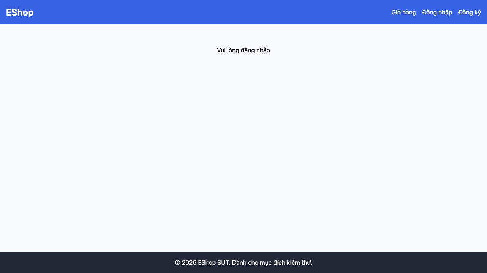

# [BUG][Profile] Trạng thái chưa đăng nhập không cung cấp đường tới đăng nhập

## Found by Test Case
GUI-011

## Requirement liên quan
FR-04, SEC-02

## Severity / Priority
Major / P1

## Environment
**Browser:** Chrome 150.0.7871.182
**OS:** macOS 26.5.2
**URL:** http://127.0.0.1:5173/profile
**Commit:** `fc5acd6d9d858aba553addd8a4a84391c178b15d`

## Steps to reproduce
1. Đăng xuất.
2. Truy cập trực tiếp `/profile`.
3. Kiểm tra vùng nội dung chính và các link hành động.

## Expected result
Không lộ dữ liệu cá nhân và có luồng xác thực rõ ràng, ví dụ link/nút tới trang Đăng nhập.

## Actual result
Vùng nội dung chỉ hiển thị “Vui lòng đăng nhập”; không có link hoặc nút đăng nhập trong nội dung chính.

## Evidence

