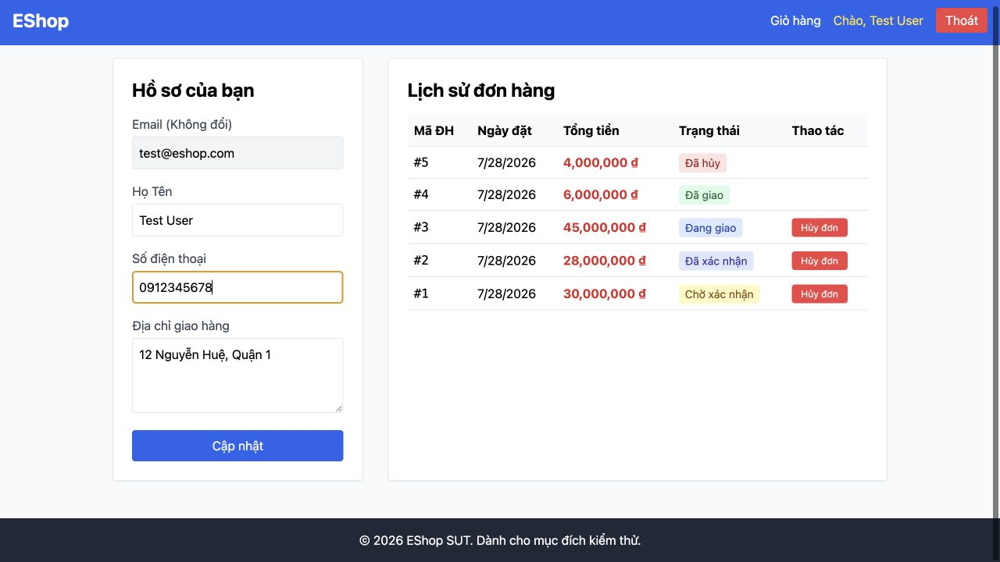
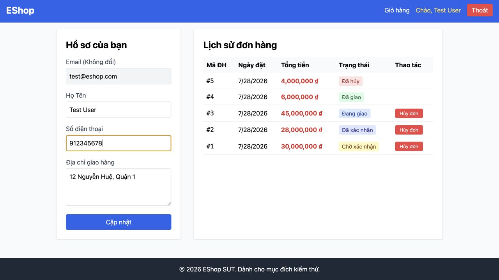

# [BUG][Profile] Validation số điện thoại từ chối số hợp lệ và nhận số sai định dạng

## Found by Test Case
GUI-021, GUI-022, GUI-023, GUI-024, GUI-029

## Requirement liên quan
FR-04

## Severity / Priority
Major / P1

## Environment
**Browser:** Chrome 150.0.7871.182
**OS:** macOS 26.5.2
**URL:** http://127.0.0.1:5173/profile
**Commit:** `fc5acd6d9d858aba553addd8a4a84391c178b15d`

## Steps to reproduce
1. Gửi form với số `0987654321` (10 chữ số, bắt đầu bằng 0).
2. Kiểm tra dữ liệu đã lưu.
3. Lặp lại với `09876543210` (11 chữ số, bắt đầu bằng 0).
4. Gửi form với `912345678` (9 chữ số, không bắt đầu bằng 0).
5. Kiểm tra dữ liệu đã lưu.

## Expected result
Hai số bắt đầu bằng 0 có độ dài 10–11 được chấp nhận; `912345678` bị từ chối.

## Actual result
`0987654321` và `09876543210` đều bị từ chối, dữ liệu DB giữ nguyên. `912345678` được chấp nhận và lưu vào hồ sơ.

## Evidence

