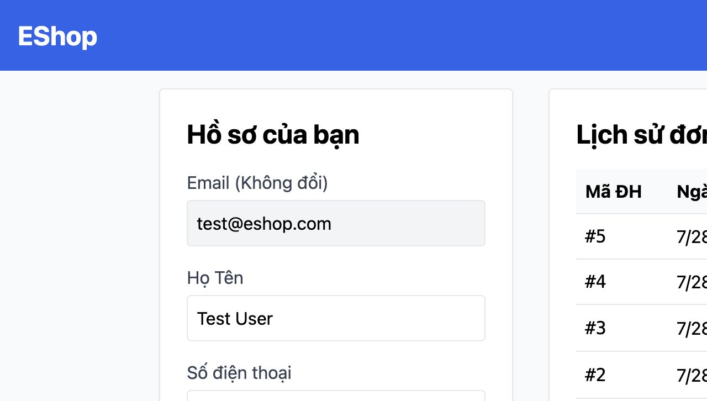

# [BUG][Order History] Hủy đơn không có dialog xác nhận

## Found by Test Case
GUI-038

## Requirement liên quan
FR-24

## Severity / Priority
Major / P1

## Environment
**Browser:** Chrome 150.0.7871.182
**OS:** macOS 26.5.2
**URL:** http://127.0.0.1:5173/profile
**Commit:** `fc5acd6d9d858aba553addd8a4a84391c178b15d`

## Steps to reproduce
1. Mở hồ sơ có đơn `pending`.
2. Bấm “Hủy đơn”.
3. Quan sát loại dialog đầu tiên và trạng thái dòng đơn.

## Expected result
Dialog xác nhận xuất hiện trước khi gửi yêu cầu hủy; chỉ hủy khi người dùng xác nhận.

## Actual result
Không có dialog `confirm`. Dialog đầu tiên là `alert` báo kết quả sau khi server đã hủy đơn; dòng đơn chuyển ngay sang “Đã hủy”.

## Evidence

