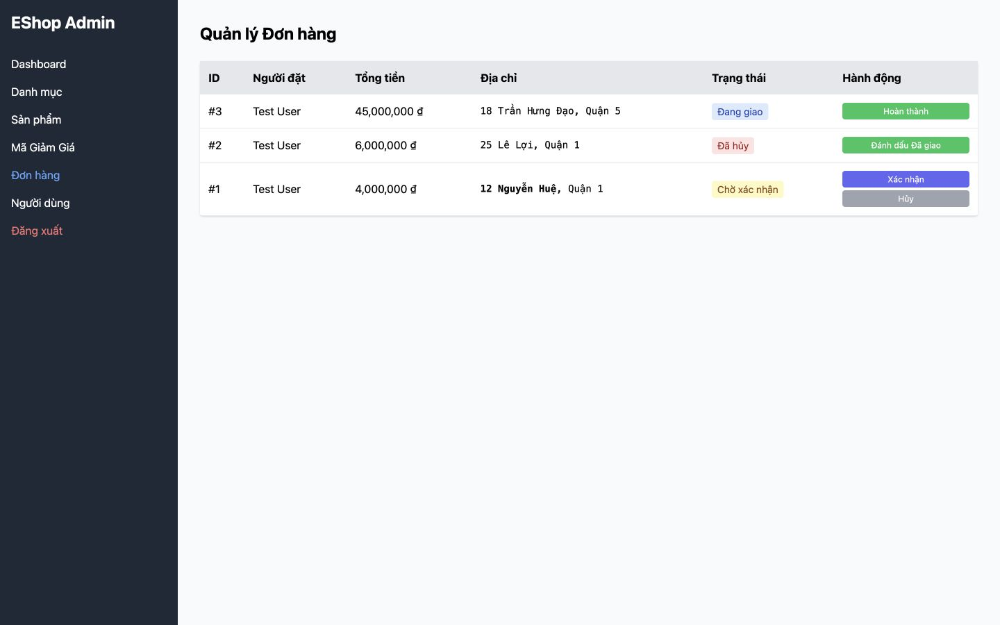

# [BUG][Admin Orders] Hành động Hủy dùng màu xám thay vì màu đỏ

## Found by Test Case
GUI-049

## Requirement liên quan
FR-21

## Severity / Priority
Minor / P2

## Environment
**Browser:** Chrome 150.0.7871.182
**OS:** macOS 26.5.2
**URL:** http://127.0.0.1:5174/
**Commit:** `fc5acd6d9d858aba553addd8a4a84391c178b15d`

## Steps to reproduce
1. Đăng nhập Web Admin.
2. Mở mục “Đơn hàng”.
3. Quan sát nút “Hủy” trên đơn `pending` hoặc `confirmed`.

## Expected result
Hành động hủy/nguy hiểm dùng màu đỏ nhất quán.

## Actual result
Nút “Hủy” dùng lớp `bg-gray-400`, trong khi các hành động tích cực dùng xanh dương/chàm.

## Evidence

