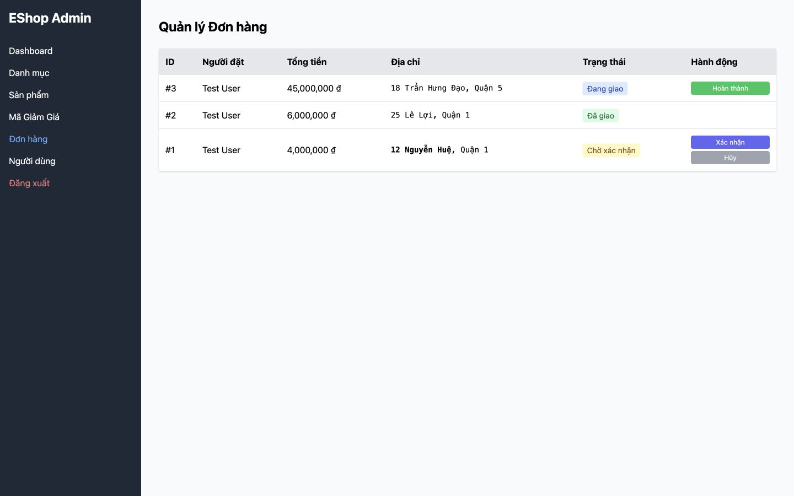

# [BUG][Accessibility] Thay đổi trạng thái động không có vùng thông báo

## Found by Test Case
GUI-052

## Requirement liên quan
FR-24

## Severity / Priority
Major / P1

## Environment
**Browser:** Chrome 150.0.7871.182
**OS:** macOS 26.5.2
**URL:** http://127.0.0.1:5173/profile and http://127.0.0.1:5174/
**Commit:** `fc5acd6d9d858aba553addd8a4a84391c178b15d`

## Steps to reproduce
1. Mở lịch sử đơn hàng hoặc Admin Orders.
2. Thực hiện một thay đổi trạng thái hợp lệ.
3. Kiểm tra `role="status"`, `role="alert"` và `aria-live` trên trang.

## Expected result
Thông báo thành công/lỗi hoặc trạng thái mới được công bố theo cách cảm nhận được mà không cần di chuyển focus thủ công.

## Actual result
Không có phần tử `role=status`, `role=alert` hoặc `aria-live` trên cả hai màn hình; cập nhật trạng thái chỉ thay đổi nội dung trực quan hoặc dùng JavaScript `alert`.

## Evidence

