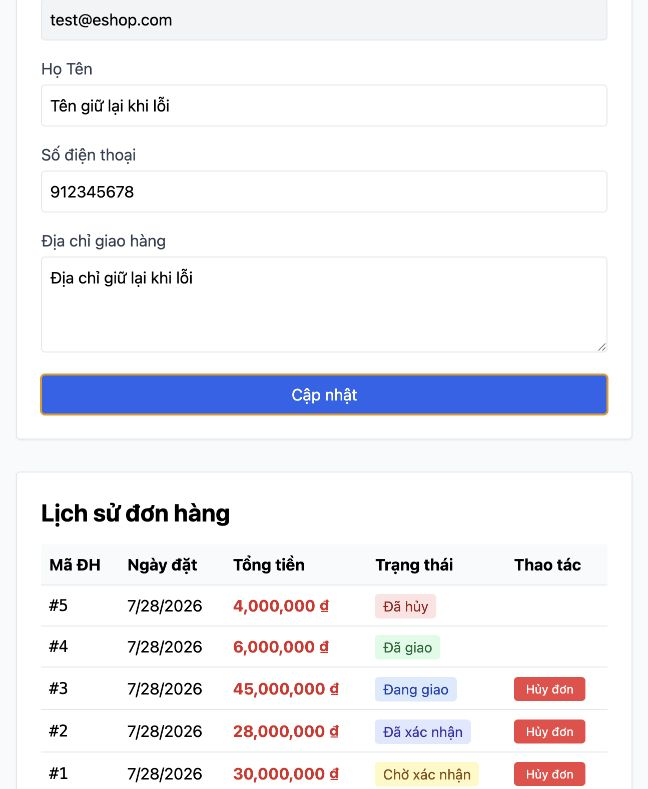

# [BUG][Profile] Lỗi cập nhật chỉ hiển thị bằng JavaScript alert

## Found by Test Case
GUI-030

## Requirement liên quan
FR-22

## Severity / Priority
Major / P1

## Environment
**Browser:** Chrome 150.0.7871.182
**OS:** macOS 26.5.2
**URL:** http://127.0.0.1:5173/profile
**Commit:** `fc5acd6d9d858aba553addd8a4a84391c178b15d`

## Steps to reproduce
1. Đăng nhập Web User và mở trang Hồ sơ.
2. Nhập dữ liệu hợp lệ vào Họ Tên, Số điện thoại và Địa chỉ.
3. Làm cho `PUT /api/users/me` trả lỗi kết nối/server.
4. Nhấn Cập nhật thông tin.

## Expected result
Trang hiển thị thông báo lỗi dễ hiểu ngay phía trên nút cập nhật, giữ nguyên dữ liệu đã nhập và hỗ trợ công nghệ trợ năng.

## Actual result
Trang chỉ mở JavaScript `alert("Lỗi cập nhật")`; không có thông báo inline, `role="alert"` hoặc `aria-live`. Dữ liệu đã nhập vẫn được giữ.

## Evidence

