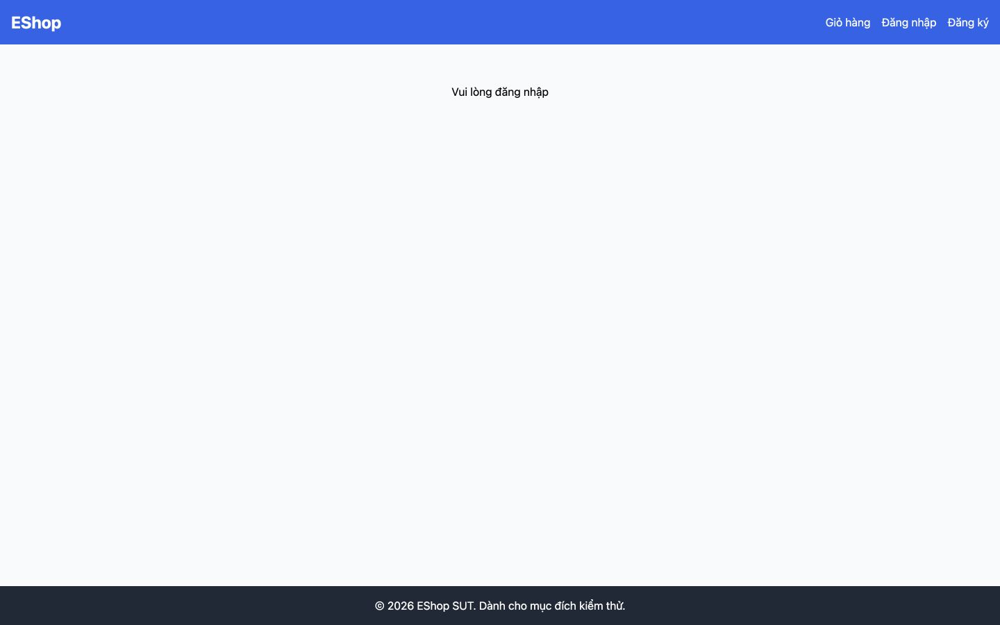

# [BUG][Profile] Lỗi tải server bị hiển thị như trạng thái chưa đăng nhập

## Found by Test Case
GUI-016

## Requirement liên quan
FR-22

## Severity / Priority
Major / P1

## Environment
**Browser:** Chrome 150.0.7871.182
**OS:** macOS 26.5.2
**URL:** http://127.0.0.1:5173/profile
**Commit:** `fc5acd6d9d858aba553addd8a4a84391c178b15d`

## Steps to reproduce
1. Đăng nhập Web User.
2. Làm cho API server không phản hồi.
3. Mở hoặc tải lại `/profile`.

## Expected result
Trang phân biệt lỗi tải dữ liệu với trạng thái rỗng/chưa đăng nhập và hiển thị thông báo thân thiện có hướng khắc phục.

## Actual result
Request lấy user thất bại làm phiên phía client bị đăng xuất và trang chỉ hiển thị “Vui lòng đăng nhập”; người dùng không được biết đây là lỗi server.

## Evidence

