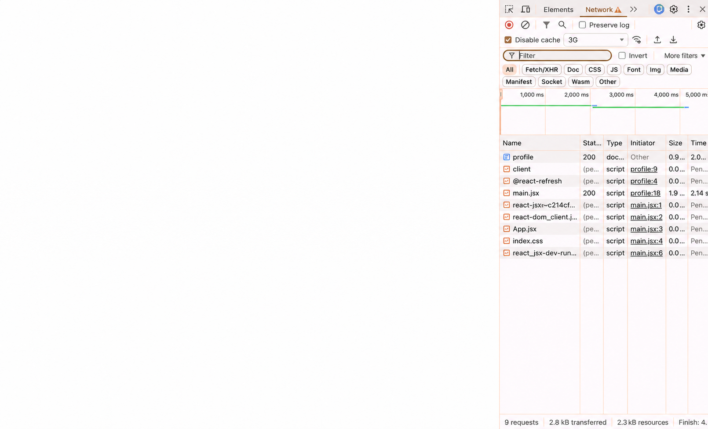

# [BUG][Profile] Trang trắng khi đang tải dữ liệu, không có loading state

## Found by Test Case
GUI-014

## Requirement liên quan
FR-04, FR-11; Heuristic: Visibility of system status

## Severity / Priority
Major / P1

## Environment
**Browser:** Chrome 150.0.7871.182
**OS:** macOS 26.5.2
**URL:** http://127.0.0.1:5173/profile
**Commit:** `fc5acd6d9d858aba553addd8a4a84391c178b15d`

## Steps to reproduce
1. Đăng nhập Web User.
2. Mở DevTools và chọn Network throttling `3G`.
3. Mở hoặc tải lại `/profile`.
4. Quan sát giao diện trong lúc các request dữ liệu vẫn đang chờ phản hồi.

## Expected result
Trang hiển thị trạng thái loading nhận biết được, chẳng hạn spinner, skeleton hoặc thông báo đang tải, để người dùng không hiểu nhầm vùng trống là kết quả cuối cùng.

## Actual result
Trong lúc dữ liệu hồ sơ và đơn hàng đang tải, vùng nội dung chỉ hiển thị trang trắng; không có spinner, skeleton, thông báo hoặc trạng thái loading nào có thể nhận biết.

## Evidence

