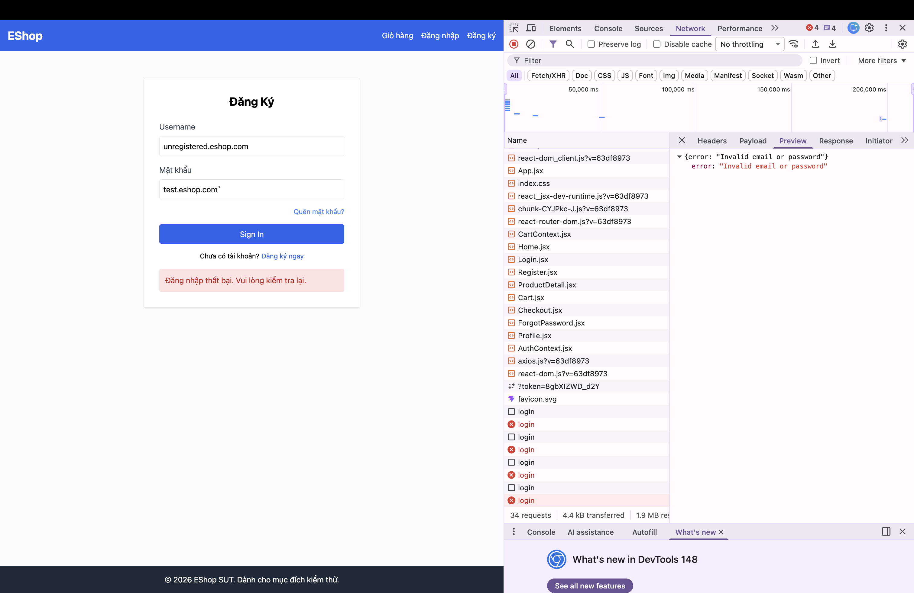

Title: [BUG][Login] Thiếu validation HTML5 type="email" ở trường Email

## Found by Test Case
TC-LOGIN-002

## Requirement liên quan
FR-02

## Severity / Priority
Major / P1

## Environment
Browser: [Nhập Browser]
OS: [Nhập OS]
URL: http://localhost:5173/login

## Steps to reproduce
1. Mở trang Login
2. Nhập Email sai định dạng: `test.eshop.com` (thiếu `@`)
3. Nhập Password: `Test1234!`
4. Bấm nút "Đăng nhập".

## Expected result
Trình duyệt báo lỗi validation HTML5 (`Vui lòng nhập định dạng email...`) và ngăn chặn form gửi dữ liệu lên server.

## Actual result
Form vẫn được submit và hệ thống trả về lỗi "Invalid email or password".

## Evidence

---

**Labels nên gắn trên GitHub Issues:**
- `type: bug`
- `module: login`
- `severity: major`
- `priority: P1`
- `status: new`
- `found-by: test-case`
