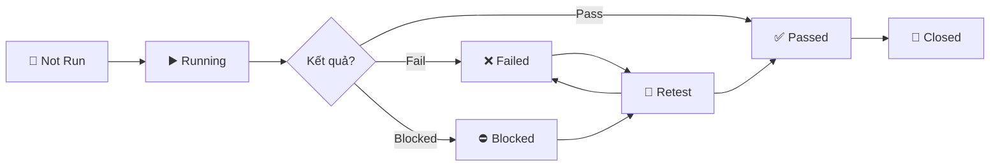

# 📋 Cấu hình Kanban Board — Dự án EShop

> Tài liệu mô tả cấu hình GitHub Project Board được khuyến nghị
> để theo dõi tiến độ kiểm thử theo mô hình Kanban.

---

## Tổng quan luồng di chuyển

---

## Chi tiết các cột (Columns)

### 1. 🔲 Not Run

| Thuộc tính    | Chi tiết                                                  |
| ------------- | --------------------------------------------------------- |
| **Mục đích**  | Chứa tất cả test case / issue chưa được thực thi         |
| **Khi nào vào** | Khi test case mới được tạo hoặc được assign cho tester |
| **Label tương ứng** | `status: not-run`                                   |
| **Hành động tiếp** | Tester kéo sang **Running** khi bắt đầu thực hiện   |

---

### 2. ▶️ Running

| Thuộc tính    | Chi tiết                                                  |
| ------------- | --------------------------------------------------------- |
| **Mục đích**  | Test case / đợt kiểm thử đang được thực thi              |
| **Khi nào vào** | Tester bắt đầu thực hiện test case                     |
| **Label tương ứng** | `status: running`                                   |
| **Hành động tiếp** | Kéo sang **Passed**, **Failed**, hoặc **Blocked** dựa trên kết quả |

---

### 3. ✅ Passed

| Thuộc tính    | Chi tiết                                                  |
| ------------- | --------------------------------------------------------- |
| **Mục đích**  | Test case đã thực thi thành công, kết quả đúng mong đợi  |
| **Khi nào vào** | Kết quả kiểm thử khớp với expected result              |
| **Label tương ứng** | `result: passed`                                    |
| **Hành động tiếp** | Kéo sang **Closed** khi kết thúc sprint / đợt test  |

---

### 4. ❌ Failed

| Thuộc tính    | Chi tiết                                                  |
| ------------- | --------------------------------------------------------- |
| **Mục đích**  | Test case thất bại — phát hiện lỗi                        |
| **Khi nào vào** | Kết quả thực tế khác với kết quả mong đợi              |
| **Label tương ứng** | `result: failed`                                    |
| **Hành động bắt buộc** | Tạo Bug Issue liên kết với test case bị fail   |
| **Hành động tiếp** | Chuyển sang **Retest** sau khi developer sửa lỗi    |

---

### 5. ⛔ Blocked

| Thuộc tính    | Chi tiết                                                  |
| ------------- | --------------------------------------------------------- |
| **Mục đích**  | Test case không thể thực thi do bị chặn bởi phụ thuộc    |
| **Khi nào vào** | Module phụ thuộc chưa hoàn thành, environment lỗi, hoặc bug blocking |
| **Label tương ứng** | `result: blocked`                                   |
| **Hành động bắt buộc** | Ghi rõ lý do blocked trong comment             |
| **Hành động tiếp** | Chuyển sang **Running** khi blocker được giải quyết  |

---

### 6. 🔄 Retest

| Thuộc tính    | Chi tiết                                                  |
| ------------- | --------------------------------------------------------- |
| **Mục đích**  | Bug đã được sửa, cần kiểm thử lại để xác nhận            |
| **Khi nào vào** | Developer đã merge PR fix bug                           |
| **Label tương ứng** | `status: retest`                                    |
| **Hành động tiếp** | Kéo sang **Passed** nếu retest pass, hoặc **Failed** nếu vẫn lỗi |

---

### 7. 🏁 Closed

| Thuộc tính    | Chi tiết                                                  |
| ------------- | --------------------------------------------------------- |
| **Mục đích**  | Issue đã hoàn tất, không cần hành động thêm               |
| **Khi nào vào** | Test case passed + bug verified, hoặc đợt test hoàn thành |
| **Label tương ứng** | `status: closed`                                    |
| **Điều kiện đóng** | Đáp ứng đầy đủ Checklist đóng bug (nếu là bug)     |

---

## Quy tắc vận hành Board

> [!IMPORTANT]
> Tuân thủ các quy tắc sau để đảm bảo board phản ánh đúng trạng thái kiểm thử.

1. **Mỗi card chỉ nằm ở một cột tại một thời điểm** — không duplicate card
2. **Cập nhật label tương ứng** khi di chuyển card giữa các cột
3. **Ghi comment** khi chuyển trạng thái, đặc biệt khi **Failed** hoặc **Blocked**
4. **Liên kết Bug Issue** với test case card khi test fail
5. **Daily standup** — review board hàng ngày để phát hiện card bị "kẹt"

---

## Cấu hình nhanh trên GitHub

> [!TIP]
> Để tạo Project Board trên GitHub:
> 1. Vào **Repository → Projects → New Project**
> 2. Chọn template **Board**
> 3. Tạo 7 cột theo thứ tự: `Not Run` → `Running` → `Passed` → `Failed` → `Blocked` → `Retest` → `Closed`
> 4. Thiết lập **Automation** (nếu dùng GitHub Projects V2):
>    - Khi issue được gán label `status: not-run` → tự động vào cột **Not Run**
>    - Khi issue được close → tự động vào cột **Closed**
