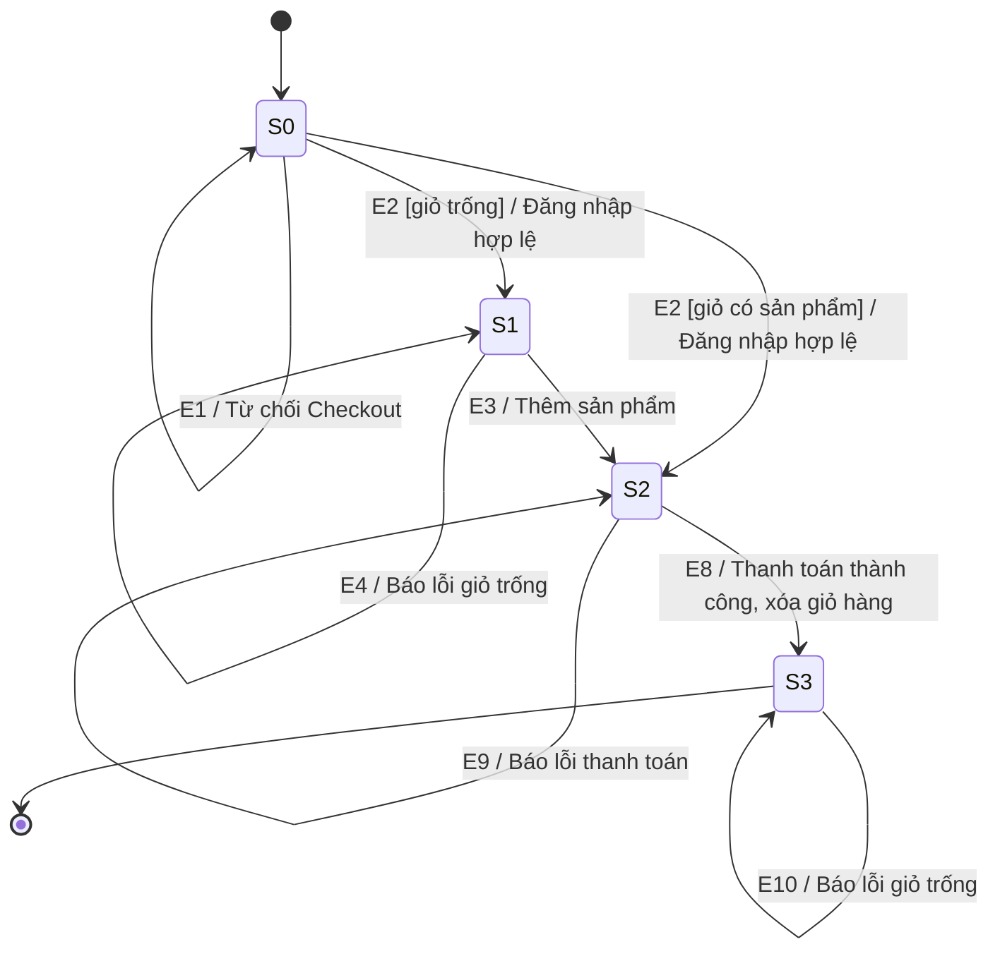

# Phân tích State Transition Testing — FR-08: Thanh toán (Checkout)

## 1. Tổng quan

FR-08 quy định quyền truy cập Checkout theo trạng thái đăng nhập và trạng thái giỏ hàng. State Transition Testing được áp dụng để kiểm tra người dùng chưa đăng nhập bị chặn, giỏ hàng trống không thể thanh toán, người dùng đã đăng nhập với giỏ hàng có sản phẩm có thể thanh toán, tổng tiền luôn do hệ thống tính và giỏ hàng chuyển sang trạng thái trống sau khi thanh toán thành công.

Theo nội dung được xác nhận khi review yêu cầu: Checkout bắt buộc có ít nhất một sản phẩm; thanh toán thất bại phải báo lỗi; giỏ hàng đã xóa trở thành giỏ trống và không thể tiếp tục thanh toán; `total_amount` từ client bị bỏ qua.

## 2. Các trạng thái (States)

| ID | Trạng thái | Mô tả | Loại |
|----|-----------|-------|------|
| S0 | Chưa đăng nhập | Người dùng chưa có phiên đăng nhập hợp lệ nên không được phép tiến hành thanh toán. | Initial |
| S1 | Đã đăng nhập, giỏ hàng trống | Người dùng đã đăng nhập nhưng giỏ hàng không có sản phẩm nên không thể thanh toán. | Intermediate |
| S2 | Sẵn sàng thanh toán | Người dùng đã đăng nhập, giỏ hàng có ít nhất một sản phẩm; giao diện hiển thị đầy đủ sản phẩm và tổng tiền tự động tính. | Intermediate |
| S3 | Thanh toán thành công, giỏ hàng đã xóa | Thanh toán đã thành công và giỏ hàng trở thành trống. Đây là trạng thái kết thúc của phiên Checkout hiện tại. | Final |

> **Lưu ý:** Thanh toán thất bại không tạo trạng thái mới; hệ thống báo lỗi và giữ người dùng tại S2 để có thể thử lại. Không bổ sung trạng thái “đang xử lý” vì yêu cầu không định nghĩa trạng thái này.

## 3. Các sự kiện (Events)

| ID | Sự kiện | Mô tả | Actor |
|----|---------|-------|-------|
| E1 | Truy cập Checkout khi chưa đăng nhập | Người dùng chưa đăng nhập cố gắng mở hoặc tiến hành thanh toán. | User |
| E2 | Đăng nhập hợp lệ | Người dùng hoàn tất đăng nhập để có quyền tiến hành thanh toán. | User / System |
| E3 | Thêm sản phẩm vào giỏ | Người dùng thêm ít nhất một sản phẩm để giỏ hàng đủ điều kiện Checkout. | User |
| E4 | Thanh toán khi giỏ hàng trống | Người dùng đã đăng nhập cố thanh toán khi không có sản phẩm. | User |
| E5 | Chỉnh sửa trực tiếp tổng tiền | Người dùng cố thay đổi trường tổng tiền trên giao diện. | User |
| E6 | Gửi yêu cầu thanh toán | Người dùng xác nhận thanh toán; backend tự tính tổng tiền từ dữ liệu giỏ hàng. | User / System |
| E7 | Gửi `total_amount` từ client | Client gửi giá trị `total_amount`, kể cả giá trị khác với tổng tiền thực tế. | User / System |
| E8 | Thanh toán thành công | Backend hoàn tất thanh toán và hệ thống xóa giỏ hàng. | System |
| E9 | Thanh toán thất bại | Quá trình thanh toán không hoàn tất thành công. | System |
| E10 | Gửi lại Checkout sau khi thành công | Người dùng gửi lại yêu cầu thanh toán sau khi giỏ hàng đã bị xóa. | User |

## 4. Bảng chuyển đổi trạng thái (State Transition Table)

| Trạng thái hiện tại | Sự kiện | Điều kiện (Guard) | Trạng thái kế tiếp | Hành động |
|---------------------|---------|-------------------|--------------------|-----------|
| S0 | E1 | Không có phiên đăng nhập hợp lệ | ❌ S0 | Từ chối tiến hành thanh toán; không tạo giao dịch và không thay đổi giỏ hàng. |
| S0 | E2 | Đăng nhập hợp lệ và giỏ hàng trống | S1 | Thiết lập phiên đăng nhập; chưa cho phép thanh toán. |
| S0 | E2 | Đăng nhập hợp lệ và giỏ hàng có ít nhất một sản phẩm | S2 | Thiết lập phiên đăng nhập; cho phép vào Checkout. |
| S1 | E3 | Thêm sản phẩm hợp lệ vào giỏ | S2 | Hiển thị sản phẩm và tự động tính tổng tiền. |
| S1 | E4 | Giỏ hàng không có sản phẩm | ❌ S1 | Không thực hiện thanh toán và hiển thị lỗi. |
| S2 | E5 | Thao tác trực tiếp trên trường tổng tiền của giao diện | ❌ S2 | Không cho phép chỉnh sửa tổng tiền; dữ liệu Checkout không thay đổi. |
| S2 | E6 | Người dùng đã đăng nhập và giỏ có ít nhất một sản phẩm | S2 | Backend tự tính lại tổng tiền từ giỏ hàng và xử lý thanh toán. |
| S2 | E7 | Request chứa `total_amount` do client cung cấp | S2 | Bỏ qua `total_amount` từ client; backend dùng tổng tiền tự tính từ giỏ hàng. |
| S2 | E8 | Thanh toán hoàn tất thành công | S3 | Hoàn tất Checkout và xóa toàn bộ giỏ hàng. |
| S2 | E9 | Thanh toán không thành công | S2 | Hiển thị lỗi; không thực hiện hành động chỉ dành cho thanh toán thành công là xóa giỏ hàng. |
| S3 | E10 | Giỏ hàng đã bị xóa và đang trống | ❌ S3 | Không thực hiện thanh toán và hiển thị lỗi do giỏ hàng trống. |

Quy ước:

- `❌`: sự kiện/chuyển đổi không được phép theo FR-08; trạng thái không đổi.
- E6 và E7 là các bước xử lý giữ nguyên S2; việc chuyển sang S3 chỉ xảy ra khi có E8.

## 5. Sơ đồ chuyển đổi trạng thái (State Transition Diagram)

## 6. Chiến lược sinh Test Case

- **Valid transitions cần cover:** 4 chuyển đổi làm thay đổi trạng thái (`S0 → S1`, `S0 → S2`, `S1 → S2`, `S2 → S3`) và 3 chuyển đổi xử lý giữ nguyên trạng thái (`S2 → S2` qua E6, E7, E9).
- **Invalid transitions cần verify:** 4 trường hợp (`S0 → S0` khi chưa đăng nhập; `S1 → S1` khi giỏ trống; `S2 → S2` khi cố sửa tổng tiền; `S3 → S3` khi gửi lại Checkout với giỏ đã xóa).
- **Test case dự kiến:** 12 test case — 7 positive, 4 negative và 1 sequence test từ chưa đăng nhập đến thanh toán thành công.
- **Coverage level:** 0-switch cho từng transition; bổ sung 1-switch/sequence để kiểm tra chuỗi `S0 → S1 → S2 → S3`.
