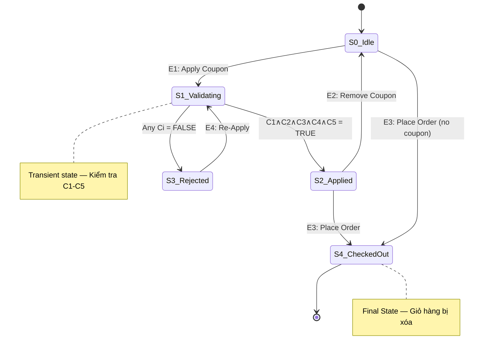

<!-- tests/test-design/FR-09-coupon-design.md -->

# Test Case Design Analysis — FR-09: Mã Giảm Giá (Coupon)

## Requirement ID

FR-09

## Module / Test Type / Technique

Mã Giảm Giá (Coupon) tại bước Checkout / Functional / State Transition Testing (STT)

## Scope

Vòng đời áp dụng coupon tại bước Checkout (Web Frontend) — từ lúc người dùng nhập mã đến khi mã được áp dụng thành công hoặc bị từ chối, và kết thúc khi đặt hàng hoàn tất.

---

## 1. State List

| State ID | State Name      | Description                                                                                                            |
| -------- | --------------- | ---------------------------------------------------------------------------------------------------------------------- |
| S0       | **Idle**        | Người dùng đang ở trang Checkout, chưa nhập mã coupon nào. Ô nhập coupon trống, tổng tiền = tổng giỏ hàng gốc.        |
| S1       | **Validating**  | Người dùng đã nhập mã coupon và bấm nút "Áp dụng". Hệ thống đang kiểm tra 5 điều kiện (C1–C5). Transient state.       |
| S2       | **Applied**     | Coupon hợp lệ (tất cả C1–C5 thỏa mãn). Giảm giá được áp dụng, `final_amount = total - discount_amount` hiển thị.     |
| S3       | **Rejected**    | Coupon không hợp lệ (ít nhất 1 trong C1–C5 không thỏa mãn). Hệ thống hiển thị thông báo lỗi. Tổng tiền giữ nguyên.   |
| S4       | **Checked Out** | Người dùng đã hoàn tất thanh toán. Giỏ hàng bị xóa. **Trạng thái kết thúc (Final State)**.                            |

> **Ghi chú:** S1 (Validating) là trạng thái transient — hệ thống tự động chuyển sang S2 hoặc S3 ngay lập tức dựa trên kết quả kiểm tra Guard Conditions. Được mô hình hóa để thể hiện rõ decision point.

---

## 2. Guard Conditions

| ID | Guard Condition                                    | True                                 | False                                         |
| -- | -------------------------------------------------- | ------------------------------------ | --------------------------------------------- |
| C1 | Mã tồn tại trong CSDL và `is_active = 1`          | Mã có trong DB, `is_active = 1`      | Mã không tồn tại hoặc `is_active = 0`        |
| C2 | Còn hạn sử dụng (`now < expired_at`)               | Ngày hiện tại < `expired_at`         | Ngày hiện tại ≥ `expired_at`                  |
| C3 | Đủ ngưỡng đơn hàng (`total >= min_order_amount`)   | Tổng đơn ≥ ngưỡng tối thiểu         | Tổng đơn < ngưỡng tối thiểu                  |
| C4 | Đã đăng nhập (JWT Token hợp lệ)                   | Có JWT Token hợp lệ                  | Không có hoặc Token hết hạn                   |
| C5 | Chưa dùng hết lượt (`uses < max_uses_per_user`)   | Số lần dùng < giới hạn               | Số lần dùng ≥ giới hạn                        |

---

## 3. Events / Triggers

| Event ID | Event Name          | Description                                                              |
| -------- | ------------------- | ------------------------------------------------------------------------ |
| E1       | **Apply Coupon**    | Người dùng nhập mã vào ô coupon và bấm nút "Áp dụng mã"                |
| E2       | **Remove Coupon**   | Người dùng bấm nút "Xóa mã" / "Hủy mã" để gỡ coupon đã áp dụng        |
| E3       | **Place Order**     | Người dùng bấm nút "Đặt hàng" / "Thanh toán" để hoàn tất checkout       |
| E4       | **Re-Apply Coupon** | Người dùng nhập mã mới (hoặc cùng mã) khi đang ở trạng thái Rejected    |

---

## 4. State Transition Diagram

### 4.1 ASCII Diagram

```
                          E1: Apply Coupon
  [S0: Idle] ──────────────────────────────────► [S1: Validating]
      │                                            │          │
      │                                            │          │
      │                           C1∧C2∧C3∧C4∧C5  │          │ ¬(C1∧C2∧C3∧C4∧C5)
      │                           (all TRUE)       │          │ (any FALSE)
      │                                            ▼          ▼
      │                                     [S2: Applied]  [S3: Rejected]
      │                                         │    │          │
      │              E2: Remove Coupon           │    │          │ E4: Re-Apply
      │            ◄─────────────────────────────┘    │          │
      │                                               │     ┌───▼─────┐
      │                                               │     │ → S1    │
      │                                               │     └─────────┘
      │                                               │
      │    E3: Place Order              E3: Place Order│
      │    (no coupon)                  (with coupon)  │
      ▼                                               ▼
  [S4: Checked Out] ◄─────────────────────── [S4: Checked Out]
     (FINAL STATE)                              (FINAL STATE)
```

### 4.2 Mermaid Diagram



---

## 5. State Transition Table

### 5.1 Valid Transitions (0-switch coverage)

| TC ID  | From State      | Event              | Guard Condition(s)                                          | To State         | Expected Result                                                                                              |
| ------ | --------------- | ------------------ | ----------------------------------------------------------- | ---------------- | ------------------------------------------------------------------------------------------------------------ |
| STT-001 | S0: Idle        | E1: Apply Coupon   | —                                                           | S1: Validating   | Hệ thống nhận mã, bắt đầu kiểm tra C1–C5                                                                    |
| STT-002 | S1: Validating  | (auto)             | C1=T, C2=T, C3=T, C4=T, C5=T                               | S2: Applied      | ✅ Coupon `SAVE10` áp dụng thành công. `discount = total × 10/100`. Hiển thị `final_amount`                  |
| STT-003 | S1: Validating  | (auto)             | C1=**F** (mã không tồn tại)                                 | S3: Rejected     | ❌ Thông báo lỗi "Mã giảm giá không hợp lệ". Mã: `NOTEXIST`                                                |
| STT-004 | S1: Validating  | (auto)             | C1=T, C2=**F** (hết hạn)                                    | S3: Rejected     | ❌ Thông báo lỗi "Mã đã hết hạn". Mã: `EXPIRED` (`expired_at = 2020-01-01`)                                 |
| STT-005 | S1: Validating  | (auto)             | C1=T, C2=T, C3=**F** (đơn dưới ngưỡng)                     | S3: Rejected     | ❌ Thông báo lỗi "Đơn hàng chưa đạt giá trị tối thiểu". Mã: `BIGBUY` với đơn = 400,000₫ < 500,000₫         |
| STT-006 | S1: Validating  | (auto)             | C4=**F** (không có JWT Token)                                | S3: Rejected     | ❌ Hệ thống từ chối — yêu cầu đăng nhập. API-level test (gọi API không gửi JWT Token)                       |
| STT-007 | S1: Validating  | (auto)             | C1=T, C2=T, C3=T, C4=T, C5=**F** (hết lượt)                | S3: Rejected     | ❌ Thông báo lỗi "Bạn đã sử dụng hết lượt". Mã: `SAVE10`, user đã dùng 1/1 lần                              |
| STT-008 | S2: Applied     | E2: Remove Coupon  | —                                                           | S0: Idle         | Gỡ coupon, tổng tiền trở về giá gốc (`total_amount`)                                                        |
| STT-009 | S2: Applied     | E3: Place Order    | —                                                           | S4: Checked Out  | ✅ Đặt hàng thành công với giá đã giảm. Giỏ hàng bị xóa. Đơn hàng lưu `final_amount`                       |
| STT-010 | S0: Idle        | E3: Place Order    | —                                                           | S4: Checked Out  | ✅ Đặt hàng thành công không có coupon. Giỏ hàng bị xóa                                                     |
| STT-011 | S3: Rejected    | E4: Re-Apply       | —                                                           | S1: Validating   | Người dùng nhập mã khác, hệ thống kiểm tra lại C1–C5                                                        |

### 5.2 Sneak Paths (Invalid Transitions)

| TC ID  | From State      | Event                        | Guard / Context                          | To State (Expected)              | Expected Result                                                                                                  |
| ------ | --------------- | ---------------------------- | ---------------------------------------- | -------------------------------- | ---------------------------------------------------------------------------------------------------------------- |
| STT-012 | S2: Applied     | E1: Apply Coupon (áp lại)    | Đã có coupon Applied                     | S2 giữ nguyên hoặc yêu cầu gỡ  | ⚠️ Hệ thống KHÔNG cho áp dụng mã thứ hai chồng lên. Hiển thị thông báo hoặc tự thay thế mã cũ                  |
| STT-013 | S3: Rejected    | E3: Place Order              | Coupon đã bị rejected                    | S4: Checked Out (không giảm giá) | ⚠️ Cho phép checkout với tổng tiền gốc. Xác nhận hệ thống KHÔNG áp dụng discount khi coupon bị rejected          |
| STT-014 | S4: Checked Out | E1: Apply Coupon             | Final State — đã thanh toán              | S4 (không thay đổi)              | ⚠️ Không thể áp dụng coupon sau khi đã thanh toán. Hệ thống ở trang xác nhận đơn hàng                           |
| STT-015 | S4: Checked Out | E3: Place Order              | Final State — giỏ hàng đã xóa           | S4 (không thay đổi)              | ⚠️ Không thể đặt hàng lại. Giỏ hàng trống, hệ thống từ chối hoặc chuyển về trang chủ                           |
| STT-016 | S1: Validating  | E1: Apply Coupon (double-click) | Đang xử lý request                     | Blocked                          | ⚠️ Không cho gửi request trùng khi đang xử lý (nút phải bị disable hoặc có debounce)                           |
| STT-017 | S0: Idle        | E1: Apply Coupon             | Mã rỗng (empty string)                  | S3: Rejected                     | ⚠️ Nhập mã rỗng → hệ thống phải từ chối, không gửi request rỗng tới server                                     |

### 5.3 Boundary / Edge-Case Transitions (Guard Condition Boundaries)

| TC ID  | From State     | Event  | Guard Condition(s)                                                     | To State     | Expected Result                                                                                                        | Test Data                                                 |
| ------ | -------------- | ------ | ---------------------------------------------------------------------- | ------------ | ---------------------------------------------------------------------------------------------------------------------- | --------------------------------------------------------- |
| STT-018 | S1: Validating | (auto) | C1=T (`is_active=1`), C2=**F** (`expired_at = 2020-01-01`)             | S3: Rejected | ❌ Mã `EXPIRED` có `is_active=1` nhưng đã hết hạn. Hệ thống phải kiểm tra C2 riêng, không chỉ dựa vào `is_active`     | Mã: `EXPIRED`, đơn ≥ 100,000₫                             |
| STT-019 | S1: Validating | (auto) | C3 boundary: `total == min_order_amount` (300,000₫)                    | S2: Applied  | ✅ Đơn hàng **vừa đúng bằng** ngưỡng tối thiểu. Spec nói `>=` nên phải pass. `discount = 300000 × 10/100 = 30,000₫`   | Mã: `SAVE10`, đơn = 300,000₫                              |
| STT-020 | S1: Validating | (auto) | C5 boundary: `uses = max_uses_per_user - 1` (lượt cuối)               | S2: Applied  | ✅ User dùng **lượt cuối** của mã. Spec: `uses < max_uses_per_user` → lượt cuối phải pass                              | Mã: `VIP100` (`max=2`), user đã dùng 1 lần                |
| STT-021 | S1: Validating | (auto) | C5 boundary: `uses == max_uses_per_user` (vừa chạm limit)             | S3: Rejected | ❌ User đã dùng **đúng bằng** `max_uses_per_user`. Spec: `uses < max_uses_per_user` → phải reject                      | Mã: `VIP100` (`max=2`), user đã dùng 2 lần                |

---

## 6. Test Data Mapping

### 6.1 Mã giảm giá mẫu (từ Spec FR-09)

| Mã mẫu    | Loại    | Giá trị   | Ngưỡng tối thiểu | Hạn dùng   | Số lần/người | Ghi chú                              |
| ---------- | ------- | --------- | ----------------- | ---------- | ------------ | ------------------------------------ |
| `SAVE10`   | percent | 10%       | 300,000₫          | 2099-12-31 | 1            | Happy path + boundary C3 + C5=F      |
| `BIGBUY`   | fixed   | 50,000₫   | 500,000₫          | 2099-12-31 | 1            | C3=F (đơn dưới ngưỡng)               |
| `VIP100`   | fixed   | 100,000₫  | 300,000₫          | 2099-12-31 | 2            | C5 boundary (lượt cuối / hết lượt)   |
| `EXPIRED`  | percent | 20%       | 100,000₫          | 2020-01-01 | 1            | C2=F + edge case (active but expired) |
| `NOTEXIST` | —       | —         | —                 | —          | —            | C1=F (mã không tồn tại trong CSDL)   |

### 6.2 Mapping: Mã mẫu ↔ Test Case ID

| Mã mẫu    | Test Case IDs sử dụng                              |
| ---------- | -------------------------------------------------- |
| `SAVE10`   | STT-002, STT-007, STT-008, STT-009, STT-012, STT-019 |
| `BIGBUY`   | STT-005                                            |
| `VIP100`   | STT-020, STT-021                                   |
| `EXPIRED`  | STT-004, STT-018                                   |
| `NOTEXIST` | STT-003                                            |

### 6.3 Precondition chung cho tất cả test cases

| Precondition                               | Giá trị                                             |
| ------------------------------------------ | --------------------------------------------------- |
| Hệ thống EShop đang hoạt động              | Backend API + Frontend Web running                   |
| User đã đăng nhập (trừ STT-006)            | `test@eshop.com` / `Test1234!` — JWT Token hợp lệ   |
| Giỏ hàng có sản phẩm                       | Tối thiểu 1 sản phẩm, tổng giá trị tùy test case    |
| Đang ở trang Checkout                      | Truy cập từ Giỏ hàng → Thanh toán                    |

---

## 7. Coverage Analysis

### 7.1 Coverage Matrix (State × Event)

| State ↓ \ Event → | E1: Apply Coupon | E2: Remove Coupon | E3: Place Order | E4: Re-Apply    |
| ------------------ | ---------------- | ----------------- | --------------- | --------------- |
| S0: Idle           | ✅ STT-001/002   | N/A               | ✅ STT-010      | N/A             |
| S1: Validating     | ⚠️ STT-016       | N/A               | N/A             | N/A             |
| S2: Applied        | ⚠️ STT-012       | ✅ STT-008        | ✅ STT-009      | N/A             |
| S3: Rejected       | N/A              | N/A               | ⚠️ STT-013      | ✅ STT-011      |
| S4: Checked Out    | ⚠️ STT-014       | N/A               | ⚠️ STT-015      | N/A             |

> ✅ = Valid transition | ⚠️ = Sneak path (phải bị chặn/xử lý) | N/A = Không áp dụng

### 7.2 Guard Condition Coverage

| Guard | TRUE tested by     | FALSE tested by    | Boundary tested by |
| ----- | ------------------ | ------------------ | ------------------ |
| C1    | STT-002            | STT-003            | STT-018 (active but expired) |
| C2    | STT-002            | STT-004, STT-018   | —                  |
| C3    | STT-002            | STT-005            | STT-019 (total == min) |
| C4    | STT-002            | STT-006            | —                  |
| C5    | STT-002            | STT-007, STT-021   | STT-020 (lượt cuối), STT-021 (vừa chạm) |

### 7.3 Summary

| Coverage Type                   | Count | TC IDs            |
| ------------------------------- | ----- | ----------------- |
| **Valid transitions (0-switch)** | 11    | STT-001 → STT-011 |
| **Sneak paths**                 | 6     | STT-012 → STT-017 |
| **Edge-case / Boundary**        | 4     | STT-018 → STT-021 |
| **Tổng test cases**             | **21** | STT-001 → STT-021 |

---

## 8. Test Case → File Mapping Plan

Mỗi test case sẽ được tạo thành 1 file riêng tại:

```
tests/test-cases/FR-09-coupon/state-transition/TC-FR09-STT-XXX.md
```

| File Name                  | TC ID    | Description                                      | Category       |
| -------------------------- | -------- | ------------------------------------------------ | -------------- |
| `TC-FR09-STT-001.md`       | STT-001  | Apply coupon → Validating (trigger flow)          | Valid          |
| `TC-FR09-STT-002.md`       | STT-002  | All guards pass → Applied (SAVE10 happy path)     | Valid          |
| `TC-FR09-STT-003.md`       | STT-003  | C1=F → Rejected (mã không tồn tại)               | Valid (error)  |
| `TC-FR09-STT-004.md`       | STT-004  | C2=F → Rejected (mã EXPIRED hết hạn)             | Valid (error)  |
| `TC-FR09-STT-005.md`       | STT-005  | C3=F → Rejected (đơn dưới ngưỡng BIGBUY)         | Valid (error)  |
| `TC-FR09-STT-006.md`       | STT-006  | C4=F → Rejected (không có JWT Token)              | Valid (error)  |
| `TC-FR09-STT-007.md`       | STT-007  | C5=F → Rejected (SAVE10 hết lượt)                | Valid (error)  |
| `TC-FR09-STT-008.md`       | STT-008  | Remove coupon → Idle (gỡ mã SAVE10)              | Valid          |
| `TC-FR09-STT-009.md`       | STT-009  | Place order with coupon → Checked Out             | Valid          |
| `TC-FR09-STT-010.md`       | STT-010  | Place order without coupon → Checked Out          | Valid          |
| `TC-FR09-STT-011.md`       | STT-011  | Re-Apply after Rejected → Validating              | Valid          |
| `TC-FR09-STT-012.md`       | STT-012  | Apply lại khi đã Applied (chồng mã)              | Sneak path     |
| `TC-FR09-STT-013.md`       | STT-013  | Checkout khi coupon bị Rejected                   | Sneak path     |
| `TC-FR09-STT-014.md`       | STT-014  | Apply coupon sau khi Checked Out                  | Sneak path     |
| `TC-FR09-STT-015.md`       | STT-015  | Place Order lại sau khi Checked Out               | Sneak path     |
| `TC-FR09-STT-016.md`       | STT-016  | Double-click Apply khi đang Validating            | Sneak path     |
| `TC-FR09-STT-017.md`       | STT-017  | Apply mã rỗng (empty string)                     | Sneak path     |
| `TC-FR09-STT-018.md`       | STT-018  | EXPIRED: is_active=1 nhưng expired_at đã qua     | Edge case      |
| `TC-FR09-STT-019.md`       | STT-019  | SAVE10: đơn vừa đúng bằng min_order_amount        | Edge case      |
| `TC-FR09-STT-020.md`       | STT-020  | VIP100: dùng lượt cuối (uses = max - 1)           | Edge case      |
| `TC-FR09-STT-021.md`       | STT-021  | VIP100: vừa chạm max_uses_per_user                | Edge case      |

---

```text
=== AI AUDIT LOG ENTRY ===
* Tool: Claude Opus 4.6 (Thinking)
* Date: 2026-07-06
* User Prompt: Confirm STEP 1&2, proceed to STEP 3
* AI Action: Generated Test Case Design Analysis document (FR-09-coupon-design.md) consolidating State List (5 states), State Transition Diagram (ASCII + Mermaid), State Transition Table (21 TCs: 11 valid + 6 sneak paths + 4 edge cases), Guard Condition coverage matrix, and file mapping plan. Awaiting user confirmation before generating individual TC files.
==========================
```
